# ESAROM Smart Planning -- Solver Engine

## Dokumentation für Anwender und IT-Betrieb

---

## Inhaltsverzeichnis

- [1. Einleitung](#1-einleitung)
- [2. Überblick: So arbeitet die Planungs-Engine](#2-überblick-so-arbeitet-die-planungs-engine)
- [3. Snapshot-Validierung](#3-snapshot-validierung)
  - [3.1 Zwei Ebenen: Integrität + Inhalt](#31-zwei-ebenen-integrität-inhalt)
  - [3.2 Validierungen im Einzelnen](#32-validierungen-im-einzelnen)
    - [3.2.16 Artikel-Department-Pflichtfeld (harter Fehler)](#3216-artikel-department-pflichtfeld-harter-fehler)
    - [3.2.17 Betriebsmittel-Department-Konfiguration (nur Warnung)](#3217-betriebsmittel-department-konfiguration-nur-warnung)
    - [3.2.18 Artikel-Betriebsmittel-Department-Konsistenz (harter Fehler)](#3218-artikel-betriebsmittel-department-konsistenz-harter-fehler)
  - [3.3 Fehler vs. Warnung -- Übersicht](#33-fehler-vs-warnung-übersicht)
- [4. Bedarfs-Aggregation](#4-bedarfs-aggregation)
  - [4.1 Zweck: Gruppierung nach VGNR-Vorschlag](#41-zweck-gruppierung-nach-vgnr-vorschlag)
  - [4.2 Aggregationsregeln](#42-aggregationsregeln)
  - [4.3 Fehlerfälle -- wann ein Bedarf "unmet" wird](#43-fehlerfälle-wann-ein-bedarf-unmet-wird)
  - [4.4 Nach der Aggregation](#44-nach-der-aggregation)
- [5. Der Produktionsprozess](#5-der-produktionsprozess)
  - [5.1 Arbeitsgänge im Detail](#51-arbeitsgänge-im-detail)
  - [5.2 Benötigte Ressourcen je Arbeitsgang](#52-benötigte-ressourcen-je-arbeitsgang)
  - [5.3 Wann wird COMB statt BA01 + ABF01 verwendet?](#53-wann-wird-comb-statt-ba01-abf01-verwendet)
  - [5.4 Wann entfällt ein Arbeitsgang?](#54-wann-entfällt-ein-arbeitsgang)
  - [5.5 Wie ist ein Arbeitsgang intern definiert?](#55-wie-ist-ein-arbeitsgang-intern-definiert)
- [6. Ressourcen-Vorauswahl (Constraint Preparator)](#6-ressourcen-vorauswahl-constraint-preparator)
  - [6.1 Planungszeitraum bestimmen](#61-planungszeitraum-bestimmen)
  - [6.2 Betriebsmittel-Eignung prüfen](#62-betriebsmittel-eignung-prüfen)
  - [6.3 Dauern berechnen](#63-dauern-berechnen)
  - [6.4 Betriebsmittel nach Typ gruppieren](#64-betriebsmittel-nach-typ-gruppieren)
  - [6.5 Rohrverbindungen prüfen (Fluss-Reduktion)](#65-rohrverbindungen-prüfen-fluss-reduktion)
  - [6.6 Anzahl der Kandidaten begrenzen](#66-anzahl-der-kandidaten-begrenzen)
  - [6.7 Mitarbeitende-Auswahl](#67-mitarbeitende-auswahl)
  - [6.8 Lange Arbeitsgänge aufteilen (Schichtübergabe)](#68-lange-arbeitsgänge-aufteilen-schichtübergabe)
- [7. Der Solver: Optimierung des Produktionsplans](#7-der-solver-optimierung-des-produktionsplans)
  - [7.1 Was entscheidet der Solver?](#71-was-entscheidet-der-solver)
  - [7.2 Regeln (Constraints)](#72-regeln-constraints)
  - [7.3 Zielfunktion: Was wird optimiert?](#73-zielfunktion-was-wird-optimiert)
  - [7.4 Solver-Pipeline: Schrittweises Lösen](#74-solver-pipeline-schrittweises-lösen)
  - [7.5 Abbruch-Kriterien](#75-abbruch-kriterien)
- [8. Nicht planbare Bedarfe (Unmet Demands)](#8-nicht-planbare-bedarfe-unmet-demands)
  - [8.1 Typische Gründe](#81-typische-gründe)
  - [8.2 Beispiele und Maßnahmen](#82-beispiele-und-maßnahmen)
  - [8.3 Referenz: Alle Original-Meldungen (reasons) im Code](#83-referenz-alle-original-meldungen-reasons-im-code)
- [9. Konfiguration](#9-konfiguration)
  - [9.1 Drei Konfigurationsschichten -- in absteigender Priorität](#91-drei-konfigurationsschichten-in-absteigender-priorität)
  - [9.2 Vollständige Settings-Referenz](#92-vollständige-settings-referenz)
  - [9.3 Settings über die Snapshot-API setzen](#93-settings-über-die-snapshot-api-setzen)
- [10. Integration und Betriebshinweise](#10-integration-und-betriebshinweise)
  - [10.1 Umgebungsvariablen](#101-umgebungsvariablen)
  - [10.2 API-Endpunkte](#102-api-endpunkte)
  - [10.3 Logging und Monitoring](#103-logging-und-monitoring)
  - [10.4 Externe Worker-Architektur](#104-externe-worker-architektur)
- [Glossar](#glossar)

---

## 1. Einleitung

Die **ESAROM Solver Engine** ist das Herzstück der automatischen Produktionsplanung im System *ESAROM Smart Planning*. Sie nimmt **Bedarfe** (die Planungseinheit -- ein zu produzierender Artikel in definierter Menge mit Liefertermin), verfügbare Betriebsmittel (Tanks, Töpfe, BA-Anlagen, Leitungen, Abfüller, Arbeitsplätze) und Mitarbeitende mit ihren Qualifikationen und Schichtplänen entgegen -- und erzeugt daraus einen optimierten Produktionsplan in Form von **Werkaufträgen**.

**Was leistet die Solver Engine?**

- Automatische Zuordnung von Bedarfen zu Betriebsmitteln und Mitarbeitenden
- Einhaltung aller physischen Einschränkungen (Rohrleitungen, Kapazitäten, Verfügbarkeiten)
- Optimierung auf möglichst termingerechte Lieferung
- Minimierung von Reinigungsaufwand und Wartezeiten
- Transparente Rückmeldung, wenn Bedarfe nicht einplanbar sind

**Für wen ist dieses Dokument?**

Die Dokumentation richtet sich an **Anwenderinnen und Anwender bei ESAROM** -- insbesondere Schichtführung, Vorarbeiter am Shopfloor sowie Disposition und Planung. Sie vermittelt ein fachliches Verständnis davon, wie die Planungs-Engine vorgeht, welche Regeln sie einhält und warum einzelne Bedarfe unter Umständen nicht eingeplant werden können.

Die Kapitel 9 (Konfiguration) und 10 (Integration und Betriebshinweise) enthalten auch technische Details zu Settings, API-Endpunkten und Logs. Diese sind für das alltägliche Arbeiten nicht nötig, aber als Nachschlagewerk gedacht, wenn das Verhalten der Engine im Betrieb beurteilt werden muss.

---

## 2. Überblick: So arbeitet die Planungs-Engine

Die Solver Engine arbeitet in zwei großen Phasen, wenn sie einen Planungslauf erhält:


### Phase 1: Ressourcen-Vorauswahl (Constraint Preparator)

Bevor der eigentliche Planungsalgorithmus startet, wird das Problem drastisch verkleinert. Für jeden Arbeitsgang jedes Bedarfs wird geprüft, welche Betriebsmittel und Mitarbeitende **tatsächlich in Frage kommen**. So wird die Zahl der zu betrachtenden Kombinationen von Millionen auf einige Tausend reduziert.

> **Analogie:** Wie wenn ein erfahrener Schichtleiter vor dem Schichtplan sagt: *"Für diese 1.000-Liter-Bedarf kommen nur Tank 7, Tank 9 oder Tank 12 in Frage -- alle anderen sind zu klein, gerade belegt oder falsch angeschlossen."*

### Phase 2: Optimierung (CP-SAT Solver)

Mit der reduzierten Kandidatenliste sucht der Solver nach der besten Kombination aus **Zeitpunkt**, **Betriebsmittel** und **Mitarbeitende** für jeden Arbeitsgang -- unter Einhaltung aller Regeln und mit dem Ziel, Liefertermine möglichst einzuhalten.

Der Solver liefert **jederzeit** die bisher beste Lösung. Je länger er läuft, desto besser wird das Ergebnis. Abgebrochen wird, wenn das Zeitlimit erreicht ist, die Lösung gut genug ist oder keine Verbesserung mehr möglich scheint.

---

## 3. Snapshot-Validierung

Jeder eingehende Snapshot wird vor der eigentlichen Planung durch eine Reihe von Validierungen geführt. Ziel ist es, inkonsistente Eingabedaten **möglichst früh** zu erkennen -- bevor der Solver gestartet wird -- und so zwischen harten Datenfehlern (die den Planungslauf abbrechen) und weichen Auffälligkeiten (die nur im Log protokolliert werden) zu unterscheiden.

### 3.1 Zwei Ebenen: Integrität + Inhalt

Die Validierung erfolgt in zwei Stufen:

1. **Integritäts-Validierung** (`validate_snapshot_integrity`): Der Snapshot wird nach dem Pydantic-Schema in ein Python-Objekt geladen, wieder serialisiert und mit dem ursprünglichen Input verglichen. Abweichungen (fehlende Pflichtfelder, falsche Typen, unbekannte Felder) führen zu einem Fehler mit Statuscode `463` (`SnapshotValidationError`).
2. **Inhalts-Validierung** (`validate_snapshot`): Fachliche Konsistenzprüfungen -- siehe folgende Übersicht. Einige erzeugen Fehler, andere nur Warnungen im Log.

### 3.2 Validierungen im Einzelnen

Folgende Prüfungen werden nacheinander durchgeführt ([snapshot_validator.py](../src/microservice_engine/adapters/validators/snapshot_validator.py)):

#### 3.2.1 Eindeutige IDs (harter Fehler)

Für jede Entitätsart wird geprüft, dass alle IDs **eindeutig** und **nicht leer** sind:

| Entität | Geprüftes ID-Feld |
|---|---|
| Bedarf | `demand_id` |
| Artikel | `article_id` |
| Arbeitsplan | `work_plan_id` |
| Betriebsmittel | `equipment_id` |
| Mitarbeitende-Verfügbarkeit | `worker_id` |
| Mitarbeitende-Qualifikationen | `worker_id` |

Duplikate oder leere IDs führen zu `SnapshotValidationError` mit einer Liste der betroffenen IDs.

#### 3.2.2 Referenzielle Integrität -- Arbeitspläne (harter Fehler)

`validate_work_plan_ids`: Jede `work_plan_id`, die ein Artikel referenziert, muss im Arbeitsplan-Katalog des Snapshots existieren. Fehlt ein Arbeitsplan, bricht die Validierung ab.

#### 3.2.3 Referenzielle Integrität -- Bedarfe/Artikel (harter Fehler)

`validate_demand_article_ids`: Jede `article_id`, die ein Bedarf referenziert, muss im Artikelkatalog des Snapshots existieren.

#### 3.2.4 Artikeldichte (harter Fehler)

`validate_density_values`: Jeder Artikel muss eine positive relative Mindestdichte (`rel_density_min > 0`) haben. Die Dichte wird für Volumen-/Gewicht-Umrechnungen in der Dauerberechnung benötigt.

#### 3.2.5 Vollständigkeit der work_item_configs (harter Fehler)

`validate_work_item_configs_completeness`: Für jeden Artikel müssen in `work_item_configs` Einträge für **alle** Arbeitsgänge vorhanden sein, die der referenzierte Arbeitsplan über seine ProcessStep-Felder vorsieht (VOAR01/VOPU01, HE01, RF01/2, QS01/2, BA01, ABF01, WART01-4). Fehlt ein Eintrag, kann der Artikel nicht geplant werden.

#### 3.2.6 Existenz und Timing von HE01 + ABF01 (harter Fehler)

`validate_start_end_operation_existence`: Jeder Artikel muss `work_item_configs` für **HE01** und **ABF01** haben. Zusätzlich muss mindestens einer von `net_time_factor` oder `ramp_up_time` größer 0 sein -- sonst wäre die Dauerberechnung für Start- und End-Arbeitsgang unmöglich.

#### 3.2.7 Mitarbeitende-Konsistenz (nur Warnung)

`validate_worker_consistency`: Prüft, ob Mitarbeitende, für die Verfügbarkeiten angegeben sind, auch Qualifikationen besitzen -- und umgekehrt. Asymmetrien werden **nur geloggt**; die Planung läuft trotzdem weiter.

| Fall | Konsequenz |
|---|---|
| Mitarbeitende mit Verfügbarkeit, aber ohne Qualifikationen | Warnung im Log |
| Mitarbeitende mit Qualifikationen, aber ohne Verfügbarkeit | Warnung im Log |
| Weder Qualifikationen noch Verfügbarkeiten definiert | Warnung, Validierung wird übersprungen |

#### 3.2.8 Betriebsmittel-Unverfügbarkeit-Konsistenz (nur Warnung)

`validate_equipment_unavailability_consistency`: Vergleicht die Liste der Betriebsmittel mit der Liste der Unverfügbarkeiten (Wartung, Revision, ...).

| Fall | Konsequenz |
|---|---|
| Unverfügbarkeit für nicht existierendes Betriebsmittel | Warnung mit IDs |
| Betriebsmittel ohne dokumentierte Unverfügbarkeiten | Warnung mit IDs -- könnte auch einfach bedeuten "immer verfügbar" |

#### 3.2.9 Arbeitsgang-Betriebsmittel-Verfügbarkeit (harter Fehler)

`validate_work_item_equipment_availability`: Für jeden Arbeitsgang-Schlüssel, der in einem Arbeitsplan referenzierter Artikel vorkommt, muss **mindestens ein kompatibles Betriebsmittel** existieren (via `equipment.work_items`). Ausnahmen: QS01, QS02, WART01-WART04 (keine Betriebsmittel-Anforderung).

#### 3.2.10 Qualifikationskompatibilität Betriebsmittel ↔ Mitarbeitende (harter Fehler)

`validate_equipment_worker_qualification_compatibility`: Alle von Betriebsmitteln geforderten Qualifikationen müssen durch **mindestens einen Mitarbeitenden** mit einer passenden Qualifikation in einer der aktiven Kategorien (`ALLOWED_WORKER_QUALIFICATION_CATEGORIES`, Standard `["A", "Q"]`) abgedeckt sein. Fehlende Qualifikationen führen zum Abbruch.

Zusätzlich wird **nur geloggt** (Warnung):

- Qualifikationen mit weniger als 3 qualifizierten Mitarbeitenden (Engpass-Hinweis)
- Von Mitarbeitenden vorhandene, aber von keinem Betriebsmittel benötigte Qualifikationen

#### 3.2.11 Betriebsmittel-Vorgänger-Referenzen (harter Fehler)

`validate_equipment_predecessor_references`: Jeder in `equipment.predecessors` eingetragene Schlüssel muss einem existierenden `equipment_key` entsprechen. Tote Verweise führen zum Abbruch (inkonsistente Verrohrung).

#### 3.2.12 Verpackungs-Kompatibilität -- Vorgänger-Referenzen (harter Fehler)

`validate_packaging_equipment_compatibility_references`: Jeder in `packaging_equipment_compatibility[*].predecessors` eingetragene Schlüssel muss einem existierenden Betriebsmittel entsprechen.

#### 3.2.13 Betriebsmittel-Konnektivität (nur Warnung)

`validate_equipment_connectivity`: Erkennt isolierte Betriebsmittel im Fluss-Netzwerk. Ein Betriebsmittel gilt als isoliert, wenn es weder Vorgänger noch Nachfolger hat. Ausnahmen:

- Betriebsmittel, die **ausschließlich** Start-Arbeitsgänge (`START_WORK_ITEMS`, Standard `["HE01"]`) bedienen, brauchen keinen Vorgänger
- Betriebsmittel, die **ausschließlich** End-Arbeitsgänge (`END_WORK_ITEMS`, Standard `["ABF01"]`) bedienen, brauchen keinen Nachfolger
- Betriebsmittel, die **ausschließlich** ausgenommene Arbeitsgänge (`EXCLUDED_WORK_ITEMS`, Standard `["VOAR01", "VOPU01"]`) bedienen, werden komplett aus der Prüfung ausgenommen

Isolierte Betriebsmittel führen **nicht** zum Abbruch, werden aber mit Details geloggt, damit Stammdaten-Anomalien sichtbar werden.

#### 3.2.14 Verpackungs-Referenzen (harter Fehler)

`validate_packaging_references`: Drei Teilprüfungen:

1. Jede Verpackung in `packaging_equipment_compatibility` muss **mindestens einen Vorgänger** haben (sonst kann die Engine den Abfüller nicht anschließen)
2. Jede von einem Bedarf referenzierte Verpackung (`demand.packaging`) muss im Verpackungs-Katalog existieren
3. Jede von einem Artikel referenzierte Standardverpackung (`article.standard_packaging`) muss im Verpackungs-Katalog existieren

#### 3.2.15 Existenz von Mitarbeitenden-Verfügbarkeiten (harter Fehler)

`_validate_human_availability_exists`: Die Liste `worker_availability` darf nicht leer sein -- sie wird für die schichtbasierte Planungsstart-Berechnung benötigt. Alternativ muss `PLANNING_START_MODE` auf `demand_driven` umgestellt werden.

#### 3.2.16 Artikel-Department-Pflichtfeld (harter Fehler)

`validate_article_department_presence`: Jeder Artikel muss eine nicht-leere `department_id` (Disponent2 / BM0110) besitzen. Artikel ohne gültiges Department können keinem Betriebsmittel-Bereich zugeordnet werden und führen zum Abbruch.

#### 3.2.17 Betriebsmittel-Department-Konfiguration (nur Warnung)

`validate_equipment_department_presence`: Betriebsmittel ohne konfigurierte Departments werden im Log aufgeführt. Fehlende Departments können die Zuordnung zwischen Artikeln und Betriebsmitteln einschränken, brechen aber den Planungslauf nicht ab.

#### 3.2.18 Artikel-Betriebsmittel-Department-Konsistenz (harter Fehler)

`validate_article_equipment_department_consistency`: Jede von einem Artikel referenzierte Department-ID muss in mindestens einem Betriebsmittel konfiguriert sein. Fehlt die Abdeckung, bricht die Validierung ab. Die Prüfung wird übersprungen (mit Warnung), wenn **kein einziges** Betriebsmittel Departments konfiguriert hat -- dies erhält die Kompatibilität mit älteren Snapshots ohne Department-Daten.

### 3.3 Fehler vs. Warnung -- Übersicht

| Validierung | Verhalten |
|---|---|
| Eindeutige IDs, Referenz-Integrität, Dichte, HE01/ABF01, Qualifikations-Coverage, Vorgänger-Referenzen, Verpackungs-Referenzen, Human Availability, Artikel-Department-Pflichtfeld, Artikel-Betriebsmittel-Department-Konsistenz | **Fehler** -- Planungslauf bricht mit Statuscode 463 ab |
| Mitarbeitende-Konsistenz, Betriebsmittel-Unverfügbarkeit-Konsistenz, isolierte Betriebsmittel, seltene Qualifikationen, Betriebsmittel-Department-Konfiguration | **Warnung** -- nur Log-Eintrag, Planung läuft weiter |

> **Hinweis für IT/Support:** Warnungen sind wichtige Frühindikatoren für Stammdaten-Anomalien. Es empfiehlt sich, das Log der Solver Engine regelmäßig nach `WARNING`-Zeilen mit `validate_` im Dateinamenprefix zu durchsuchen.

---

## 4. Bedarfs-Aggregation

Nach erfolgreicher Snapshot-Validierung werden die eingehenden Bedarfe **aggregiert**. Dieser Schritt wurde spät im Projekt eingeführt; er fasst kundenorientierte Einzelbedarfe zu planbaren Einheiten zusammen, bevor die Produktionsplanung startet.

> **Wichtige Konvention:** Ab diesem Schritt bezeichnet der Begriff **Bedarf** im Rest dieser Dokumentation (und in allen nachgelagerten Logs, Metriken und Datenstrukturen) immer einen **aggregierten Bedarf**, nicht mehr einen Einzelbedarf aus dem Snapshot. Grund: Um die Umstellung auf Aggregation **datenmodell-schonend** zu implementieren, überschreibt die Aggregation die Liste der API-Bedarfe durch die Liste der aggregierten Bedarfe. Downstream-Komponenten (Constraint Preparator, Solver) "sehen" daher nie den ursprünglichen Einzelbedarf, sondern stets den aggregierten.

### 4.1 Zweck: Gruppierung nach VGNR-Vorschlag

Die ESAROM-Disposition weist jedem Einzelbedarf einen **VGNR-Vorschlag** zu -- eine Kennzeichnung, dass mehrere Einzelbedarfe zu einer gemeinsamen Charge produziert werden sollten. Aufgabe der Aggregation ist es, Bedarfe mit demselben `vgnr_vorschlag` zu **einem aggregierten Bedarf** zusammenzufassen, um Rüstaufwand und Reinigungsbedarf zu minimieren.

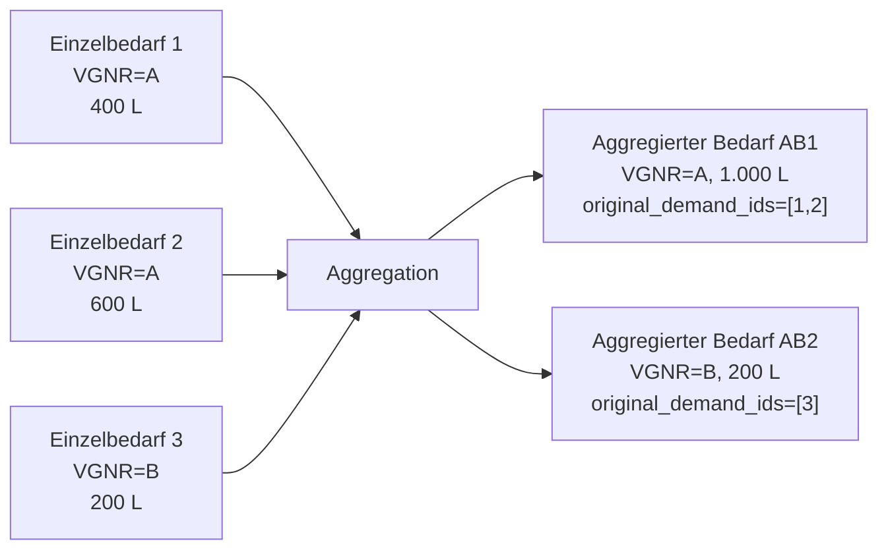

### 4.2 Aggregationsregeln

Für jede VGNR-Gruppe erzeugt die Engine genau einen aggregierten Bedarf nach folgenden Regeln:

| Feld des aggregierten Bedarfs | Herleitung aus den Einzelbedarfen der Gruppe |
|---|---|
| `demand_id` | Neu generierte UUID |
| `article_id` | Muss in allen Einzelbedarfen der Gruppe identisch sein (sonst unmet, siehe 4.3) |
| `quantity` | **Summe** aller Einzelmengen |
| `packaging` | Verpackung des Einzelbedarfs mit der **größten Menge** (`largest_demand.packaging`) |
| `due_date` | **Frühester** Liefertermin aller Einzelbedarfe |
| `priority` | **Höchste** Priorität der Einzelbedarfe (oder `None`, wenn alle None sind) |
| `dispatcher_group` | Erste nicht-leere Dispatcher-Gruppe (muss in allen Einzelbedarfen identisch sein, siehe 4.3) |
| `vgnr_vorschlag` | Übernommen (ist ja der Gruppierungsschlüssel) |
| `successor` | Immer `None` (wird in einem späteren Schritt gesetzt) |
| `original_demand_ids` | Liste der `demand_id`s der Einzelbedarfe, **absteigend sortiert nach Menge** |

Die feldweisen Regeln sind in [`aggregate_demands`](../src/microservice_engine/core/services/demand_aggregation.py) implementiert.

### 4.3 Fehlerfälle -- wann ein Bedarf "unmet" wird

Die Aggregation führt vier Validierungen durch. Fällt ein Einzelbedarf oder eine VGNR-Gruppe durch, werden die betroffenen Einzelbedarfe als Unmet Demand gemeldet (siehe § 8.3 für die Original-Meldungen):

1. **Menge ≤ 0** (`zero_or_negative_quantity`): Einzelbedarfe mit nicht-positiver Menge werden **vor** der Gruppierung aussortiert
2. **Inkonsistente Artikel-IDs in einer VGNR-Gruppe** (`inconsistent_article_id_in_vgnr_group`): Eine VGNR-Gruppe darf nur **einen** Artikel produzieren; sonst werden **alle** Einzelbedarfe der Gruppe als unmet markiert
3. **Inkonsistente Dispatcher-Gruppen in einer VGNR-Gruppe** (`inconsistent_dispatcher_group_in_vgnr_group`): Analog -- Dispatcher-Gruppen müssen einheitlich sein (Nullwerte werden ignoriert)
4. **Keine Verpackung in der VGNR-Gruppe** (`Demand Aggregation found no packaging in VGNR group`): Wenn alle Einzelbedarfe der Gruppe `packaging=None` haben, kann keine Verpackung für den aggregierten Bedarf gewählt werden

### 4.4 Nach der Aggregation

Ab hier arbeitet die gesamte Pipeline nur noch mit **aggregierten Bedarfen**:

- Der Constraint Preparator (Kap. 6) erzeugt Arbeitsgänge pro aggregiertem Bedarf
- Der Solver (Kap. 7) plant aggregierte Bedarfe ein
- Unmet Demands werden pro Einzelbedarf oder pro aggregiertem Bedarf gemeldet -- je nachdem, in welcher Phase sie entstanden sind
- Das Feld `original_demand_ids` bleibt im aggregierten Bedarf erhalten, damit die API-Response (Werkauftrag) wieder zu den ursprünglichen Einzelbedarfen rückreferenzierbar ist

> **Konsequenz für die Kapazitätsgrenze `MAX_DEMANDS_COUNT`:** Diese Einstellung begrenzt die Anzahl **aggregierter** Bedarfe, nicht die Anzahl der Einzelbedarfe aus dem Snapshot. Bei aktiver VGNR-Konsolidierung kann die Anzahl der Einzelbedarfe deutlich höher sein als der Wert in `MAX_DEMANDS_COUNT`.

---

## 5. Der Produktionsprozess

Jeder Bedarf durchläuft eine Kette von Arbeitsgängen -- von der Vorbereitung bis zur Abfüllung. Die folgende Grafik zeigt den typischen Ablauf:

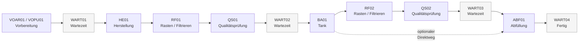

> **Hinweis:** Bei manchen Produkten entfallen die Schritte RF02, QS02 und WART03. In diesen Fällen geht es direkt vom Tank (BA01) zur Abfüllung (ABF01) -- dargestellt durch den gestrichelten Pfeil.

### 5.1 Arbeitsgänge im Detail

| Schritt | Bezeichnung |
|---|---|
| **VOAR01** | Vorbereitung Aroma |
| **VOPU01** | Vorbereitung Pulver |
| **WART01** | Wartezeit 1 |
| **HE01** | Herstellung |
| **RF01** | Rasten und/oder Filtrieren (1) |
| **QS01** | Qualitätsprüfung 1 |
| **WART02** | Wartezeit 2 |
| **BA01** | Bearbeitung / Lagerung |
| **RF02** | Rasten und/oder Filtrieren (2) |
| **QS02** | Qualitätsprüfung 2 |
| **WART03** | Wartezeit 3 |
| **ABF01** | Abfüllung |
| **WART04** | Wartezeit 4 (Abschluss) |
| **COMB** | Kombinierte Bearbeitung + Abfüllung (bei bestimmten Verpackungstypen, siehe 5.3) |

#### Rasten und Filtrieren -- Aufspaltung je nach Sequenz

Die Arbeitsgänge **RF01** und **RF02** stehen für *Rasten und/oder Filtrieren*. Für jeden dieser Arbeitsgänge wird im Artikelstamm eine **Sequenz** hinterlegt, die festlegt, in welcher Reihenfolge gerastet und filtriert werden muss -- und mit welcher Rastdauer.

Die Engine **zerlegt den Arbeitsgang anhand dieser Sequenz automatisch in getrennte Teil-Arbeitsgänge** -- einen für das Rasten und einen für das Filtrieren. Hintergrund: Ein Produkt, das z.B. 24 Stunden rasten muss, darf den Filter während dieser Zeit nicht blockieren. Der Filter wird daher nur für den zeitlich viel kürzeren Filtrier-Schritt belegt, während die Rastdauer auf dem Tank erfolgt.

### 5.2 Benötigte Ressourcen je Arbeitsgang

In ESAROM werden die Typen von Betriebsmitteln als **Funktionen** bezeichnet. Die folgende Tabelle zeigt die **typische** Anzahl benötigter Betriebsmittel pro Funktion und Arbeitsgang (Abweichungen je Arbeitsplan/Rezept möglich). Mitarbeitende sind separat ausgewiesen, da sie nicht im Materialfluss stehen.

| Arbeitsgang | Arbeitsplatz | Tank oder Topf | BA-Anlage | Abfüller | Mitarbeitende |
|---|:---:|:---:|:---:|:---:|:---:|
| **VOAR01 / VOPU01** | 1 | -- | -- | -- | 1+ |
| **WART01** | -- | -- | -- | -- | -- |
| **HE01** | 1 | 1 | -- | -- | 1+ |
| **RF01 -- Rasten** | -- | 1 | -- | -- | -- |
| **RF01 -- Filtrieren** | 1 | 2 | -- | -- | 1+ |
| **QS01** | -- | 1 | -- | -- | -- |
| **WART02** | -- | 1 | -- | -- | -- |
| **BA01** | -- | 2 | 1 | -- | 1 |
| **RF02 -- Rasten** | -- | 1 | -- | -- | -- |
| **RF02 -- Filtrieren** | 1 | 2 | -- | -- | 1+ |
| **QS02** | -- | 1 | -- | -- | -- |
| **WART03** | -- | 1 | -- | -- | -- |
| **ABF01** | -- | 1 | -- | 1 | 1+ |
| **WART04** | -- | -- | -- | -- | -- |
| **COMB** | -- | 2 | 1 | 1 | 1+ |

> **Hinweis:** Nur **WART01** (nach der Vorbereitung) und **WART04** (nach der Abfüllung) brauchen kein Betriebsmittel. Für **WART02**, **WART03**, **QS01** und **QS02** wird zwar keine eigene Betriebsmittel-Anforderung validiert, in der Praxis bleibt das Produkt aber während dieser Zeiten in einem Tank liegen. Die Engine weist die entsprechenden Betriebsmittel dann entsprechend zu (typischerweise derselbe Tank, der schon vom vorangegangenen Arbeitsgang gehalten wird).

Bei Arbeitsgängen, die mehrere Tanks benötigen (z.B. BA01 mit 2 Tanks), müssen beide Tanks gleichzeitig verfügbar und physisch verbunden sein.

#### Materialfluss-Position, Flow-Constraint und dauerbestimmendes Betriebsmittel

Zusätzlich zur reinen *Anzahl* trägt jede Funktion drei Eigenschaften, die das Verhalten der Engine in der Ressourcen-Vorauswahl (Kap. 6) und bei der Optimierung (Kap. 7) bestimmen.

**Position** -- gibt die Reihenfolge im Materialfluss eines Arbeitsgangs vor: Das Produkt startet auf Position 0 (Tank), wird über Position 1 (Leitung) zur Bearbeitung auf Position 2 (Topf, BA-Anlage oder Abfüller) gefördert. Funktionen mit Position `-1` (Mitarbeitende, Arbeitsplatz) stehen außerhalb des Materialflusses.

**Flow-Constraint** -- gibt an, ob zwischen dem zugewiesenen Betriebsmittel an Position *P* und jenem an Position *P+1* eine **physische Verbindung** bestehen muss. Ist der Flow-Constraint aktiv, prüft die Engine (Kap. 6.5) entlang der hinterlegten Verrohrung, ob eine zulässige Kette existiert -- andernfalls wird der Bedarf als unmet gemeldet.

**Dauerbestimmend** -- legt fest, welche Funktion den **Durchsatz** (und damit die Dauer) des Arbeitsgangs vorgibt. Bei HE01 bestimmt der Arbeitsplatz die Dauer, nicht der Tank; bei ABF01 der Abfüller; bei BA01 die BA-Anlage. Tanks und Leitungen sind nie dauerbestimmend -- sie werden lediglich belegt.

Zusätzlich gilt: Zwischen zwei aufeinanderfolgenden **Arbeitsgängen** kann eine Flow-Kontinuität erzwungen werden, wenn das Produkt nicht zwischengelagert werden darf (siehe 5.5.3).

### 5.3 Wann wird COMB statt BA01 + ABF01 verwendet?

Bei bestimmten Verpackungstypen kann die Bearbeitung (BA01) und die Abfüllung (ABF01) **nicht getrennt** ablaufen, sondern müssen in **einem zusammenhängenden Arbeitsgang** durchgeführt werden. Dieser zusammengeführte Arbeitsgang heißt **COMB** (engl. *combined*).

#### Wie wird die Entscheidung getroffen?

Die Engine prüft für jeden Bedarf die zugehörige Verpackungs-ID gegen eine Whitelist (`MERGE_PROCESSING_PACKAGING_IDS`). Ist die Verpackungs-ID in dieser Liste enthalten, wird COMB verwendet -- ansonsten BA01 + ABF01 als getrennte Arbeitsgänge.

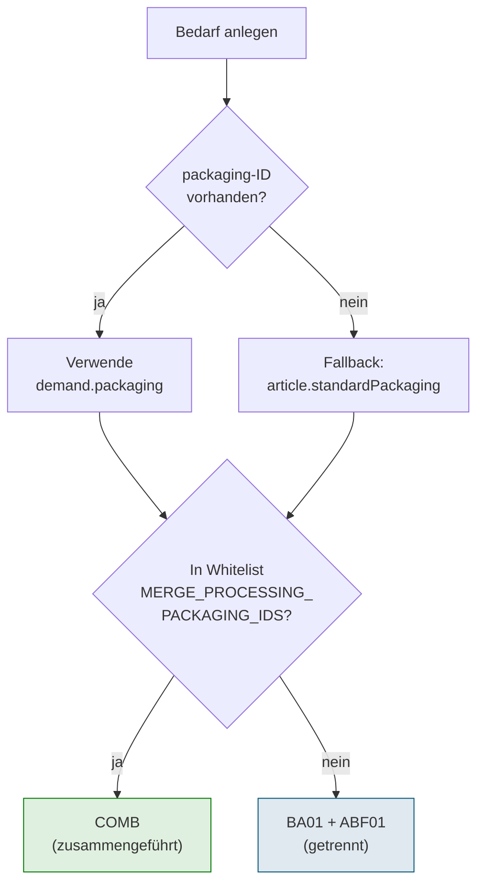

**Reihenfolge der Prüfung:**

1. Ist im Bedarf eine Verpackungs-ID gesetzt (`demand.packaging`)? Wenn ja, diese verwenden
2. Ansonsten: Standard-Verpackung des Artikels verwenden (`article.standardPackaging`)
3. Diese Verpackungs-ID gegen die Whitelist prüfen

#### Whitelist der COMB-auslösenden Verpackungen

Standardmäßig sind folgende Verpackungs-IDs in der Whitelist enthalten (Setting `MERGE_PROCESSING_PACKAGING_IDS`):

| Verpackungs-ID |
|---|
| `70387` |
| `70653` |
| `71357` |
| `71358` |

> Diese Liste kann pro Planungslauf über das Snapshot-Feld `mergeProcessingPackagingIds` (siehe [9.3.1](#931-offiziell-dokumentierte-solverconfig-felder)) oder dauerhaft über die Umgebungsvariable `MERGE_PROCESSING_PACKAGING_IDS` (komma-separiert) angepasst werden.

#### Auswirkung auf den Arbeitsplan

Wenn COMB verwendet wird, gelten folgende Einschränkungen am zugehörigen Arbeitsplan -- die Engine validiert dies und meldet einen Fehler, falls eine dieser Einschränkungen verletzt ist:

| Schritt | Bei COMB |
|---|---|
| **BA01** | entfällt, wird durch COMB ersetzt |
| **ABF01** | entfällt, wird durch COMB ersetzt |
| **RF02** (Rasten und Filtrieren 2) | **nicht erlaubt** -- Artikel mit COMB-Verpackung dürfen keine RF02-Stufe haben |
| **QS02** (Qualitätsprüfung 2) | **nicht erlaubt** |
| **WART03** (Wartezeit 3) | **nicht erlaubt** |

> **Für Schichtführung:** Erscheint im Plan ein COMB-Arbeitsgang, wurde dieser automatisch wegen der Verpackung des Artikels gewählt. Die Bedienung erfolgt am BA-Betriebsmittel und am Abfüller gleichzeitig -- die Ressourcenanforderungen entsprechen denen in der Tabelle in [Abschnitt 5.2](#52-benötigte-ressourcen-je-arbeitsgang).
>
> **Für IT/Stammdaten:** Wird ein neuer Verpackungstyp eingeführt, der COMB benötigt, muss seine ID in `MERGE_PROCESSING_PACKAGING_IDS` ergänzt werden.

#### Wichtige Einschränkung: konkurrierende Arbeitsgänge in der COMB-Kette

Damit COMB tatsächlich erzeugt werden kann, **darf in der zusammenzuführenden Kette zwischen WART02 und WART04 außer BA01 und ABF01 kein weiterer Arbeitsgang entstehen**. Das betrifft konkret die Schritte **RF02, QS02 und WART03**: Sind im `workItemConfig` des betroffenen Artikels für einen dieser Schritte `rampUpTime` oder `netTimeFactor` ungleich 0, würde der Schritt erzeugt werden -- und der Bedarf kann **nicht verarbeitet werden**.

In diesem Fall wird der Bedarf als **Unmet Demand** mit der Meldung **"unable to create work operations"** im Solver-Ergebnis aufgeführt. Die übrigen Bedarfe werden normal eingeplant.

> **Wann tritt das auf?** In der Praxis nur, wenn ein Artikel sowohl eine COMB-Verpackung verwendet als auch einen Arbeitsplan mit non-trivialen Zeiten für RF02 / QS02 / WART03 referenziert. Korrekturmöglichkeiten:
>
> - Stamm-Daten anpassen: Im `workItemConfig` des Artikels die Zeiten für RF02 / QS02 / WART03 auf 0 setzen
> - Verpackung ändern: Bedarf auf eine Verpackung umstellen, die nicht in `MERGE_PROCESSING_PACKAGING_IDS` enthalten ist
> - Whitelist anpassen: Verpackungs-ID aus `MERGE_PROCESSING_PACKAGING_IDS` entfernen, falls die Merge-Logik für diese Verpackung nicht (mehr) gewünscht ist

Mehr Hintergrund zum allgemeinen Mechanismus, wann ein Arbeitsgang entfällt, im nächsten Abschnitt.

### 5.4 Wann entfällt ein Arbeitsgang?

Nicht jeder im Arbeitsplan vorgesehene Schritt wird tatsächlich als Arbeitsgang in den Solver eingebracht. Ob ein Arbeitsgang entsteht oder entfällt, entscheidet die Engine **pro Bedarf und pro Schritt** anhand der Werte im `workItemConfig` des zugehörigen Artikels.

#### Die Regel

Ein Arbeitsgang wird **nur dann erzeugt**, wenn für den entsprechenden `workItemKey` im Artikel **mindestens einer** der beiden folgenden Werte ungleich 0 ist:

- **`rampUpTime`** -- Rüstzeit des Arbeitsgangs (chargenmengen-unabhängig)
- **`netTimeFactor`** -- Korrekturfaktor für die Netto-Bearbeitungszeit (chargenmengen-abhängig, multipliziert mit dem Anlagendurchsatz)

Sind **beide Werte 0** (oder im Artikel nicht definiert), entfällt der Arbeitsgang für diesen Bedarf vollständig -- weder Vorbereitung noch Bearbeitungszeit, keine Ressourcenbelegung.

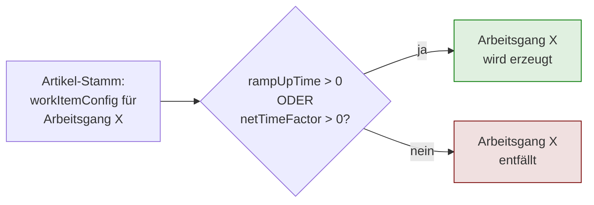

#### Beispiele

| Artikel-Konfiguration für RF01 | Ergebnis |
|---|---|
| `rampUpTime: 60.0`, `netTimeFactor: 0.016` | Arbeitsgang RF01 wird erzeugt (Rasten und Filtrieren mit Zeitvorgabe) |
| `rampUpTime: 0`, `netTimeFactor: 0` | Arbeitsgang RF01 entfällt (kein Rast-/Filtrier-Schritt für diesen Artikel) |
| `rampUpTime: 0`, `netTimeFactor: 0.5` | Arbeitsgang RF01 wird erzeugt (nur mengenabhängig) |
| `rampUpTime: 30.0`, `netTimeFactor: 0` | Arbeitsgang RF01 wird erzeugt (nur Rüstzeit) |
| `workItemKey` nicht im `workItemConfig` enthalten | Arbeitsgang entfällt (gleiches Verhalten wie beide Werte = 0) |

#### Praktische Bedeutung

- **Modellierung optionaler Schritte:** Steht in einem Arbeitsplan-Template z.B. ein Rast-/Filtrier-Schritt RF02, der nur für einen Teil der Artikel erforderlich ist, wird er bei den übrigen Artikeln einfach durch Zeit-Werte 0 unterdrückt
- **Datenqualität:** Fehlen die Zeiten für einen tatsächlich benötigten Schritt, "verschwindet" dieser still aus dem Plan -- die Stamm-Daten sollten regelmäßig auf Plausibilität geprüft werden
- **Wechselwirkung mit COMB:** Siehe [Abschnitt 5.3](#53-wann-wird-comb-statt-ba01-abf01-verwendet) -- bei COMB-Verpackungen müssen RF02 / QS02 / WART03 zwingend entfallen, sonst wird der Bedarf zum Unmet Demand

#### Pflicht-Arbeitsgänge: definierter Start und definiertes Ende

Ein Bedarf ist nur dann planbar, wenn die Engine für ihn eine **vollständige Kette mit definiertem Start und Ende** erzeugen kann. Andernfalls wird der Bedarf als Unmet Demand markiert.

| Position | Pflicht-Arbeitsgang | Optional davor / danach |
|---|---|---|
| **Start** | **HE01** (Herstellung) | optional davor: VOAR01 (Vorbereitung Aroma) und/oder VOPU01 (Vorbereitung Pulver) |
| **Ende** | **ABF01** (Abfüllung) -- oder **COMB**, wenn die Verpackung in der Whitelist enthalten ist (siehe [5.3](#53-wann-wird-comb-statt-ba01-abf01-verwendet)) | optional danach: WART04 (Abschluss-Wartezeit) |

**Konkret heißt das:**

- **HE01 muss erzeugt werden** -- d.h. im `workItemConfig` des Artikels muss für `HE01` mindestens einer der Werte `rampUpTime` oder `netTimeFactor` ungleich 0 sein
- **ABF01** (bzw. **COMB** bei Merge-Verpackung) **muss erzeugt werden** -- analoge Bedingung
- **VOAR01 / VOPU01** sind reine Vorbereitungs-Schritte und dürfen entfallen -- sie sind explizit aus den Konnektivitäts-Prüfungen ausgenommen
- Alle dazwischenliegenden Schritte (WART01, RF01, QS01, WART02, BA01, RF02, QS02, WART03, WART04) dürfen entfallen, sofern sie für den jeweiligen Artikel nicht benötigt werden

> **Konsequenz für die Stamm-Daten:** Beim Anlegen eines neuen Artikels muss zwingend ein `workItemConfig`-Eintrag mit nicht-trivialen Zeiten für **HE01** und für **ABF01** (oder bei COMB-Verpackung implizit für den COMB-Schritt) hinterlegt werden. Fehlen diese, wird **jeder** Bedarf des Artikels als Unmet Demand zurückgemeldet. Die Whitelist der Start- bzw. End-Arbeitsgänge ist intern in den Settings `START_WORK_ITEMS` und `END_WORK_ITEMS` definiert (Standard `["HE01"]` / `["ABF01"]`); `EXCLUDED_WORK_ITEMS` (Standard `["VOAR01", "VOPU01"]`) listet die optionalen Vorgänger-Arbeitsgänge.

### 5.5 Wie ist ein Arbeitsgang intern definiert?

Jeder Arbeitsgang-Typ (HE01, BA01, ABF01, ...) hat eine fest hinterlegte interne Definition, die drei Dinge regelt:

1. **Welche Funktionen werden benötigt und in welcher Reihenfolge** durchströmt das Material die Betriebsmittel? (Position 0, 1, 2, ...)
2. **Welches Betriebsmittel bestimmt die Dauer** des Arbeitsgangs? (`duration-defining`)
3. **Muss am Übergang zum vorhergehenden Arbeitsgang Tank-/Topf-Kontinuität** eingehalten werden? (`requires_predecessor_flow`)

Diese Definition ist **nicht** Teil der Stamm-Daten -- sie ist im Code festgelegt und wird vom Kunden nicht konfiguriert. Sie ist hier dokumentiert, damit nachvollziehbar ist, **warum die Engine bestimmte Equipment-Kombinationen plant und andere nicht**.

#### 5.5.1 Reihenfolge der Funktionen im Materialfluss (Position)

Innerhalb eines Arbeitsgangs erhält jede benötigte Funktion eine **Position**, die ihre Stelle im physischen Materialfluss angibt:

- **Position 0**: Erstes Betriebsmittel im Fluss (typisch ein Tank oder Topf, in dem das Material zu Beginn liegt)
- **Position 1, 2, ...**: Nachfolgende Betriebsmittel in Fließrichtung
- **Position -1**: Funktion ohne Materialfluss (z.B. Person -- Mitarbeitende stehen nicht im Rohrsystem)

**Beispiel BA01 (Bearbeitung):**

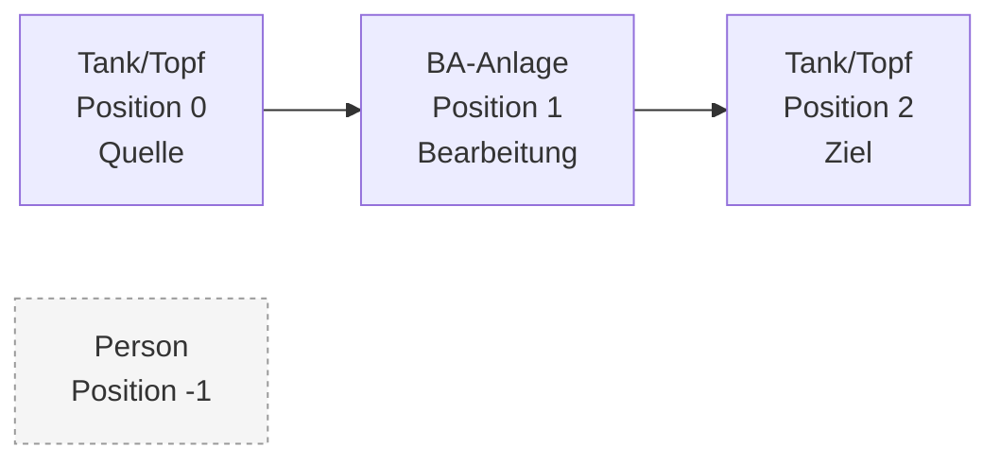

Die Engine sorgt automatisch dafür, dass das Betriebsmittel an Position P **physisch verbunden** ist mit jenem an Position P-1 (Verrohrung) -- sonst kann das Material gar nicht fließen. Falls keine direkte Verbindung existiert, kann eine **Leitung** als verbindendes Element automatisch eingeplant werden (siehe [Abschnitt 6.5](#65-rohrverbindungen-prüfen-fluss-reduktion)).

#### 5.5.2 Welches Betriebsmittel bestimmt die Dauer? (`duration-defining`)

Pro Arbeitsgang ist **genau ein Funktionstyp** als **dauerbestimmend** (`defines_duration = true`) markiert. Dieses Betriebsmittel bestimmt, **wie lange der Arbeitsgang konkret dauert**. Die Berechnung erfolgt nach folgendem Schema (vereinfacht):

```text
Dauer [s] = Rüstzeit [s] + (Zeitfaktor x 3600 x Bedarfsmenge / Durchsatz des Betriebsmittels)
```

- Hat das dauerbestimmende Betriebsmittel einen **Durchsatz** (Liter/Stunde), skaliert die Dauer mit der Bedarfsmenge
- Ist der **Zeitfaktor 0** (z.B. bei einer reinen Qualitätsprüfung), entfällt der mengen-abhängige Teil und die Dauer ist eine **Konstante** (nur Rüstzeit)
- Der Faktor **3600** rechnet Stunden (Durchsatz-Einheit im Artikelstamm) in Sekunden (interne Solver-Einheit) um
- Andere Betriebsmittel des Arbeitsgangs (`defines_duration = false`) bekommen die **gleiche Dauer** zugewiesen -- sie sind die ganze Zeit blockiert, auch wenn sie selbst nicht "arbeiten" (z.B. der Tank/Topf, aus dem gepumpt wird)

**Beispiele:**

| Arbeitsgang | Dauerbestimmende Funktion | Verhalten |
|---|---|---|
| **BA01** | BA-Anlage (Position 1) | mengenabhängig -- abhängig vom Durchsatz der konkret zugewiesenen BA-Anlage |
| **ABF01** | Abfüller (Position 1) | mengenabhängig -- hängt vom Durchsatz des konkret zugewiesenen Abfüllers ab |
| **HE01** | Arbeitsplatz (Position 0) | je nach `workItemConfig` mengenabhängig oder konstant |
| **QS01 / QS02** | Tank/Topf (Position 0) | typisch **konstant** -- die Prüfung dauert immer gleich lang, unabhängig von der Menge |
| **WART01 / WART02 / WART03 / WART04** | (Tank/Topf, falls relevant) | Artikelstamm-Wert ist **Untergrenze** -- der Solver darf länger einplanen, wenn nachfolgende Schritte noch nicht bedient werden können |
| **COMB** | BA-Anlage (Position 1) | mengenabhängig -- die Abfüller-Geschwindigkeit (Position 3) wird in der Dauer derzeit **nicht** berücksichtigt (vereinfachte Annahme) |

> **Hinweis zu Mehrfach-Durchgängen bei BA01:** Verlangt der Artikel eine BA-Sequenz wie z.B. "HPHas", muss das Material mehrfach durch die BA-Anlage geschickt werden. Die effektive Dauer wird entsprechend hochgerechnet (`Durchsatz / Anzahl Durchgänge`). Bei mehr als einem Durchgang werden zudem **automatisch zwei Tanks/Töpfe** statt einem reserviert (Hin- und Her-Pumpen).

#### 5.5.3 Tank-/Topf-Kontinuität zwischen Arbeitsgängen (`requires_predecessor_flow`)

Wenn ein Bedarf von einem Arbeitsgang zum nächsten übergeht, gibt es zwei Möglichkeiten:

| Flag | Bedeutung |
|---|---|
| **`requires_predecessor_flow = true`** | Der Tank/Topf am **Beginn** dieses Arbeitsgangs (Position 0) muss **identisch** sein mit dem Tank/Topf am **Ende** des Vorgänger-Arbeitsgangs (max. Position). Das Material bleibt im selben Tank/Topf liegen und wird dort vom nächsten Schritt übernommen |
| **`requires_predecessor_flow = false`** | Es gibt keine solche Bindung. Der Folgeschritt darf einen anderen Tank/Topf wählen |

**Warum dieser Unterschied?** Die meisten Arbeitsgänge verarbeiten **Flüssigkeiten**, die nicht außerhalb von Tanks zwischengelagert werden können -- die Kette muss also tank-/topf-kontinuierlich sein. Eine Ausnahme bilden die Vorbereitungs-Arbeitsgänge **VOAR01 / VOPU01** und der Start **HE01**: Hier werden noch keine Flüssigkeiten gehandhabt, sondern feste Zutaten (Aroma, Pulver) zusammengetragen. Erst in HE01 entsteht das flüssige Produkt. Vor HE01 gibt es daher nichts, was im Tank/Topf "verbleiben" muss.

**Welche Arbeitsgänge haben welches Flag?**

| Arbeitsgang | `requires_predecessor_flow` | Begründung |
|---|:---:|---|
| VOAR01 / VOPU01 | nein | Vorbereitung -- keine Flüssigkeit, kein Materialfluss aus einem Vorgänger |
| WART01 | nein | kein Equipment, keine Verbindung |
| **HE01** | **nein** | Start des Flüssigkeits-Flusses -- erstmalige Befüllung |
| RF01 | ja | Rasten und Filtrieren im selben Tank wie HE01 |
| QS01 / QS02 | ja | Prüfung im selben Tank |
| WART02 | ja | Pufferzeit im selben Tank |
| BA01 | ja | Bearbeitung -- Eingangs-Tank/Topf = Ende von WART02 |
| RF02 | ja | analog RF01 |
| WART03 | ja | analog WART02 |
| **ABF01** | **ja** | Abfüllung -- Eingangs-Tank/Topf = Ende des vorherigen Schritts |
| **COMB** | **ja** | analog BA01 + ABF01 |
| WART04 | nein | kein Equipment |

> **Praktische Auswirkung:** Im Plan kann es vorkommen, dass die Engine einen Bedarf nicht einplanen kann, weil **keine Tank-Kette** existiert, in der das Material vom HE01-Topf bis zum Abfüller durchgehend in verbundenen Tank-/Topf-Einheiten liegen kann. In solchen Fällen wird der Bedarf als Unmet Demand mit Verweis auf die Fluss-Prüfung gemeldet (siehe [Abschnitt 6.5](#65-rohrverbindungen-prüfen-fluss-reduktion)).

#### 5.5.4 Hinweis zur aktuellen Implementierung: Arbeitsplan im Snapshot wird nicht ausgewertet

Die in diesem Abschnitt 5.5 beschriebenen Strukturen (Positionen/Fluss innerhalb eines Arbeitsgangs, dauerbestimmende Funktion, Pflicht-Arbeitsgänge HE01/ABF01, `requires_predecessor_flow`) sind in der aktuellen Implementierung **fest im Code verankert** und stammen **nicht** aus dem im Snapshot mitgelieferten `workPlan`-Objekt.

**Hintergrund:** Im API-Schema gibt es ein `workPlan`-Objekt pro Artikel mit `ProcessStep`-Einträgen (`rampupTimeEquipment`, `netTimeEquipment`, `workItemKey`, ...). Dieses Objekt wird **momentan nicht ausgewertet**, weil sich im Verlauf der Implementierung zeigte, dass für eine korrekte Planung deutlich mehr Informationen nötig sind (Position im Materialfluss, dauerbestimmende Funktion, Flow-Flags, Pflicht-Charakter von Start/Ende), die der `workPlan` in seiner jetzigen Form nicht liefert. Die fehlenden Informationen ließen sich gut über die bereits vorhandenen Felder in `Article` (`workItemConfigs` mit `rampUpTime` / `netTimeFactor`) und über hart codierte Default-Strukturen abbilden, daher wurde dieser Weg gewählt.

**Welche Informationen sind aktuell hart codiert und müssten für echte Konfigurierbarkeit aus dem Arbeitsplan kommen?**

| Information | aktuell | für echte Konfigurierbarkeit |
|---|---|---|
| Reihenfolge der Funktionen im Materialfluss (Position 0, 1, 2, ...) pro Arbeitsgang-Typ | hart codiert | pro `workItemKey` im Arbeitsplan definierbar |
| Dauerbestimmende Funktion pro Arbeitsgang-Typ | hart codiert | pro `workItemKey` im Arbeitsplan definierbar |
| `requires_predecessor_flow` pro Arbeitsgang-Typ | hart codiert | pro `workItemKey` im Arbeitsplan definierbar |
| Start- und End-Arbeitsgang (`START_WORK_ITEMS` / `END_WORK_ITEMS`) | Settings-Wert `["HE01"]` / `["ABF01"]` | pro Arbeitsplan definierbar |
| Liste der von der Konnektivitätsprüfung ausgenommenen Arbeitsgänge (`EXCLUDED_WORK_ITEMS`) | Settings-Wert `["VOAR01", "VOPU01"]` | pro Arbeitsplan definierbar |

**Praktische Konsequenz:**

- Aus Kundensicht: Artikel, die **abweichende Flussstrukturen** oder **andere Start-/End-Arbeitsgänge** als die hier dokumentierten benötigen würden, können **heute nicht** abgebildet werden -- die Engine geht für alle Artikel vom gleichen Grundschema aus
- Aus IT-Sicht: Wenn neue Produkttypen mit abweichenden Prozessen eingeführt werden sollen, ist eine **Code-Änderung** in der Solver Engine nötig. Eine Erweiterung der API/des Arbeitsplan-Modells zu einer echten Konfigurierbarkeit ist möglich, aber noch nicht umgesetzt

> Das `workPlan`-Feld im Snapshot darf weiterhin übergeben werden -- es wird vom Snapshot-Validator auf Schema-Konformität geprüft, aber inhaltlich **nicht** zur Laufzeit der Engine herangezogen. Für die Planung zählen ausschließlich die hart codierten Definitionen und die `workItemConfigs` des Artikels.

---

## 6. Ressourcen-Vorauswahl (Constraint Preparator)

Der Constraint Preparator ist die Vorbereitungsstufe der Planungs-Engine. Er reduziert für jeden Arbeitsgang die Anzahl der möglichen Betriebsmittel und Mitarbeitende auf eine handhabbare Menge. Dies geschieht in mehreren Stufen:

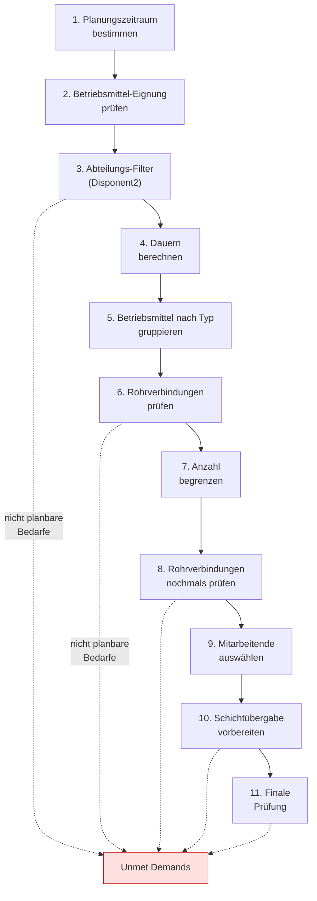

Bei jeder dieser Stufen können Bedarfe als **nicht planbar** erkannt werden (z.B. weil keine geeignete Betriebsmittel verfügbar ist). Diese werden transparent gemeldet und nicht weiter betrachtet (siehe Abschnitt 8).

### 6.1 Planungszeitraum bestimmen

Die Engine bestimmt vor jedem Planungslauf zwei Zeitpunkte: `planning_period_start` und `planning_period_end`. Nur innerhalb dieses Zeitfensters werden Bedarfe eingeplant, und nur die in diesem Fenster liegenden Betriebsmittel-Verfügbarkeiten und Mitarbeitenden-Schichten werden berücksichtigt.

#### Ende des Planungshorizonts (`planning_period_end`)

Das Ende ist in allen Fällen gleich definiert:

```text
planning_period_end = spätestes dueDate aller Bedarfe + PLANNING_PERIOD_AFTER_LAST_DUE_DATE_DAYS
```

Standardwert: **30 Tage** nach dem spätesten Liefertermin (Setting `PLANNING_PERIOD_AFTER_LAST_DUE_DATE_DAYS`). Dieser großzügige Puffer stellt sicher, dass auch Bedarfe, die notgedrungen nach ihrem Termin eingeplant werden müssen (Verspätung), noch im Zeitfenster Platz finden.

#### Start des Planungshorizonts (`planning_period_start`)

Für den Start gibt es **drei Modi**, gesteuert über das Setting `PLANNING_START_MODE` (bzw. das Snapshot-Feld `planningStartMode`):

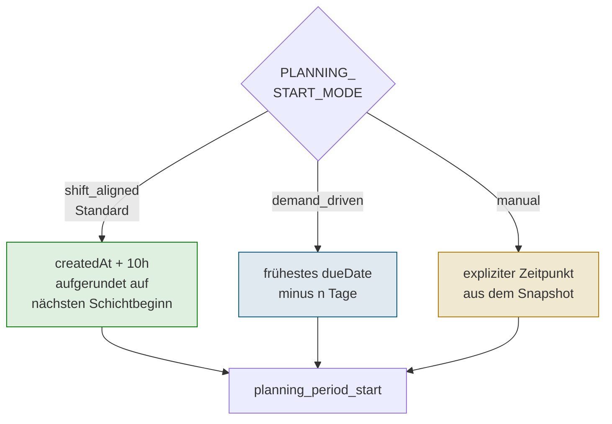

**Modus 1: `shift_aligned` (Standard)**

```text
Ausgangspunkt  = snapshot.metadata.createdAt + PLANNING_START_LOOKAHEAD_HOURS
planning_start = Beginn der ersten Mitarbeitenden-Schicht, die >= Ausgangspunkt liegt
```

- `PLANNING_START_LOOKAHEAD_HOURS` (Standard: 10 Stunden) ist die Mindestvorlaufzeit, die zwischen dem Erstellungs-Zeitpunkt des Snapshots und dem Planungsbeginn liegen muss -- um realistisch nicht "gerade jetzt" mit der Produktion anzufangen, sondern erst mit dem nächsten vernünftigen Schichtstart
- Der eigentliche Startzeitpunkt ergibt sich aus der frühest möglichen **Mitarbeitenden-Verfügbarkeit** (`WorkerAvailability.startDatetime`) nach diesem Vorlauf. Damit ist garantiert, dass ab `planning_period_start` tatsächlich Personal im Haus ist
- Benötigt Mitarbeitenden-Verfügbarkeitsdaten im Snapshot

**Modus 2: `demand_driven` (Legacy-Verhalten)**

```text
planning_start = frühestes dueDate aller Bedarfe - PLANNING_PERIOD_BEFORE_FIRST_DUE_DATE_DAYS
```

- Standardpuffer: **2 Tage** vor dem frühesten Liefertermin (Setting `PLANNING_PERIOD_BEFORE_FIRST_DUE_DATE_DAYS`)
- Ignoriert Mitarbeitenden-Schichten -- der Zeitpunkt kann daher auf ein Wochenende oder außerhalb einer Schicht fallen
- Einfache Logik ohne Abhängigkeit vom Erstellungs-Zeitpunkt des Snapshots

**Modus 3: `manual`**

```text
planning_start = snapshot.solverConfig.manualPlanningStartDatetime
```

- Der Startzeitpunkt wird **explizit** im Snapshot übergeben (Feld `manualPlanningStartDatetime`, UTC ISO 8601 mit `Z`-Suffix, z.B. `"2026-05-25T06:00:00Z"`)
- Pflicht-Feld, sobald `planningStartMode = "manual"` gesetzt ist
- Nützlich für Tests, What-if-Szenarien oder wenn der Start exakt aus einem vorgelagerten Prozess vorgegeben werden soll

#### Auswirkung auf die Betriebsmittel

Sobald `planning_period_start` und `planning_period_end` feststehen, werden die im Snapshot enthaltenen Verfügbarkeitsdaten auf dieses Fenster zugeschnitten:

- Betriebsmittel, die **außerhalb** des Zeitfensters in Revision oder Wartung sind, werden **normal eingeplant** (ihre Unverfügbarkeit ist für diesen Lauf irrelevant)
- Betriebsmittel, die *innerhalb* des Fensters dauerhaft nicht verfügbar sind, werden **ignoriert**
- Mitarbeitenden-Schichten, die außerhalb des Fensters liegen, werden **ignoriert**

**Beispiel (Modus `shift_aligned`):**

> Snapshot erstellt am **1. März 10:00**, frühestes dueDate = 15. März, spätestes dueDate = 20. März.
>
> - Ausgangspunkt: 1. März 10:00 + 10h = **1. März 20:00**
> - Nächste Mitarbeitenden-Schicht ab 2. März 06:00 --> `planning_period_start` = **2. März 06:00**
> - `planning_period_end` = 20. März + 30 Tage = **19. April**

### 6.2 Betriebsmittel-Eignung prüfen

#### Grundfilter

Für jeden Arbeitsgang werden Betriebsmittel nach drei Kriterien gefiltert:

1. **Verfügbarkeit:** Ist das Betriebsmittel im Planungszeitraum nicht in Wartung oder Revision?
2. **Losgröße:** Liegt die Bedarfsmenge im gültigen Min/Max-Bereich des Betriebsmittels?
3. **Arbeitsgang-Typ:** Unterstützt das Betriebsmittel diesen Arbeitsgang (z.B. HE01, ABF01)?

Zusätzlich werden bei ABF01-Schritten (Abfüllung) nur Betriebsmittel berücksichtigt, die mit dem jeweiligen **Verpackungstyp** kompatibel sind (z.B. Glasflasche, Bag-in-Box).

#### Backward Pass und Forward Pass: Verrohrungs-Konsistenz

Nach dem Grundfilter können immer noch Betriebsmittel übrig bleiben, die zwar für sich allein geeignet, aber mit den geeigneten Nachbarn in der Produktionskette **nicht verrohrt** sind. Zwei aufeinanderfolgende Läufe sorgen dafür, dass nur solche Betriebsmittel übrig bleiben, die tatsächlich **durchgehend verbunden** sind:

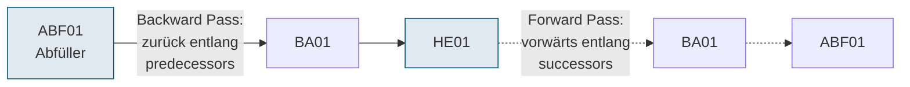

**Backward Pass (Rückwärtsdurchlauf):**

- **Startpunkt:** die letzten Arbeitsgänge der Kette -- **ABF01 bzw. COMB** (Abfüllung). Deren eingeschränktes Kandidaten-Set ergibt sich aus der Verpackungs-Kompatibilität (nicht jeder Abfüller kann jede Verpackung)
- **Ablauf:** Für jeden aktuellen Arbeitsgang werden die **Equipment-Predecessors** (Betriebsmittel, die laut Verrohrung Vorgänger sein können) gesammelt und als neue Kandidaten für den **vorangehenden Arbeitsgang** zugelassen -- aber nur, wenn das Predecessor-Equipment im Grundfilter-Set dieses Arbeitsgangs liegt und den passenden `work_item_key` hat
- **Iteration:** Innerhalb einer Arbeitsgang-Übergang-Paarung wird bis zu `MAX_ITERATION_COUNT` (Standard 5) mal propagiert, um auch indirekte Verbindungen (A -> B -> C über mehrere Hops gleicher Resource-Sets) zu erfassen
- **Sonderfälle:** VOAR01/VOPU01 erhalten alle Betriebsmittel, die ihren `work_item_key` unterstützen; WART01/WART04 bekommen eine leere Liste (kein Equipment)

Nach dem Backward Pass enthält jeder Arbeitsgang eine **Obergrenze** seiner möglichen Betriebsmittel -- jede darin enthaltene Einheit hat theoretisch eine Verbindung bis zum Endpunkt (ABF01/COMB).

**Forward Pass (Vorwärtsdurchlauf):**

- **Startpunkt:** die ersten Produktionsschritte -- **HE01** (Start der Flüssigkeits-Kette)
- **Ablauf:** Für jeden Arbeitsgang wird geprüft, ob jedes Betriebsmittel seines Nachfolgers über die **Equipment-Successors** des aktuellen Arbeitsgangs erreichbar ist. Nicht erreichbare Betriebsmittel werden aus dem Nachfolger **entfernt**
- **Iteration:** Auch hier bis zu `MAX_ITERATION_COUNT` Mal pro Nachfolger, um mehrstufige Erreichbarkeit (A -> B -> C) zu erkennen
- **Sonderfälle:** VOAR01, VOPU01, WART01, WART04 sind von der Konnektivitäts-Prüfung ausgenommen -- sie hängen nicht physisch im Fluss (WART01/04 haben kein Equipment; VOAR01/VOPU01 bearbeiten noch Feststoffe)

Nach dem Forward Pass enthält jeder Arbeitsgang nur noch Betriebsmittel, die von **beiden** Seiten aus (vom Start HE01 und vom Ende ABF01) erreichbar sind.

#### Self-Loops: Dasselbe Betriebsmittel für aufeinanderfolgende Arbeitsgänge

Ein Betriebsmittel ist automatisch **sein eigener Predecessor** (Self-Loop). Dadurch kann z.B. ein Tank T07 sowohl für RF01 (Rasten und Filtrieren) als auch für das folgende QS01 (Qualitätskontrolle) verwendet werden -- das Produkt muss nicht für jede Stufe in einen anderen Tank umgepumpt werden. Voraussetzung: T07 unterstützt beide `work_item_keys`.

#### Warum ist das so wichtig?

Ohne Backward- und Forward-Pass müsste der Solver im schlechtesten Fall für jede Kombination von Betriebsmitteln über alle Arbeitsgänge einzeln prüfen, ob sie zusammen passt. Die Pass-Algorithmen eliminieren diesen Aufwand, indem sie die physikalische Verrohrungs-Topologie bereits in der Vorbereitungsphase auswerten. Bedarfe, für die am Ende kein durchgehender Pfad existiert, werden als **Unmet Demand** gemeldet.

#### Abteilungs-Filter (Disponent2)

Nach dem Backward/Forward-Pass wird jedes Betriebsmittel zusätzlich auf **Abteilungs-Kompatibilität** geprüft: Ein Betriebsmittel ist nur dann geeignet, wenn seine hinterlegte `department_id` mit der `department_id` des Artikels übereinstimmt (Disponent2 / BM0110). Betriebsmittel ohne Abteilungs-Einschränkung (kein `department_id` gesetzt) sind für alle Artikel zulässig (Abwärtskompatibilität).

Bleibt nach dem Abteilungs-Filter für einen Arbeitsgang kein Betriebsmittel mehr übrig, wird der gesamte Bedarf als **Unmet Demand** gemeldet (siehe [Abschnitt 8.3](#83-nicht-planbare-bedarfe-unmet-demands-je-phase) → Phase: Constraint Preparator -- Abteilungs-Filter).

### 6.3 Dauern berechnen

Für jede Kombination aus Bedarf und geeigneter Betriebsmittel berechnet die Engine die voraussichtliche Bearbeitungsdauer:

**Standardformel (Ergebnis in Sekunden):**

```
Dauer [s] = Rüstzeit [s] + (Zeitfaktor x 3600 x Bedarfsmenge / Durchsatz des Betriebsmittels)
```

- **Rüstzeit:** Konstante Rüstzeit (aus dem Artikelstamm, in Sekunden) -- unabhängig von der Bedarfsmenge
- **Zeitfaktor:** Dimensionsloser Multiplikator aus dem Artikelstamm
- **Durchsatz:** Kapazität des Betriebsmittels in Liter pro Stunde
- **Faktor 3600:** Umrechnung von Stunden (Artikelstamm-/Snapshot-Einheit beim Durchsatz) in Sekunden (interne Solver-Einheit)

**Sonderfälle:**

- **WART01 / WART02 / WART03 / WART04** (Wartezeiten): Die im Artikelstamm hinterlegte Dauer ist eine **Untergrenze**. Der Solver darf für diese Wartezeiten bei Bedarf **auch mehr Zeit** einplanen (z.B. wenn nachfolgende Arbeitsgänge noch nicht starten können, weil Betriebsmittel oder Mitarbeitende gerade belegt sind). Nach oben begrenzt wird die Wartezeit global durch `WAITINGTIME_MAX_SECONDS` (Standard 72 h).
- **BA01**: Berücksichtigt die Bearbeitungssequenz (z.B. "Homogenisieren, Pasteurisieren") und berechnet die Anzahl der notwendigen Durchgänge
- **COMB** (Kombiniert): Verwendet die gleiche Logik wie BA01

### 6.4 Betriebsmittel nach Typ gruppieren

Viele Arbeitsgänge benötigen **gleichzeitig mehrere Betriebsmittel verschiedener Funktionen** (z.B. Tank + BA-Anlage + Tank). Die Engine ordnet jedes geeignete Betriebsmittel einer Position im Materialfluss zu:

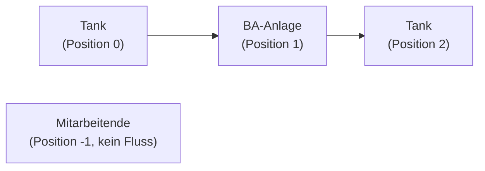

Die Positionsnummern spiegeln den physischen Materialfluss wider: Das Produkt wird z.B. aus einem Tank (Position 0) über eine BA-Anlage (Position 1) in einen Tank (Position 2) gepumpt. Mitarbeitende haben Position -1, da sie nicht im Materialfluss stehen.

### 6.5 Rohrverbindungen prüfen (Fluss-Reduktion)

Während Backward/Forward Pass (6.2) die Kandidaten auf der flachen Ebene `eligible_equipment` reduziert, arbeitet der **Flow-based Reducer** auf der reichhaltigeren Struktur aus Abschnitt 5.5: `resource_by_type` mit expliziter Position. Er prüft nicht nur "gibt es irgendeine Verbindung?", sondern "passen die konkreten Positionen (Tank 0 -> BA-Anlage 1 -> Tank 2) der Kombination zusammen?".

#### Zwei Arten von Fluss-Regeln

1. **Innerhalb eines Arbeitsgangs (intra-operation):** Das Betriebsmittel an Position P muss laut Verrohrung einen **direkten oder über eine zulässige Leitung erreichbaren Predecessor** an Position P-1 haben. Ein Topf an Position 1 z.B. ist nur dann zulässig, wenn mindestens ein Tank aus dem Positions-0-Set an ihn angeschlossen ist.
2. **Zwischen zwei Arbeitsgängen (inter-operation):** Nur wenn `requires_predecessor_flow=true` gesetzt ist (siehe [Abschnitt 5.5.3](#553-tank-topf-kontinuität-zwischen-arbeitsgängen-requires_predecessor_flow)): Der Tank/Topf an **Position 0** des aktuellen Arbeitsgangs muss identisch mit dem Tank/Topf an der **höchsten Position** des Vorgänger-Arbeitsgangs sein -- das Produkt bleibt im selben Behälter.

#### Ablauf

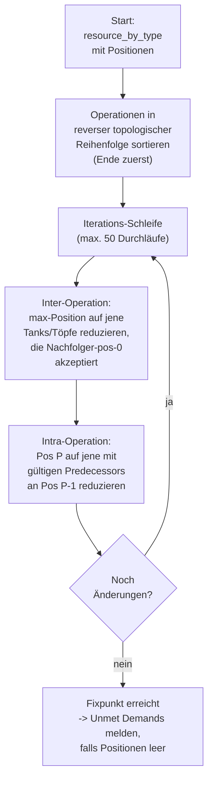

1. Die Operationen werden in **reverser topologischer Reihenfolge** verarbeitet (letzter Arbeitsgang zuerst) -- so können Einschränkungen von hinten nach vorne propagieren
2. **Inter-Operation-Durchlauf:** An der letzten Position des aktuellen Arbeitsgangs werden nur noch Tanks/Töpfe behalten, die von den Position-0-Tanks/Töpfe aller Nachfolger (inklusive ihrer Predecessor-Kette, auch über Leitungen) akzeptiert werden. In der Gegenrichtung wird der Nachfolger ebenfalls aufgeräumt: Tanks/Töpfe an dessen Position 0, für die es keinen passenden Vorgänger mehr gibt, werden entfernt
3. **Intra-Operation-Durchlauf:** Innerhalb einer Operation wird Position für Position rückwärts verglichen (max-Position -> 0): An Position P-1 bleiben nur Betriebsmittel, die Predecessor **mindestens eines** Betriebsmittels an Position P sind. Anschließend noch ein Vorwärts-Check (0 -> max): An Position P bleiben nur Betriebsmittel, die **mindestens einen** gültigen Predecessor an Position P-1 haben
4. **Iteration:** Schritte 2 und 3 wiederholen sich, bis sich in einem ganzen Durchlauf **nichts mehr ändert** (Fixpunkt). Die Obergrenze liegt bei 50 Durchläufen -- wird sie erreicht, bricht der Lauf mit einem Laufzeit-Fehler ab (deutet auf einen Algorithmus-Bug hin, sollte in der Praxis nicht passieren)

Nach diesem Prozess ist garantiert, dass jedes Betriebsmittel in jeder Position zu einem physikalisch realisierbaren Fluss **quer durch alle Arbeitsgänge eines Bedarfs** gehört.

#### Leitungen

Leitungen stehen nicht als eigene Position in `required_resource_types`, werden aber als **vermittelnde Elemente** erkannt: Wenn zwei Positionen (z.B. Tank an Pos 0 und BA-Anlage an Pos 1) nicht direkt verbunden sind, aber eine Leitung im Vorauswahl-Set existiert, die zwischen beiden vermittelt, gilt die Verbindung als gültig. Der Solver weist diese Leitungen später bei der Planung explizit zu und belegt sie für die Dauer des Arbeitsgangs.

#### Protokollierung: nachvollziehbar, warum ein Bedarf nicht planbar wurde

Pro Operation werden sämtliche Reduktionsschritte mitgeschrieben (`OperationReductionLogs`). Bleibt am Ende eine Position ohne Betriebsmittel, meldet die Engine den Bedarf als **Unmet Demand** mit einer **vollständigen Herleitung** -- beginnend beim letzten Arbeitsgang der Kette, vorwärts bis zur betroffenen Stelle, inklusive der jeweiligen Begründung ("Must flow to successor X", "Backward pass: valid predecessors = [...]"). Dies erleichtert die Fehlersuche in Stamm-Daten erheblich.

#### Warum wird die Fluss-Prüfung zweimal durchgeführt (Stufen 5 und 7)?

Als Sicherheitsnetz: Stufe 5 läuft **vor** der Ressourcen-Reduktion (6.6) und macht die Verrohrung konsistent. Stufe 7 läuft **nach** der Ressourcen-Reduktion und stellt sicher, dass die zyklische Stichproben-Auswahl in Stufe 6 keine ungünstigen Kombinationen erzeugt hat, die die Fluss-Kette wieder verletzen. Findet Stufe 7 weitere Unmet Demands, werden diese ergänzend gemeldet.

### 6.6 Anzahl der Kandidaten begrenzen

Nach der Fluss-Prüfung können immer noch viele Betriebsmittel übrig bleiben. Je mehr Kandidaten der Solver betrachten muss, desto länger dauert die Planung. Die Ressourcen-Reduktion begrenzt die Auswahl auf eine **konfigurierbare Maximalanzahl** pro Betriebsmitteltyp (Standard: 3).

Die Auswahl erfolgt **zyklisch** -- die Engine merkt sich, welche Betriebsmittel bereits für andere Bedarfe ausgewählt wurden, und bevorzugt noch nicht verwendete Betriebsmittel. So werden alle Betriebsmittel gleichmäßig belastet.

**Beispiel mit maximal 2 Betriebsmittel pro Typ:**

| Bedarf | Ausgewählte Tanks |
|---|---|
| Bedarf 1 | T01, T03 |
| Bedarf 2 | T07, T09 |
| Bedarf 3 | T01, T03 (Rotation) |

#### Achtung: `MAX_RESOURCES_PER_TYPE` ist ein sensibler Parameter

Dieser Wert hat direkten Einfluss darauf, ob die Engine überhaupt eine Lösung findet **und** wie schnell sie das tut. Die Standard-Einstellung **3** hat sich in der Praxis als Sweet Spot bewährt:

| Wert | Verhalten |
|:---:|---|
| **1** | Keine Auswahlfreiheit -- der Solver kann wegen harter Kollisionen praktisch nie alle Bedarfe einplanen. **Nicht empfohlen**. |
| **2** | Führt oft zu **Infeasibility**: Bei gleichzeitigen Kollisionen auf wenigen Geräten hat der CP-SAT Solver keinen Ausweich-Pfad und deklariert das Modell als unlösbar, obwohl es real eine Lösung gäbe |
| **3** *(Standard)* | Stabil. Genug Flexibilität für Ausweich-Planung, ohne den Suchraum zu explodieren |
| **4+** | Das Problem wird **für CP-SAT extrem schwer**: Die Zahl der Kombinationen wächst stark, Fluss-Constraints müssen für viel mehr Paare geprüft werden, und die Laufzeit geht in Minuten bis Stunden -- oft ohne Qualitäts-Gewinn |
| **-1** | Keine Reduktion (alle Kandidaten). Nur für kleine Test-Szenarien sinnvoll |

> **Empfehlung:** `MAX_RESOURCES_PER_TYPE` nicht leichtfertig ändern. Falls ein konkreter Engpass vermutet wird, immer in Testläufen mit repräsentativen Snapshots validieren und Lösbarkeit + Laufzeit beobachten, bevor der Wert produktiv angepasst wird.

### 6.7 Mitarbeitende-Auswahl

Nachdem die Betriebsmittel-Kandidaten feststehen, wählt die Engine die zulässigen Mitarbeitenden aus. Die Zulassungsregel ist streng:

> Eine mitarbeitende Person muss **jede Qualifikation besitzen**, die für **irgendein** im Kandidaten-Set verbliebenes Betriebsmittel gefordert ist.

Es wird also die **Vereinigung aller Qualifikationen** aller noch möglichen Betriebsmittel gebildet, und die Person muss **alle** davon erfüllen (logisches UND über sämtliche Qualifikationen).

#### Warum so streng?

**Motivation:** Der Solver soll **Betriebsmittel und Mitarbeitende unabhängig voneinander** zuweisen dürfen. Wäre die Mitarbeitenden-Eignung an eine bestimmte **Kombination** von Betriebsmitteln geknüpft, würde jede Equipment-Entscheidung die verfügbaren Personen einschränken -- und umgekehrt. Das würde zu komplexen, miteinander verwobenen Entscheidungen führen, die CP-SAT schlecht auflösen kann.

Indem die Mitarbeitenden **für alle möglichen Equipment-Zuteilungen gleichzeitig qualifiziert** sein müssen, sind die beiden Dimensionen **entkoppelt**: Egal welches konkrete Betriebsmittel der Solver am Ende auswählt -- die einmal als zulässig markierte Person passt immer.

#### Beispiel: realistischer Fall mit Mehrfach-Kandidaten

Schwieriger wird es, sobald **pro Funktion mehrere Kandidaten** im Spiel sind. Angenommen, der Constraint Preparator hat für HE01 ergeben:

| Funktion | Kandidaten | jeweils erforderliche Qualifikation |
|---|---|---|
| Arbeitsplatz | **A1**, **A2** | `Q_A1`, `Q_A2` |
| Topf | **M3**, **M4**, **M7** | `Q_M3`, `Q_M4`, `Q_M7` |

Die Mitarbeitenden-Auswahl bildet die **Vereinigung aller** erforderlichen Qualifikationen:

```text
benötigt = { Q_A1, Q_A2, Q_M3, Q_M4, Q_M7 }
```

Zulässig ist **nur**, wer alle 5 besitzt. Wer auch nur `Q_M7` fehlt, fällt raus -- selbst wenn er/sie für **A1 + M3** geeignet gewesen wäre. Diese Strenge ist **bewusst in Kauf genommen**: sie kostet manchmal Kandidaten, entlastet aber den Solver enorm, weil er Equipment- und Mitarbeitenden-Zuteilung getrennt optimieren kann.

#### Konsequenz für die Praxis

- **Breite Qualifikationen** bei wenigen Personen helfen deutlich mehr als schmale Qualifikationen bei vielen
- Falls zu viele Bedarfe an der Mitarbeitenden-Eignung scheitern (Unmet Demand "No eligible workers"), lohnt ein Blick auf die Qualifikationsmatrix -- möglicherweise gibt es ein Betriebsmittel mit einer seltenen Qualifikation, das alle anderen Personen ausschließt
- Das Setting `MAX_RESOURCES_PER_TYPE` (siehe [6.6](#66-anzahl-der-kandidaten-begrenzen)) wirkt auch hier: je mehr Equipment-Kandidaten im Set bleiben, desto mehr Qualifikationen fordert die UND-Verknüpfung -- d.h. **weniger** Mitarbeitende sind zulässig. Das ist ein weiterer Grund, den Wert nicht unnötig hoch zu setzen

#### Mehr als eine Person pro Arbeitsgang

Manche Betriebsmittel verlangen nicht nur **eine**, sondern **mehrere Mitarbeitende** gleichzeitig (z.B. komplexe Abfüller, die zwei Personen zur Bedienung brauchen). Dies wird pro Betriebsmittel über den **Usage Factor** (`Equipment.usageFactor` im API-Datenmodell) hinterlegt.

> **Pflicht im Snapshot:** `usageFactor` muss **ganzzahlig** sein (1, 2, 3, ...). Gebrochene Werte wie 1.5 sind nicht zulässig -- der Solver kann nur ganze Personen einplanen.

**Aggregations-Regel:** Für jeden Arbeitsgang wird der **maximale Usage Factor** aller im Kandidaten-Set verbliebenen Betriebsmittel gebildet. Ist dieser Maximalwert größer als 1, wird die geforderte Anzahl Mitarbeitender des Arbeitsgangs auf diesen Wert gesetzt.

| Beispiel | Usage Factors im Kandidaten-Set | Ergebnis (`quantity` für Person) |
|---|---|---|
| nur Standard-Betriebsmittel | alle 1 | 1 |
| ein Abfüller mit `usageFactor: 2` im Set | 1, 1, **2** | 2 |
| mehrere Bedienungs-intensive Abfüller | 1, 2, **3** | 3 |

Die UND-Regel für Qualifikationen (oben) bleibt dabei unverändert: **jede** dieser Personen muss sämtliche geforderten Qualifikationen besitzen -- auch wenn es zwei oder drei sind.

### 6.8 Lange Arbeitsgänge aufteilen (Schichtübergabe)

Manche Arbeitsgänge dauern länger als eine Schicht. Damit Mitarbeitende Feierabend machen können, während die Betriebsmittel weiterlaufen, werden solche Arbeitsgänge in **zwei Teile (P1 und P2)** aufgeteilt.

#### Ablauf der Aufteilung

- **Bedingung:** Der Arbeitsgang benötigt eine mitarbeitende Person und dauert länger als **`OPERATION_SPLIT_THRESHOLD_SECONDS`** (Standard 3 Stunden, konfigurierbar)
- **P1:** Erster Teil -- es wird eine Person zugeteilt
- **P2:** Zweiter Teil -- es kann dieselbe oder eine **andere** Person zugeteilt werden; bei Wechsel fällt eine konfigurierbare `WORKER_CHANGE_PENALTY_WEIGHT` (Standard 5) an, um unnötige Wechsel zu bestrafen
- **Betriebsmittel** bleiben während beider Teile durchgehend reserviert -- nur die mitarbeitende Person kann zwischen P1 und P2 wechseln


#### Wichtige Einschränkung: nur **eine** Aufteilung

Ein Arbeitsgang kann **maximal einmal** geteilt werden -- es gibt nur P1 und P2, keine weiteren Teile. Damit darf ein Arbeitsgang, der Mitarbeitende benötigt, **höchstens zwei Schichten** lang sein. Längere Arbeitsgänge werden **nicht** geplant, sondern der zugehörige Bedarf wird als **Unmet Demand** gemeldet.

Die Obergrenze ist über das Setting **`MAX_OPERATION_DURATION_SECONDS`** (Standard 16 Stunden) geregelt.

> **Ausnahme -- Reine Rasten-Operationen (RF01/RF02):** Reine Rasten-Schritte (ausschließlich Storage-Ressource, keine Person) sind von der 16h-Grenze ausgenommen. Rasten ist eine bewusst lange Tank-Belegung (z. B. 24h Tankruhe), die keine Schichtübergabe erfordert. Der zugehörige Bedarf wird daher nicht als Unmet Demand gemeldet. Der Filtrieren-Schritt desselben Arbeitsgangs unterliegt weiterhin der normalen Prüfung.

#### Kritisches Detail: Prüfung auf Basis der **maximalen** möglichen Dauer

Die Entscheidung, ob ein Arbeitsgang die 2-Schichten-Grenze überschreitet, **wird nicht erst im CP-SAT Solver getroffen**, sondern bereits im Constraint Preparator -- also **vor** dem eigentlichen Optimierungslauf. Zu diesem Zeitpunkt weiß die Engine noch nicht, welches konkrete Betriebsmittel der Solver später zuteilen wird.

Um auf der **sicheren** Seite zu sein, arbeitet die Prüfung mit der **längsten** möglichen Dauer:

> Der Arbeitsgang wird **dann ausgeschieden**, wenn **mindestens eines** der noch zulässigen dauerbestimmenden Betriebsmittel eine Bearbeitungszeit über `MAX_OPERATION_DURATION_SECONDS` ergäbe.

**Das heißt konkret:** Selbst wenn es neben einem langsamen Abfüller noch einen schnellen gibt, mit dem der Arbeitsgang bequem in die 16 Stunden passt, wird der Bedarf ausgeschieden, sobald der langsame im Kandidaten-Set übrig bleibt. Grund: der Solver wäre theoretisch **berechtigt**, den langsamen zu wählen, und hat dann keinen Ausweg mehr.

| Abfüller im Kandidaten-Set | Dauer | Ergebnis |
|---|---|---|
| nur **A1** (schnell, 8h) | max 8h | wird geteilt, planbar |
| **A1** (8h) + **A2** (12h) | max 12h | wird geteilt, planbar |
| **A1** (8h) + **A3** (20h) | max **20h** > 16h | **Unmet Demand** (schon bevor der Solver läuft) |

#### Konsequenz für die Praxis

- Enthält der Kandidaten-Pool nur ein einziges sehr langsames Betriebsmittel, kippt die ganze Einplanung -- obwohl die schnellen Geräte problemlos gereicht hätten
- Fix: entweder das langsame Gerät per Stamm-Daten aus dem Kandidaten-Pool nehmen (Verfügbarkeit, Batch-Größen, Verpackungs-Kompatibilität), oder `MAX_OPERATION_DURATION_SECONDS` erhöhen -- was allerdings bedeutet, mehr als zwei Schichten zuzulassen, was wiederum **nicht unterstützt** ist (siehe oben)
- Diese Logik ist bewusst **vor** dem CP-SAT Solver platziert, um dem Solver nur saubere, garantiert planbare Bedarfe zu übergeben. Der Solver muss sich nicht mit Sonderfällen herumschlagen, die er ohnehin nie lösen könnte

---

## 7. Der Solver: Optimierung des Produktionsplans

### 7.1 Was entscheidet der Solver?

Für jeden Arbeitsgang jedes Bedarfs muss der Solver drei Fragen beantworten:

1. **Wann?** -- Startzeit und Dauer des Schritts
2. **Wo?** -- Welche Betriebsmittel (Tank, Leitung, Topf, ...) werden zugeteilt?
3. **Wer?** -- Welcher Mitarbeitende bedient die Betriebsmittel?

### 7.2 Regeln (Constraints)

Dabei müssen gleichzeitig folgende Regeln eingehalten werden:

| Regel | Beschreibung |
|---|---|
| **Keine Doppelbelegung** | Kein Betriebsmittel und keine mitarbeitende Person darf gleichzeitig für zwei verschiedene Arbeitsgänge eingeteilt sein |
| **Reihenfolge** | Die Arbeitsgänge eines Bedarfs müssen in der richtigen Reihenfolge ablaufen (HE01 vor RF01 vor QS01 usw.) |
| **Materialfluss** | Aufeinanderfolgende Schritte müssen physisch verbundene Betriebsmittel verwenden (Rohrleitungen) |
| **Zuweisung** | Jeder Schritt erhält genau die vorgeschriebene Anzahl von Betriebsmittel pro Typ |
| **Verfügbarkeit** | Wartungs- und Ausfallzeiten von Betriebsmitteln und Schichtpläne von Mitarbeitenden werden beachtet |
| **Kontamination** | Bei Artikelwechsel auf einer Betriebsmittel: Verschmutzungsklasse darf nur steigen, sonst muss gereinigt werden |

#### Weiche Constraints: Regeln, die als Penalty modelliert sind

Nicht jede Regel ist im Modell als **harter** Constraint hinterlegt. Zwei für die Praxis **sehr wichtige** Regeln werden technisch als **Penalty in der Zielfunktion** abgebildet, verhalten sich aber de facto wie Constraints:

| Regel | Technische Umsetzung | Praktisches Verhalten |
|---|---|---|
| **Keine Lücken zwischen flow-gekoppelten Arbeitsgängen** (also zwischen Arbeitsgängen mit `requires_predecessor_flow=true`, siehe [5.5.3](#553-tank-topf-kontinuität-zwischen-arbeitsgängen-requires_predecessor_flow)) | Gap-Penalty pro Sekunde Lücke, sehr hoch gewichtet (`GAP_PENALTY_PER_SECOND`, Standard 10) | Bei einer vernünftig konvergierten Lösung gibt es **praktisch nie** Lücken zwischen diesen Arbeitsgängen -- der Solver vermeidet sie selbst dann, wenn andere Ziele dadurch verschlechtert werden |
| **Alle Bedarfe einplanen** (Unmet Demand vermeiden) | Penalty für nicht eingeplante Bedarfe, sehr hoch gewichtet (`UNMET_DEMAND_PENALTY_DAYS`, Standard 60 Tage Verspätungs-Äquivalent) | Bei einer vernünftig konvergierten Lösung werden **alle** Bedarfe eingeplant, die im Constraint Preparator nicht bereits als unmöglich markiert wurden |

**Warum nicht harte Constraints?**

- **Performance:** CP-SAT reagiert empfindlich auf "harte" Constraints dieser Art. Werden z.B. alle Lücken zwischen flow-gekoppelten Arbeitsgängen hart verboten, wächst der Such-Aufwand dramatisch und die ersten feasible-Lösungen lassen sehr lange auf sich warten
- **Schnelle Feasibility:** Mit weichen Penalties findet der Solver **sofort** eine gültige (wenn auch zunächst schlechte) Lösung -- z.B. einen Plan, in dem einige Bedarfe noch ausgeschlossen sind. Ab diesem Startpunkt kann er dann iterativ verbessern
- **Robustheit bei extremen Daten:** Fällt der Snapshot aus dem Rahmen (z.B. mehr Bedarfe als realistisch planbar), erhält der Kunde **eine Teillösung** plus Unmet-Demand-Liste -- statt einer Fehlermeldung "nicht lösbar"

> **"Quasi immer erfuellt" -- was heißt das genau?**
>
> Sobald der Solver hinreichend konvergiert ist (typischerweise nach wenigen Iterationen), dominieren diese hohen Penalties die Zielfunktion so stark, dass die zugehörigen Regeln **in der Praxis nicht mehr verletzt werden**. Einzige Ausnahme: wenn keine gültige Lösung existiert, die beide Regeln gleichzeitig einhält -- dann bleibt der Solver mit einer Verletzung zurück und macht diese transparent. Ein konkretes Indiz wäre eine sehr hohe `totalCostFunctionValue` im Ergebnis, dominiert von einer nicht-null `numberOfUnmetDemands` oder Lücken-Summen.

Die genauen Gewichte dieser Penalties sind im nächsten Abschnitt aufgeführt.

### 7.3 Zielfunktion: Was wird optimiert?

Die Engine optimiert mehrere Ziele gleichzeitig. Da diese Ziele in Konkurrenz zueinander stehen, werden sie über konfigurierbare Gewichtungsfaktoren (Penalties) gegeneinander abgewogen:

| Ziel | Beschreibung | Standardgewicht |
|---|---|---|
| **Liefertermin-Einhaltung** | Verspätungen werden bestraft. Ein Tag zu spät wiegt deutlich schwerer als ein Tag zu früh | Verspätung: 100 / Tag, Verfrühung: 5 / Tag |
| **Bestätigte Termine** | Bedarfe mit bestätigten Lieferterminen werden 10x stärker bestraft bei Verspätung | Multiplikator: 10 |
| **Wartezeiten minimieren** | Unnötige Pausen zwischen aufeinanderfolgenden Schritten werden bestraft | 50 / Tag |
| **Lücken vermeiden** | Lücken zwischen direkt aufeinanderfolgenden Arbeitsgängen eines Bedarfs (flüssige Produkte können nicht zwischengelagert werden) | 10 / Sekunde |
| **Reinigung minimieren** | Jede notwendige Reinigung erhöht die Kosten | 50 pro Reinigung |
| **Nicht eingeplante Bedarfe** | Bedarfe, die der Solver nicht einplanen kann, werden mit hoher Strafe belegt | 60 Tage Verspätungs-Äquivalent |

> **Zum Verständnis:** Die Gewichte haben keine physische Einheit -- sie bestimmen die relative Wichtigkeit der Ziele zueinander. Hoeheres Gewicht = wichtigeres Ziel.

#### Priorität pro Bedarf (`priority`)

Zusätzlich zu den globalen Gewichten kann jeder Bedarf über das API-Feld **`Demand.priority`** individuell priorisiert werden. Der Wert wirkt als **Multiplikator auf die Verspätungs-Strafe** dieses Bedarfs:

```text
tardiness_penalty_für_diesen_Bedarf
    = TARDINESS_PENALTY_PER_DAY
    x (priority + 1)
    x (confirmed ? CONFIRMED_DUE_DATE_PENALTY_MULTIPLIER : 1)
    x Anzahl Tage Verspätung
```

| `priority` | Multiplikator | Effekt |
|---|:---:|---|
| nicht gesetzt / 0 | x1 | Standardverhalten |
| 1 | x2 | Verspätung wiegt doppelt so schwer wie bei Standardbedarfen |
| 2 | x3 | Verspätung dreifach gewichtet |
| n | x(n+1) | ... |

**Wichtig:**

- `priority` wirkt **nur auf die Verspätungs-Strafe (Tardiness)**, nicht auf Verfrühung, Wartezeiten oder Lücken
- Der Multiplikator ist **multiplikativ mit der Bestätigt-Gewichtung** kombiniert: ein priorisierter, bestätigter Bedarf mit `priority: 2` wird also mit Faktor `3 x 10 = 30` gegenüber einem Standard-Bedarf gewichtet
- `priority` ist **optional**. Fehlt das Feld oder ist es `null`, wird `0` angenommen (d.h. Standardverhalten)
- Sinnvolle Anwendung: gezielte Bevorzugung eines einzelnen Großkunden-Bedarfs oder einer kurzfristig hinzugekommenen Dringlichkeits-Order, ohne das globale Gewicht `TARDINESS_PENALTY_PER_DAY` ändern zu müssen

> **Achtung:** `priority` wirkt ausschließlich über die Tardiness-Strafe. Sie ist **kein** harter Reihenfolge-Mechanismus: auch ein hoch priorisierter Bedarf kann verspätet werden, wenn dies im Gesamtplan die insgesamt geringsten Strafpunkte verursacht (z.B. wenn sehr viele bestätigte Standardbedarfe gleichzeitig dagegen stehen).

### 7.4 Solver-Pipeline: Schrittweises Lösen

Das vollständige Planungsproblem mit allen Bedarfen und Regeln gleichzeitig zu lösen, würde zu lange dauern. Deshalb verwendet die Engine eine **inkrementelle Strategie mit Sliding Window**: Bedarfe werden in Batches schrittweise hinzugefügt, wobei immer alle Regeln aktiv sind und nur ein begrenzter Teil der bereits geplanten Bedarfe für den Solver noch veränderlich bleibt.

#### Grundidee: Batch-weises Hinzufügen mit begrenztem Sliding Window

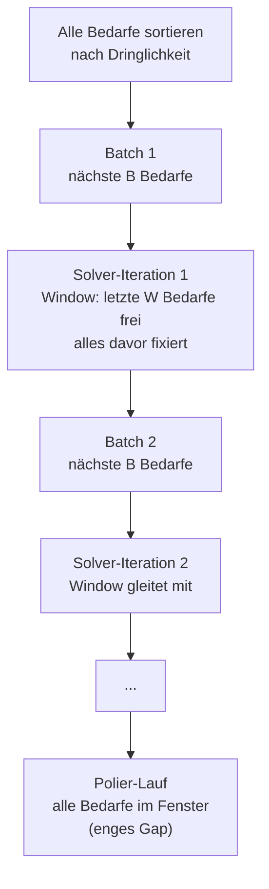

In jeder Iteration sind folgende drei "Schichten" von Bedarfen gleichzeitig im CP-SAT Modell:

| Schicht | Beschreibung |
|---|---|
| **Fixiert** | Bedarfe, die bereits weiter als `INCREMENTAL_DEMAND_SLIDING_WINDOW_SIZE` Plätze zurückliegen. Ihre Startzeiten, Equipment- und Mitarbeitenden-Zuweisungen werden **unveränderlich** ins Modell eingebaut |
| **Im Sliding Window** | Die letzten `INCREMENTAL_DEMAND_SLIDING_WINDOW_SIZE` Bedarfe vor dem aktuellen Batch. Ihre Entscheidungen aus der Vor-Iteration werden dem Solver als **Hints (Starthilfe)** vorgegeben, er darf sie aber aktualisieren |
| **Neu im aktuellen Batch** | Die nächsten `INCREMENTAL_DEMAND_BATCH_SIZE` Bedarfe. Kein Hint -- der Solver muss hier erstmals Entscheidungen treffen |

#### So läuft eine Iteration ab

1. **Reihenfolge:** Alle Bedarfe werden einmal zu Beginn nach Dringlichkeit sortiert -- frühester Liefertermin zuerst, bestätigte Termine bevorzugt, höhere Priorität zuerst
2. **Batch bilden:** Die nächsten `INCREMENTAL_DEMAND_BATCH_SIZE` Bedarfe (Standard: 10) kommen neu hinzu
3. **Sliding Window aktualisieren:** Die letzten `INCREMENTAL_DEMAND_SLIDING_WINDOW_SIZE` Bedarfe (Standard: 30) bleiben im "veränderlichen" Bereich; alles davor wird auf die Lösung der Vor-Iteration festgeschrieben
4. **Solve:** CP-SAT löst das reduzierte Problem mit Zeitbudget `INCREMENTAL_DEMAND_ITERATION_TIME_LIMIT_SECONDS` (Standard: 900 Sekunden / 15 Minuten)
5. **Hinweis weitergeben:** Die aktuelle Lösung wird in die nächste Iteration übernommen (Sliding Window verschiebt sich)
6. **Finaler Gesamtlauf zum Abschluss:** Nach dem letzten Batch erfolgt eine abschließende globale Optimierung über alle eingeplanten Bedarfe innerhalb des Gesamt-Zeitrahmens (`INCREMENTAL_DEMAND_TOTAL_TIME_LIMIT_SECONDS`)

> **Abbruch-Kriterien einer einzelnen Iteration:** Eine Iteration endet, wenn **eines** der folgenden Kriterien zuerst erreicht wird:
> 1. **Zeitbudget erschöpft:** Die maximale Laufzeit `INCREMENTAL_DEMAND_ITERATION_TIME_LIMIT_SECONDS` (Standard: 900 s / 15 min) ist abgelaufen.
> 2. **Gap-Stagnation *(wenn `ENABLE_ADAPTIVE_STOPPING=true`)* :** Die Adaptive-Stopping-Logik greift, wenn die Verbesserungsrate unter `GAP_STOPPING_MIN_ABS_IMPROVEMENT_PER_SEC` fällt.
> 3. **Idle Timeout *(wenn `ENABLE_ADAPTIVE_STOPPING=true`)* :** Seit dem letzten Fortschrittsereignis (neue Lösung oder Bound-Verbesserung) ist mehr als `GAP_STOPPING_WINDOW_SECONDS` (Standard: 30 s) vergangen, ohne dass der Solver nennenswert vorankommt. Der Solver wird dann früher gestoppt, um Rechenzeit für nachfolgende Iterationen freizugeben.

#### Relevante Parameter im Zusammenspiel

| Parameter | Standard | Wirkung |
|---|:---:|---|
| `INCREMENTAL_DEMAND_BATCH_SIZE` | 10 | Anzahl Bedarfe, die pro Iteration neu ins Modell kommen. Kleinere Werte = mehr Iterationen, dafür jede einzelne schneller und einfacher |
| `INCREMENTAL_DEMAND_SLIDING_WINDOW_SIZE` | 30 | Länge des Sliding Window -- wie viele zurückliegende Bedarfe noch veränderlich bleiben. Größere Werte = mehr Freiheit für Nach-Optimierung, aber aufwändiger pro Iteration |
| `INCREMENTAL_DEMAND_ITERATION_TIME_LIMIT_SECONDS` | 900 (15 min) | Maximale Zeit pro Iteration |
| `INCREMENTAL_DEMAND_TOTAL_TIME_LIMIT_SECONDS` | 43200 (12h) | Harter Gesamtdeckel für die gesamte Pipeline inkl. finalem Gesamtlauf |

#### Warum Sliding Window statt "alles frei lassen"?

- **Rechenzeit bleibt beherrschbar:** Ohne Fixierung wächst das CP-SAT-Modell mit jeder Iteration, bis CP-SAT an seine Grenzen stößt. Das Sliding Window hält die Modellgröße weitgehend konstant
- **Lokale Nach-Optimierung:** Innerhalb des Windows kann der Solver noch Zuteilungen verfeinern, z.B. um Engpässe durch die neu hinzukommenden Bedarfe auszugleichen
- **Stabilität der früheren Entscheidungen:** Stark zurückliegende Bedarfe werden nicht ständig umgeplant -- das gibt ein stabileres Ergebnis und verhindert, dass jede neue Iteration den gesamten Plan umwirft

**Vorteil des Gesamtverfahrens:** Jede Iteration erzeugt eine vollständig gültige Lösung. Der Hint für die nächste Iteration verletzt daher keine Regeln -- neue Bedarfe haben einfach noch keinen Hint.

> **Für IT/Ops:** Die oben genannten Parameter sind über Umgebungsvariablen oder `solverConfig` im Snapshot einstellbar. Typische Stellhebel für die Gesamt-Laufzeit sind `INCREMENTAL_DEMAND_BATCH_SIZE` (größer = weniger Iterationen), `INCREMENTAL_DEMAND_SLIDING_WINDOW_SIZE` (kleiner = schneller pro Iteration) und `INCREMENTAL_DEMAND_ITERATION_TIME_LIMIT_SECONDS` (kleiner = schneller, Risiko schlechterer Zwischen-Lösungen).

### 7.5 Abbruch-Kriterien

Der Solver bricht ab, wenn eines der folgenden Kriterien erreicht wird:

| Kriterium | Beschreibung | Standard |
|---|---|---|
| **Zeitlimit** | Maximale Gesamtlaufzeit für die komplette Solver-Pipeline | 12 Stunden (`INCREMENTAL_DEMAND_TOTAL_TIME_LIMIT_SECONDS`) |
| **Gap-Stagnation (gap_stagnation)** | Die absolute Verbesserungsrate (AbsRoC) der Gap pro Sekunde fällt unter den Mindestschwellenwert. Bedeutet: Weitere Rechenzeit bringt kaum noch Fortschritt | 1,0 Solver-Einheiten/Sekunde (`GAP_STOPPING_MIN_ABS_IMPROVEMENT_PER_SEC`) |
| **Idle Timeout (idle_timeout)** | Seit dem letzten Fortschrittsereignis (neue Lösung oder Bound-Verbesserung) ist mehr als `GAP_STOPPING_WINDOW_SECONDS` vergangen, ohne dass der Solver vorankommt. Verhindert sinnlose Wartezeit nach dem letzten echten Fortschritt. Nur aktiv wenn `ENABLE_ADAPTIVE_STOPPING=true` | 30 Sekunden (`GAP_STOPPING_WINDOW_SECONDS`) |

#### Gap-Stagnation im Detail

Die **Gap-Stagnation**-Prüfung misst, ob die Optimierung noch nennenswert vorankommt:

1. **Rolling Window:** Über ein gleitendes Zeitfenster (`GAP_STOPPING_WINDOW_SECONDS`, Standard 30 Sekunden) werden Gap-Datenpunkte gesammelt
2. **Rate of Change (RoC):** Die Verbesserungsrate wird als lineare Regression über alle Punkte im Fenster berechnet (Einheit: Solver-Einheiten pro Sekunde)
3. **Abbruch bei geringer Verbesserung:** Unterschreitet die absolute Verbesserungsrate den Schwellenwert `GAP_STOPPING_MIN_ABS_IMPROVEMENT_PER_SEC` (Standard: 1,0), wird der Solver gestoppt

**Praktische Bedeutung:** Der Solver bricht ab, sobald er trotz weiterer Rechenzeit kaum noch bessere Lösungen findet. Dies verhindert stundenlanges Rechnen für marginale Verbesserungen von weniger als 1% und gibt Rechenzeit für nachfolgende Batches oder andere Planungsläufe frei.

> **Für Schichtführer:** "Solver läuft 30 Minuten" heißt nicht immer, dass er die ganze Zeit braucht. Oft bricht er früher ab, weil weitere Verbesserungen zu langsam kommen (gap_stagnation).

---

## 8. Nicht planbare Bedarfe (Unmet Demands)

Nicht jeder Bedarf kann immer eingeplant werden. Die Engine erkennt solche Fälle frühzeitig und meldet sie transparent als **Unmet Demands** im Ergebnis. Der restliche Plan wird trotzdem erstellt -- nur die betroffenen Bedarfe fehlen.

### 8.1 Typische Gründe

| Grund | Beschreibung | Phase |
|---|---|---|
| **Keine geeignete Betriebsmittel** | Kein verfügbares Betriebsmittel hat die richtige Kapazität oder den richtigen Typ für den Arbeitsschritt | Constraint Preparator |
| **Losgröße passt nicht** | Die Bedarfsmenge liegt außerhalb der Min/Max-Kapazität aller verfügbaren Betriebsmittel | Constraint Preparator |
| **Keine Rohrverbindung** | Die verbleibenden Betriebsmittel sind physisch nicht miteinander verbunden | Constraint Preparator (Fluss-Reduktion) |
| **Kein qualifizierter Mitarbeitende** | Kein verfügbarer Mitarbeitende hat alle Qualifikationen für die Betriebsmittelkombination | Constraint Preparator |
| **Operation zu lang** | Ein Arbeitsgang würde länger als 16 Stunden dauern | Constraint Preparator (Schichtübergabe) |
| **Solver findet keinen Platz** | Alle Betriebsmittel und Mitarbeitende sind im relevanten Zeitraum belegt | Solver |

### 8.2 Beispiele und Maßnahmen

**Beispiel 1: Keine geeignete Betriebsmittel**

> *"Bedarf 4711: Nicht planbar. Kein geeignetes Betriebsmittel für Arbeitsgang HE01 (Herstellung), BA01 (Tank)."*

**Mögliche Ursachen:**

- Alle Töpfe sind im Planungszeitraum in Wartung
- Die Bedarfsmenge (z.B. 5.000 Liter) übersteigt die Kapazität aller verfügbaren Töpfe

**Empfohlene Maßnahmen:**

- Prüfen, ob Wartungszeiträume verschoben werden können
- Prüfen, ob die Bedarf aufgeteilt werden kann
- Ggf. den Planungszeitraum anpassen

---

**Beispiel 2: Keine Rohrverbindung**

> *"Bedarf 4712: Nicht planbar. Keine gültigen Betriebsmittel nach Fluss-Prüfung für Arbeitsgang BA01."*

**Mögliche Ursachen:**

- Die verbleibenden Tanks für BA01 sind mit keiner Leitung an die verbleibenden Abfüller für ABF01 angeschlossen
- Eine Leitung ist im relevanten Zeitraum nicht verfügbar

**Empfohlene Maßnahmen:**

- Prüfen, ob die Verrohrungsdaten im System aktuell sind
- Prüfen, ob Leitungen temporaer nicht verfügbar sind, die eigentlich verfügbar sein könnten

---

**Beispiel 3: Kein qualifizierter Mitarbeitende**

> *"Bedarf 4713: Nicht planbar. Kein geeignetes Betriebsmittel für Arbeitsgang HE01 (Person)."*

**Mögliche Ursachen:**

- Die Kombination aus Tank, Leitung und Topf erfordert eine seltene Kombination von Qualifikationen
- Alle qualifizierten Mitarbeitenden sind in dem Zeitraum im Urlaub

**Empfohlene Maßnahmen:**

- Prüfen, ob Qualifikationsdaten aktuell sind
- Prüfen, ob zusätzliche Mitarbeitende geschult werden sollten

---

**Beispiel 4: Solver findet keinen Platz**

> *Bedarf erscheint nicht als Unmet Demand in der Constraint-Preparator-Phase, aber der Solver kann ihn nicht termingerecht einplanen.*

**Mögliche Ursachen:**

- Zu viele Bedarfe im selben Zeitraum -- die Kapazität reicht nicht für alle
- Einzelne Engpass-Betriebsmittel sind vollständig belegt

**Empfohlene Maßnahmen:**

- Prüfen, ob Liefertermine verschoben werden können
- Prüfen, ob Bedarfe priorisiert werden können (bestätigte Termine werden bevorzugt)
- Ggf. die Anzahl der gleichzeitigen Bedarfe (`MAX_DEMANDS_COUNT`) anpassen

---

### 8.3 Referenz: Alle Original-Meldungen (reasons) im Code

Jeder Unmet Demand im API-Response trägt im Feld `reason` einen englischen Text, der direkt aus dem Code stammt. Die folgende Tabelle listet **alle** möglichen Original-Meldungen auf -- gruppiert nach Pipeline-Phase -- mit ihrer fachlichen Ursache. Die Original-Strings sind wörtlich wiedergegeben (Platzhalter in `{...}`), damit sie eins-zu-eins im Log oder in der API-Antwort wiedergefunden werden können.

#### Phase: Bedarfs-Aggregation (vor dem Constraint Preparator)

In dieser Phase werden eingehende Bedarfe validiert und zu VGNR-Gruppen zusammengefasst.

| Original-Meldung (English) | Quelle | Ursache |
|---|---|---|
| `zero_or_negative_quantity` | [demand_aggregation.py:80](../src/microservice_engine/core/services/demand_aggregation.py#L80) | Die Bedarfsmenge (`quantity`) ist 0 oder negativ. Der Bedarf ist inhaltsleer und wird nicht eingeplant. |
| `inconsistent_article_id_in_vgnr_group` | [demand_aggregation.py:114](../src/microservice_engine/core/services/demand_aggregation.py#L114) | Mehrere Bedarfe derselben VGNR-Gruppe verweisen auf **unterschiedliche Artikel**. Eine VGNR-Gruppe muss aber genau einen Artikel produzieren -- alle Bedarfe der Gruppe werden als unmet markiert. |
| `inconsistent_dispatcher_group_in_vgnr_group` | [demand_aggregation.py:132](../src/microservice_engine/core/services/demand_aggregation.py#L132) | Bedarfe derselben VGNR-Gruppe haben **unterschiedliche Dispatcher-Gruppen** (Dispogruppen). Auch hier muss die Gruppe einheitlich sein. |
| `Demand Aggregation found no packaging in VGNR group` | [demand_aggregation.py:148](../src/microservice_engine/core/services/demand_aggregation.py#L148) | In der VGNR-Gruppe hat **kein einziger Bedarf eine Verpackungsangabe** (`packaging`). Ohne Verpackung kann kein Abfüller ausgewählt werden. |

#### Phase: Bedarfs-Initialisierung (Arbeitsgang-Erzeugung)

Aus jedem Bedarf werden die konkreten Arbeitsgänge gemäß Arbeitsplan abgeleitet.

| Original-Meldung (English) | Quelle | Ursache |
|---|---|---|
| `Unable to create work operations for demand.` | [demand_initializer.py:110](../src/microservice_engine/core/services/demand_initializer.py#L110) | Beim Ableiten der Arbeitsgänge aus Artikel/Arbeitsplan ist eine Exception aufgetreten (fehlender Arbeitsplan, falsche Datentypen, Referenz auf nicht existierenden Artikel). Typischerweise ein **Datenqualitätsproblem** im Snapshot. |

#### Phase: Bedarfs-Reduktion (Performance)

Wenn mehr Bedarfe eingehen als `MAX_DEMANDS_COUNT` erlaubt, werden die spätesten herausgefiltert.

| Original-Meldung (English) | Quelle | Ursache |
|---|---|---|
| `Filtered due to performance optimization - demand due date {due_date} too late` | [demand_reduction.py:111](../src/microservice_engine/utils/demand_reduction.py#L111) | Der Bedarf liegt außerhalb der `MAX_DEMANDS_COUNT` dringendsten Bedarfe und wird aus Laufzeitgründen nicht bearbeitet. Tritt auf, wenn sehr viele Bedarfe gleichzeitig eingereicht werden -- nicht fachlich unplanbar, sondern bewusst priorisiert. |

#### Phase: Constraint Preparator -- Betriebsmittel-Eignung

Für jeden Arbeitsgang wird geprüft, ob ausreichend geeignete Betriebsmittel verfügbar sind (siehe § 6.2).

| Original-Meldung (English) | Quelle | Ursache |
|---|---|---|
| `Operation {operation_id} ({work_item_key}): Insufficient {resource_type} equipment (need {required_quantity}, have {available_count})` | [unmet_demands_filter.py:64-67](../src/microservice_engine/core/services/constraint_preparator/unmet_demands_filter.py#L64-L67) | Für den Arbeitsgang (z.B. HE01, BA01) sind weniger geeignete Betriebsmittel des geforderten Typs (z.B. Tank, Leitung, BA-Anlage, Abfüller) verfügbar, als der Arbeitsgang benötigt. Nach Anwendung aller Eignungsfilter (Losgröße, Arbeitsgang-Typ, Verpackungstyp, Verfügbarkeit) bleibt nicht genug übrig. |

#### Phase: Constraint Preparator -- Abteilungs-Filter (Disponent2)

Tritt auf, wenn nach dem Abteilungs-Filter (Disponent2) kein kompatibles Betriebsmittel für einen Arbeitsgang übrig bleibt (siehe § 6.2 → Abteilungs-Filter).

| Original-Meldung (English) | Quelle | Ursache |
|---|---|---|
| `No compatible equipment for operation {operation_id} ({work_item_key}): department '{operation_department}' not covered by any available equipment (chain {demand_id})` | [constraint_preparator.py:96-100](../src/microservice_engine/core/services/constraint_preparator/constraint_preparator.py#L96-L100) | Die `department_id` des Artikels (Disponent2) stimmt mit keinem der für den Arbeitsgang verfügbaren Betriebsmittel überein. Typische Ursache: Betriebsmittel sind einem anderen Bereich zugeordnet oder der Artikel hat eine falsche Abteilungs-Referenz. Prüfen: Stimmt `department_id` des Artikels mit dem `department_id` der erwarteten Betriebsmittel überein? |

#### Phase: Constraint Preparator -- Dauerberechnung

Für jede Kombination Bedarf x geeignetes Betriebsmittel wird die Dauer berechnet (siehe § 6.3).

| Original-Meldung (English) | Quelle | Ursache |
|---|---|---|
| `No equipment capable of processing required sequence '{processing_sequence}' for operation {operation_id}` | [duration_calculator.py:478](../src/microservice_engine/core/services/constraint_preparator/duration_calculator.py#L478) | Für einen BA01- oder COMB-Arbeitsgang wird eine Bearbeitungssequenz (z.B. "Homogenisieren -> Pasteurisieren") gefordert, aber **keine der verfügbaren BA-Anlagen** kann diese Sequenz fahren. Oft ein Hinweis auf fehlende Capability-Flags im Betriebsmittelstamm. |
| `Duration calculation failed for operation {operation_id}: {error}` | [duration_calculator.py:502](../src/microservice_engine/core/services/constraint_preparator/duration_calculator.py#L502) | Bei der Dauerberechnung ist ein Fehler aufgetreten -- z.B. ein `InvalidWorkPlanError` (Arbeitsplan inkonsistent), `SnapshotValidationError` (Eingabedaten fehlerhaft) oder fehlende Durchsatzangaben. Die konkrete Fehlermeldung wird an `{error}` angehangen. |

#### Phase: Constraint Preparator -- Fluss-Reduktion (Rohrverbindungen)

Siehe § 6.5. Wenn nach der Prüfung physischer Rohrverbindungen nicht mehr genug Equipment übrig bleibt, wird der Bedarf als unmet markiert.

| Original-Meldung (English) | Quelle | Ursache |
|---|---|---|
| `Flow-based reduction left insufficient equipment for {N} operation(s):` gefolgt von `[chain i/N] {explanation}` je Kette | [flow_based_reducer.py:407-408](../src/microservice_engine/core/services/constraint_preparator/flow_based_reducer.py#L407-L408) | Nach dem Rückwärts- und Vorwärtsdurchlauf entlang der Verrohrung bleibt für einen oder mehrere Arbeitsgänge **kein zulässiger Betriebsmittel-Fluss** übrig. Die eingebettete Erklärung zeigt pro Kette, welches Equipment aus welchem Grund entfernt wurde (z.B. `Backward pass: Must serve as predecessor for at least one equipment at next position {position}` oder `Forward pass: Must have at least one predecessor equipment at previous position {prev_position}`). |

#### Phase: Constraint Preparator -- Schichtübergabe

Siehe § 6.8. Arbeitsgänge, die selbst mit Aufteilung zu lang werden, sind nicht planbar.

| Original-Meldung (English) | Quelle | Ursache |
|---|---|---|
| `Operation {operation_id} has excessive duration ({X}s) exceeding maximum of {Y}s` | [operation_splitter.py:220](../src/microservice_engine/core/services/constraint_preparator/operation_splitter.py#L220) | Die maximal mögliche Dauer des Arbeitsgangs übersteigt `MAX_OPERATION_DURATION_SECONDS` (Standard: 16 h). Selbst durch Aufteilen in P1/P2 lässt sich der Arbeitsgang nicht auf zwei Schichten verteilen. Typisch bei sehr großen Chargen auf langsamen Betriebsmitteln. Reine Rasten-Schritte (RF01/RF02, nur Storage) sind von dieser Prüfung ausgenommen. |

#### Phase: Solver -- Modellaufbau

| Original-Meldung (English) | Quelle | Ursache |
|---|---|---|
| `Unable to create decision variables in CP-SAT model builder for demand.` | [model_builder.py:261](../src/microservice_engine/core/services/solver_components/model_builder.py#L261) | Beim Aufbau der CP-SAT Entscheidungsvariablen ist für diesen Bedarf ein Fehler aufgetreten (z.B. inkonsistente Intervall-Bounds, leere Equipment-Liste nach allen Filtern). Weist in der Regel auf ein tieferliegendes Datenproblem hin, das die früheren Filter nicht gefangen haben. |

#### Phase: Solver -- Optimierung

Der Solver kann einzelne Bedarfe als "absent" markieren, wenn `ENABLE_OPTIONAL_DEMANDS=true` aktiv ist.

| Original-Meldung (English) | Quelle | Ursache |
|---|---|---|
| `CP-SAT solver excluded demand from solution` | [optimization_service.py:199](../src/microservice_engine/core/services/solver_components/optimization_service.py#L199) | Der Solver hat entschieden, den Bedarf **nicht einzuplanen**, weil die dafür fällige Unmet-Strafe (`UNMET_DEMAND_PENALTY_DAYS`) günstiger ist als die Kosten, die durch Einplanung entstehen würden (Verspätung, Verdrängung anderer Bedarfe, etc.). Tritt typischerweise bei Kapazitätsengpässen auf. |

#### Phase: Inkrementeller Solver -- Pipeline-Abbruch

Im inkrementellen Modus werden ggf. ganze Batches an verbleibenden Bedarfen als unmet markiert, wenn eine Iteration scheitert (siehe § 7.4).

| Original-Meldung (English) | Quelle | Ursache |
|---|---|---|
| `Incremental demand solver: total time budget exhausted before this batch` | [incremental_demand_solver.py:299](../src/microservice_engine/core/services/solver_components/incremental_demand_solver.py#L299) | Das Gesamt-Zeitbudget (`INCREMENTAL_DEMAND_TOTAL_TIME_LIMIT_SECONDS`) war bereits aufgebraucht, bevor dieser Batch starten konnte. Alle noch nicht bearbeiteten Bedarfe erhalten diese Meldung. |
| `Model preparation failed in incremental demand solver` | [incremental_demand_solver.py:366](../src/microservice_engine/core/services/solver_components/incremental_demand_solver.py#L366) | In der Modellvorbereitung einer Iteration (Variablen, Constraints, Hints, Fixierung) ist eine Exception aufgetreten. Die Iteration und alle folgenden Bedarfe werden abgebrochen. |
| `Incremental demand solver: no feasible solution when adding this demand batch` | [incremental_demand_solver.py:417](../src/microservice_engine/core/services/solver_components/incremental_demand_solver.py#L417) | Eine Iteration konnte keine zulässige Lösung finden (`NoSolutionFoundError` oder Timeout ohne Treffer). Mit Hinzunahme der neuen Bedarfe ist das Problem infeasible geworden. Alle ab diesem Batch verbleibenden Bedarfe werden unmet. |

> **Hinweis für IT/Support:** Die Meldungen können im Log der Solver Engine per `grep` auf die englischen Originalstrings gefunden werden -- z.B. `kubectl logs <pod> | grep "Flow-based reduction"`. Platzhalter wie `{operation_id}` sind zur Laufzeit durch konkrete IDs ersetzt.

---

## 9. Konfiguration

### 9.1 Drei Konfigurationsschichten -- in absteigender Priorität

Die Solver Engine ist über zahlreiche Parameter konfigurierbar. Beim Ermitteln eines Werts wird die folgende Reihenfolge durchlaufen, **die erste vorhandene Quelle gewinnt**:

1. **Snapshot (`solverConfig`):** Pro Planungslauf über das Feld `solverConfig` im Snapshot-Request -- überschreibt für diesen einen Lauf alle anderen Quellen
2. **Umgebungsvariable:** Beim Start des Containers gesetzt -- gilt für die gesamte Lebensdauer des Containers
3. **Standardwert:** Im Programmcode hinterlegt ([src/microservice_engine/core/settings.py](../src/microservice_engine/core/settings.py), Dictionary `DEFAULTS`)

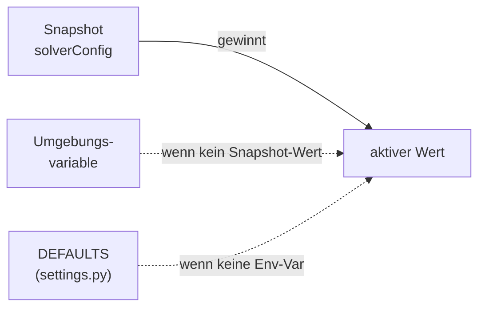

| Quelle | Welche Settings? | Wirkungsdauer |
|---|---|---|
| **`DEFAULTS` in settings.py** | Alle Parameter -- jede Setting hat hier einen Standardwert | dauerhaft (bis Code-Änderung) |
| **Umgebungsvariable** | Jede Setting aus `DEFAULTS` -- der Variablenname muss exakt mit dem Setting-Namen übereinstimmen | bis Container-Neustart |
| **Snapshot `solverConfig`** | (a) Die in der API explizit dokumentierten Felder; (b) technisch zusätzlich jede weitere `DEFAULTS`-Setting (siehe 7.3) | nur für diesen einen Planungslauf |

### 9.2 Vollständige Settings-Referenz

Die folgenden Abschnitte listen **alle** verfügbaren Settings in der Reihenfolge und Gruppierung, wie sie in `DEFAULTS` stehen. Jeder Parameter ist zugleich ein gültiger Umgebungsvariablen-Name und (via camelCase) auch ein gültiger `solverConfig`-Schlüssel. Interne Parameter, die für Kunden **keine praktische Relevanz** haben, sind entsprechend markiert ("intern").

#### 9.2.1 Common

Allgemeine Parameter, die quer über die gesamte Pipeline wirken.

| Parameter | Typ | Standard | Beschreibung |
|---|---|---|---|
| `LOG_LEVEL` | int/str | `INFO` | Log-Level der Solver Engine. Werte: `DEBUG`, `INFO`, `WARNING`, `ERROR`, `CRITICAL` |
| `MAX_LOG_EQUIPMENT_DISPLAY` | int | 5 | *(intern)* Max. Anzahl an Betriebsmitteln in Log-Zeilen (Verpackungsvergleich) |
| `MAX_DISPLAY_COUNT` | int | 5 | *(intern)* Max. Anzahl an Elementen in Backward/Forward-Pass-Logs |
| `MAX_DEMANDS_COUNT` | int | 10000 | **Wichtig:** Maximale Anzahl **aggregierter Bedarfe**, die pro Planungslauf eingeplant werden. Darüber hinausgehende Bedarfe werden mit `reason="Filtered due to performance optimization"` als unmet zurückgegeben (siehe § 8.3). Kundenseitig typischerweise deutlich kleiner (25--500) gesetzt, um Laufzeit zu begrenzen |

#### 9.2.2 HTTP-Statuscodes (intern)

Codes, die die Solver Engine in API-Fehlerfällen zurückgibt. Keine Anpassung vorgesehen -- nur für IT-Debug relevant.

| Parameter | Typ | Standard | Bedeutung |
|---|---|---|---|
| `STATUS_CODE_ARTICLE_NOT_FOUND` | int | 460 | Artikel-ID in Demand existiert nicht im Artikelstamm |
| `STATUS_CODE_WORK_PLAN_NOT_FOUND` | int | 461 | Arbeitsplan-ID existiert nicht |
| `STATUS_CODE_INVALID_WORK_PLAN` | int | 462 | Arbeitsplan ist inhaltlich ungültig |
| `STATUS_CODE_SNAPSHOT_VALIDATION_ERROR` | int | 463 | Snapshot-Validierung fehlgeschlagen (siehe Kapitel 3) |
| `STATUS_CODE_WORK_OPERATION_VALIDATION_ERROR` | int | 560 | Arbeitsgang-Ableitung fehlgeschlagen |
| `STATUS_CODE_SOLVER_ERROR` | int | 561 | Generischer Solver-Fehler |
| `STATUS_CODE_NO_SOLUTION_FOUND` | int | 562 | Keine zulässige Lösung |
| `STATUS_CODE_OPTIMIZER_ERROR` | int | 563 | Fehler in der Optimierungspipeline |
| `STATUS_CODE_SOLVER_NO_VALID_RESULT` | int | 564 | Lösung vorhanden, aber nicht validierbar |
| `STATUS_CODE_WORK_OPERATIONS_FACTORY_ERROR` | int | 565 | Fehler beim Aufbau der Arbeitsgangs-Struktur |
| `STATUS_OK` | int | 200 | *(nur für Tests)* |
| `STATUS_UNPROCESSABLE_ENTITY` | int | 422 | *(nur für Tests)* |

#### 9.2.3 Solver -- Kernparameter

Parameter, die an den zugrundeliegenden CP-SAT-Solver (Google OR-Tools) durchgereicht werden. Die meisten Werte sind das Ergebnis empirischer Abstimmung und sollten **nicht ohne Rücksprache** verändert werden.

| Parameter | Typ | Standard | Beschreibung |
|---|---|---|---|
| `SOLVER_NUM_SEARCH_WORKERS` | int | 8 | Parallele Suchthreads. `0` = automatisch = Anzahl CPU-Kerne. Mehr Worker = höherer RAM-Bedarf |
| `SOLVER_RANDOM_SEED` | int | 42 | Seed für Reproduzierbarkeit der Suchergebnisse |
| `SOLVER_LINEARIZATION_LEVEL` | int | 1 | *(intern, tuning)* Linearisierungsgrad (0=aus, 1=basis, 2=voll) |
| `SOLVER_CP_MODEL_PROBING_LEVEL` | int | 2 | *(intern, tuning)* Probing-Tiefe (0=aus, 1=einfach, 2=aggressiv) |
| `SOLVER_SYMMETRY_LEVEL` | int | 2 | *(intern, tuning)* Symmetrieerkennung (0=aus, 4=exhaustive) |
| `SOLVER_MAX_PRESOLVE_ITERATIONS` | int | 3 | *(intern, tuning)* Presolve-Durchläufe |
| `SOLVER_KEEP_ALL_FEASIBLE_SOLUTIONS_IN_PRESOLVE` | bool | false | *(intern, tuning)* Alle Presolve-Lösungen behalten |
| `SOLVER_PRESOLVE_BVE_THRESHOLD` | int | 500 | *(intern, tuning)* Boolean-Variable-Elimination Schwelle |
| `SOLVER_PRESOLVE_BVE_CLAUSE_WEIGHT` | int | 3 | *(intern, tuning)* BVE Clause-Gewicht |
| `SOLVER_PRESOLVE_SUBSTITUTION_LEVEL` | int | 1 | *(intern, tuning)* Substitutionsaggressivität (0-2) |
| `SOLVER_PRESOLVE_USE_BVA` | bool | true | *(intern, tuning)* Bounded Variable Addition |
| `SOLVER_PRESOLVE_BLOCKED_CLAUSE` | bool | true | *(intern, tuning)* Blocked-Clause-Elimination |
| `SOLVER_OPTIMIZE_WITH_CORE` | bool | false | *(intern, tuning)* Core-basierte Suche |
| `SOLVER_USE_LNS_ONLY` | bool | false | *(intern, tuning)* Nur LNS verwenden (false = volles Portfolio) |
| `SOLVER_DIVERSIFY_LNS_PARAMS` | bool | true | *(intern, tuning)* LNS-Parameter diversifizieren |
| `SOLVER_LNS_INITIAL_DIFFICULTY` | float | 0.5 | *(intern, tuning)* Initial freigegebener Variablenanteil in LNS |
| `SOLVER_INTERLEAVE_SEARCH` | bool | false | *(intern, tuning)* Interleaving vs. voll parallele Suche |
| `SOLVER_INTERLEAVE_BATCH_SIZE` | int | 0 | *(intern, tuning)* Tasks pro Worker (0 = adaptiv) |
| `SOLVER_SHARED_TREE_NUM_WORKERS` | int | 0 | *(intern, tuning)* Shared-Tree-Suche (0 = aus) |
| `SOLVER_SOLUTION_POOL_SIZE` | int | 300 | *(intern, tuning)* Größe des Lösungspools |
| `SOLVER_USE_RINS_LNS` | bool | true | *(intern, tuning)* RINS Large Neighborhood Search |
| `SOLVER_USE_FEASIBILITY_PUMP` | bool | true | *(intern, tuning)* Feasibility Pump für erste Lösung |
| `SOLVER_FP_ROUNDING` | int | 3 | *(intern, tuning)* FP-Rundung (0=NEAREST, 1=LOCK, 2=PROPAGATION, 3=ACTIVE_LOCK) |
| `SOLVER_EXPLOIT_INTEGER_LP_SOLUTION` | bool | true | *(intern, tuning)* Integer-LP-Lösungen nutzen |
| `SOLVER_EXPLOIT_ALL_LP_SOLUTION` | bool | true | *(intern, tuning)* Alle LP-Lösungen nutzen |
| `SOLVER_POLISH_LP_SOLUTION` | bool | false | *(intern, tuning)* LP-Lösungen polieren |

#### 9.2.4 Solution Extraction (intern)

| Parameter | Typ | Standard | Beschreibung |
|---|---|---|---|
| `PRESOLVER_DOMINANCE_RATIO` | float | 0.8 | Schwelle, ab der eine Lösung als "im Presolve gefunden" gilt |
| `PRESOLVER_FAST_SOLVE_THRESHOLD` | float | 0.001 | Zeitschwelle (Sekunden), ab der ein Solve als "fast" klassifiziert wird |

#### 9.2.5 Solver -- globale Laufzeit- und Abbruchsteuerung

Diese Parameter sind **praxisrelevant**. Sie steuern, wie lange der Solver maximal läuft und wann er ausreichend "gut" ist, um abzubrechen.

| Parameter                        | Typ   | Standard    | Beschreibung                                                                                                                                             |
|----------------------------------|-------|-------------|----------------------------------------------------------------------------------------------------------------------------------------------------------|
| `SOLVER_TIME_LIMIT_SECONDS`      | int   | 10800 (3 h) | **Harte Obergrenze** für die Gesamtlaufzeit eines einzelnen CP-SAT-Laufs                                                                                 |
| `SOLVER_LOG_SEARCH_PROGRESS`     | bool  | true        | Verbose Fortschrittslogs des Solvers aktivieren                                                                                                          |
| `SOLVER_ENUMERATE_ALL_SOLUTIONS` | bool  | false       | Enumerationsmodus statt Optimierungsmodus (für Tests)                                                                                                    |
| `SOLVER_PROGRESS_LOG_EVERY`      | int   | 1000        | Log-Throttle (Iterationen)                                                                                                                               |
| `SOLVER_REPAIR_HINT`             | bool  | true        | Der Solver versucht, einen infeasiblen Hint zu reparieren, bevor er die Suche neu startet. Verbessert die Anlaufzeit wenn Hints leicht inkonsistent sind |
| `SOLVER_HINT_CONFLICT_LIMIT`     | int   | 1000        | Maximale Anzahl Konflikte, die beim Hint-Reparatur-Versuch toleriert werden. Bei Überschreitung fällt der Solver auf vollständige Suche zurück           |

#### 9.2.6 Adaptive Stopping

Erkennt Stagnation (keine nennenswerten Verbesserungen mehr) und beendet den Solver früher.

| Parameter                                  | Typ   | Standard | Beschreibung                                                                                                                 |
|--------------------------------------------|-------|----------|------------------------------------------------------------------------------------------------------------------------------|
| `ENABLE_ADAPTIVE_STOPPING`                 | bool  | true     | Stagnationserkennung aktivieren                                                                                              |
| `GAP_STOPPING_WINDOW_SECONDS`              | int   | 30       | Beobachtungsfenster (Sekunden) für Gap-Stagnation und Idle-Timeout. Kein Fortschritt in diesem Fenster → Solver wird beendet |
| `GAP_STOPPING_MIN_ABS_IMPROVEMENT_PER_SEC` | float | 1.0      | Mindest-Verbesserungsrate (Solver-Einheiten/Sekunde) im Fenster; darunter gilt die Lösung als stagniert                      |

#### 9.2.7 Inkrementeller Demand-Solver

Siehe § 7.4 für das Konzept.

| Parameter | Typ | Standard | Beschreibung |
|---|---|---|---|
| `INCREMENTAL_DEMAND_BATCH_SIZE` | int | 10 | Anzahl Bedarfe, die pro Iteration neu hinzukommen |
| `INCREMENTAL_DEMAND_SLIDING_WINDOW_SIZE` | int | 30 | Größe des Sliding Window (Bedarfe, die noch veränderlich bleiben) |
| `INCREMENTAL_DEMAND_ITERATION_TIME_LIMIT_SECONDS` | int | 900 (15 min) | Max. Zeitbudget **pro Iteration** |
| `INCREMENTAL_DEMAND_TOTAL_TIME_LIMIT_SECONDS` | int | 43200 (12 h) | Max. Zeitbudget für die gesamte inkrementelle Pipeline inkl. finalem Gesamtlauf |

#### 9.2.8 Planungszeitraum

| Parameter | Typ | Standard | Beschreibung |
|---|---|---|---|
| `PLANNING_PERIOD_BEFORE_FIRST_DUE_DATE_DAYS` | int | 2 | Puffer in Tagen vor dem frühesten Fälligkeitstermin |
| `PLANNING_PERIOD_AFTER_LAST_DUE_DATE_DAYS` | int | 30 | Puffer in Tagen nach dem spätesten Fälligkeitstermin |
| `PLANNING_START_MODE` | str | `shift_aligned` | Startmodus: `shift_aligned`, `demand_driven`, `manual` |
| `PLANNING_START_LOOKAHEAD_HOURS` | int | 10 | Mindestvorlaufzeit in Stunden (nur im Modus `shift_aligned`) |
| `MANUAL_PLANNING_START_DATETIME` | datetime\|None | None | Expliziter Startzeitpunkt (UTC, ISO 8601). Pflicht wenn `PLANNING_START_MODE=manual` |

#### 9.2.9 Mitarbeitende (Qualifikationsauswahl)

| Parameter | Typ | Standard | Beschreibung |
|---|---|---|---|
| `ALLOWED_WORKER_QUALIFICATION_CATEGORIES` | list[str] | `["A", "Q"]` | Welche ESAROM-Qualifikationskategorien werden berücksichtigt. Werte: `A` = Aktiv, `Q` = Qualifiziert, `t` = trainierbar |

#### 9.2.10 Constraint Preparation

| Parameter | Typ | Standard | Beschreibung |
|---|---|---|---|
| `DUMMY_EQUIPMENT_DURATION` | float | 3600.0 | Fallback-Dauer (Sekunden) für Betriebsmittel ohne Durchsatzangabe |
| `WAITINGTIME_MAX_SECONDS` | float | 259200.0 (72 h) | Max. zulässige Dauer eines Arbeitsgangs (relevant für Wartezeit-Arbeitsgänge) |
| `SCHEDULER_TIME_UNIT_SECONDS` | int | 300 (5 min) | Zeitquantisierung des Solvers. Kleinere Werte = feinere Planung, aber längere Laufzeit |
| `UUID_SHORTEN_LENGTH` | int | 8 | *(intern)* Kürzungslänge für CP-SAT-Variablennamen |
| `EQUIPMENT_KEY_PREVIEW_COUNT` | int | 5 | *(intern)* Anzahl Betriebsmittel in Log-Previews |
| `MAX_ITERATION_COUNT` | int | 5 | Max. Durchläufe von Backward/Forward-Pass in der Fluss-Reduktion |

#### 9.2.11 Solver-Pipeline

| Parameter | Typ | Standard | Beschreibung |
|---|---|---|---|
| `ENABLE_OPTIONAL_DEMANDS` | bool | true | Bedarfe dürfen als unmet ausgelassen werden (mit Strafe statt Infeasibility) |
| `UNMET_DEMAND_PENALTY_DAYS` | int | 60 | Strafe für unmet Bedarf, ausgedrückt in Tagen Verspätungs-Äquivalent |

#### 9.2.12 Kontamination

| Parameter | Typ | Standard | Beschreibung |
|---|---|---|---|
| `ENABLE_CONTAMINATION_CONSTRAINTS` | bool | false | Kontaminations- und Reinigungsregeln aktivieren |
| `ENABLE_DETERMINISTIC_CLEANING` | bool | false | Deterministische Reinigung **nach** dem Lösen aktivieren: fügt 0-Dauer-`CIP`-Arbeitsschritte auf Basis von Hygiene-Klassen-Übergängen ein (nur Sichtbarkeit, keine Terminverschiebung) |
| `CONTAMINATION_CONSTRAINT_MODE` | str | `circuit` | Modellierungsvariante: `circuit` (aktuell), `pairwise` (**veraltet, nicht verwenden**) |
| `CONTAMINATION_TIME_WINDOW_DAYS` | int | 2 | Zeitfenster für Arc-Erzeugung in den Kontaminations-Constraints |
| `CLEANING_DURATION_SECONDS` | int | 3600 (1 h) | Dauer einer Reinigungsoperation |
| `ENABLE_FRIDAY_EOD_CLEANING` | bool | true | Am Freitag zum Schichtende reinigen, wenn Kontamination hoch |
| `FRIDAY_EOD_HOUR` | int | 20 | Uhrzeit der Freitagsreinigung |
| `FRIDAY_WEEKDAY` | int | 4 | *(intern)* Python-Wochentagsindex für Freitag |
| `ENABLE_FLOW_CONSTRAINTS` | bool | true | Fluss-Constraints (Rohrverbindungen) aktivieren |
| `MAX_RESOURCES_PER_TYPE` | int | 3 | Max. Anzahl vorausgewählter Betriebsmittel pro Typ und Arbeitsgang. `-1` = unbegrenzt |

> **Wichtig:** `ENABLE_CONTAMINATION_CONSTRAINTS` und `ENABLE_DETERMINISTIC_CLEANING` sind **gegenseitig exklusiv**. Pro Planungslauf darf nur einer der beiden Modi aktiv sein. Sind beide gleichzeitig aktiv, bricht die Engine mit Statuscode **463** (`SnapshotValidationError`) ab und meldet:
> `"enableContaminationConstraints and enableDeterministicCleaning are mutually exclusive. Please enable only one cleaning mode."`

#### CIP-Einträge im API-Response

Beide Modi (constraint-basiert und deterministisch) erzeugen im Ergebnis CIP-Operationen mit folgenden Eigenschaften:

| Feld | Wert |
|---|---|
| `work_item_key` | `"CIP"` |
| `demand_id` | `null` (Reinigung ist nicht einem Bedarf zugeordnet) |
| `batch_size` | `0` |
| Zeitpunkt | unmittelbar **vor** dem Arbeitsgang, der die Reinigung auslöst |
| Dauer | `CLEANING_DURATION_SECONDS` (constraint-Modus, Standard 1 h) bzw. **immer 0** (deterministischer Modus) |

Jede CIP-Operation erhält im Response einen **eigenen `ProductionOrder`** mit leerer `demands`-Liste, damit sie von nachgelagerten Systemen eindeutig identifiziert werden kann.

#### 9.2.13 Arbeitsgang-Aufteilung (Schichtübergabe)

| Parameter | Typ | Standard | Beschreibung |
|---|---|---|---|
| `OPERATION_SPLIT_THRESHOLD_SECONDS` | int | 10800 (3 h) | Arbeitsgänge länger als dieser Wert werden in P1/P2 aufgeteilt |
| `ENABLE_OPERATION_SPLITTING` | bool | true | Operationsaufteilung aktivieren |
| `MAX_OPERATION_DURATION_SECONDS` | int | 57600 (16 h) | Absolute Obergrenze -- Arbeitsgänge darüber werden als unmet gemeldet. Ausnahme: reine Rasten-Schritte (RF01/RF02, nur Storage) |
| `WORKER_CHANGE_PENALTY_WEIGHT` | int | 5 | Strafe pro Mitarbeitenden-Wechsel zwischen P1 und P2. `0` = aus |
| `CONFIRMED_DUE_DATE_PENALTY_MULTIPLIER` | int | 10 | Multiplikator für die Verspätungs-Strafe bei **bestätigten** Lieferterminen |

#### 9.2.14 Zielfunktion -- Penalty-Gewichte

Siehe § 7.3 für die fachliche Beschreibung.

| Parameter | Typ | Standard | Beschreibung |
|---|---|---|---|
| `ENABLE_DUEDATE_PENALTY` | bool | true | Verspätungs-/Verfrühungs-Strafen aktivieren |
| `ENABLE_MAKESPAN_PENALTY` | bool | true | Durchlaufzeit-Strafe (Makespan pro Bedarf) aktivieren |
| `ENABLE_WAITING_PENALTY` | bool | true | Wartezeit-Strafe (für WART02/WART03) aktivieren |
| `ENABLE_WASTE_PENALTY` | bool | true | Abfall-Strafe aktivieren |
| `ENABLE_CLEANING_PENALTY` | bool | true | Reinigungs-Strafe aktivieren |
| `ENABLE_LEITUNG_PENALTY` | bool | true | Strafe pro zugewiesener Leitung aktivieren |
| `ENABLE_PRECEDENCE_PENALTY` | bool | true | Strafe bei Reihenfolgeverletzung aktivieren |
| `TARDINESS_PENALTY_PER_DAY` | float | 100 | Strafe pro Tag Verspätung |
| `WAITING_PENALTY_PER_DAY` | float | 50 | Strafe pro Tag Wartezeit (WART02/WART03, dynamische Dauer) |
| `CLEANING_PENALTY_WEIGHT` | int | 50 | Strafe pro Reinigungsvorgang |
| `MAKESPAN_PENALTY_PER_DAY` | float | 10 | Strafe pro Tag Durchlaufzeit eines Bedarfs |
| `GAP_PENALTY_PER_SECOND` | float | 10 | Strafe pro Sekunde Lücke zwischen aufeinanderfolgenden Arbeitsgängen einer Charge |
| `EARLINESS_PENALTY_PER_DAY` | float | 5 | Strafe pro Tag Verfrühung |
| `LEITUNG_PENALTY_WEIGHT` | int | 1 | Strafe pro Leitung, die zur Flow-Erfüllung zugewiesen werden muss |
| `OVERLAP_PENALTY_MULTIPLIER` | int | 1 | *(defakto inaktiv)* Multiplikator für Überlappungsstrafen |
| `WASTE_PENALTY_PER_VOLUME_UNIT` | float | 0.001 | Strafe pro Liter Produktionsabfall |
| `ENABLE_HARD_PRECEDENCE_CONSTRAINTS` | bool | true | Harte Reihenfolge-Constraints (`end <= start`). `false` = nur weiche Überlappungsstrafen |

#### 9.2.15 Arbeitsplan-Verarbeitung

| Parameter | Typ | Standard | Beschreibung |
|---|---|---|---|
| `MERGE_PROCESSING_PACKAGING_IDS` | list[str] | `["70653", "70387", "71357", "71358"]` | Verpackungs-IDs, die die Zusammenlegung von BA01 + ABF01 in einen COMB-Arbeitsgang erzwingen |

#### 9.2.16 Resource Initializer

| Parameter | Typ | Standard | Beschreibung |
|---|---|---|---|
| `SHIFT_LENGTH_HOURS` | int | 8 | Schichtlänge in Stunden (für Schicht-aligned Start) |
| `ERROR_NO_EQUIPMENT` | str | *(Text)* | *(intern)* Fehlermeldung bei fehlenden Betriebsmitteln |
| `ERROR_NO_PACKAGING_COMPATIBILITY` | str | *(Text)* | *(intern)* Fehlermeldung bei fehlenden Verpackungskompatibilitätslisten |
| `ERROR_EMPTY_PREDECESSORS` | str | *(Text)* | *(intern)* Fehlermeldung bei leerer Vorgänger-Liste |

#### 9.2.17 Work-Item-Kategorien

Diese Listen werden **ausschließlich** von der Snapshot-Validierung (`validate_equipment_connectivity`) konsumiert. Sie legen fest, welche Arbeitsgangs-Schlüssel als Start/End/Ausnahme gelten und deshalb von der Konnektivitätsprüfung der Betriebsmittel ausgenommen werden.

| Parameter | Typ | Standard | Beschreibung |
|---|---|---|---|
| `START_WORK_ITEMS` | list[str] | `["HE01"]` | Arbeitsgänge, die kein Betriebsmittel-Vorgänger brauchen (Produktionsstart) |
| `END_WORK_ITEMS` | list[str] | `["ABF01"]` | Arbeitsgänge, die keinen Betriebsmittel-Nachfolger brauchen (Produktionsende) |
| `EXCLUDED_WORK_ITEMS` | list[str] | `["VOAR01", "VOPU01"]` | Arbeitsgänge, die von der Konnektivitätsprüfung komplett ausgenommen sind |

#### 9.2.18 Test-Konfiguration (intern)

Diese Werte werden **nur vom Test-Framework** referenziert -- nicht für die produktive Planung.

| Parameter | Typ | Standard | Beschreibung |
|---|---|---|---|
| `EXPECTED_SOLVE_TIME` | float | 0.1 | Erwarteter Solve-Zeitpunkt in Integrationstests |
| `EXPECTED_OBJECTIVE_VALUE` | float | 100.5 | Erwarteter Zielfunktionswert in Integrationstests |
| `EXPECTED_STATUS_CODE` | int | 562 | Erwarteter HTTP-Status in Fehler-Tests |

### 9.3 Settings über die Snapshot-API setzen

Parameter können pro Planungslauf über das Feld `solverConfig` im Snapshot-Request gesetzt werden. Die Feldnamen werden automatisch von **camelCase** in **UPPER_SNAKE_CASE** umgewandelt und gegen die Liste der bekannten Settings (`DEFAULTS`) abgeglichen.

#### 9.3.1 Offiziell dokumentierte SolverConfig-Felder

Folgende Felder sind im API-Schema (`SolverConfig`, [api/solver-engine-api-v1.yml](../api/solver-engine-api-v1.yml)) explizit dokumentiert. Sie sind der **stabile Vertrag** zwischen Frontend, ERP-Anbindung und Solver Engine -- diese Felder bleiben langfristig bestehen.

| API-Feld (camelCase) | Setting-Schlüssel | Typ | Beschreibung |
|---|---|---|---|
| `maxDemandsCount` | `MAX_DEMANDS_COUNT` | int | Maximale Anzahl Bedarfe pro Planungslauf |
| `mergeProcessingPackagingIds` | `MERGE_PROCESSING_PACKAGING_IDS` | list[str] | Verpackungs-IDs, die BA01 + ABF01 zu COMB verschmelzen |
| `planningStartMode` | `PLANNING_START_MODE` | str | `shift_aligned` \| `demand_driven` \| `manual` |
| `manualPlanningStartDatetime` | `MANUAL_PLANNING_START_DATETIME` | datetime | Expliziter Startzeitpunkt (UTC, ISO 8601 mit `Z`) |
| `allowedWorkerQualificationCategories` | `ALLOWED_WORKER_QUALIFICATION_CATEGORIES` | list[str] | Berücksichtigte Qualifikationskategorien |
| `enableContaminationConstraints` | `ENABLE_CONTAMINATION_CONSTRAINTS` | bool | Kontamination aktivieren |
| `enableDeterministicCleaning` | `ENABLE_DETERMINISTIC_CLEANING` | bool | Deterministische 0-Dauer-Reinigung nach dem Solver aktivieren |
| `enableOptionalDemands` | `ENABLE_OPTIONAL_DEMANDS` | bool | Demand-Level Optionalität aktivieren/deaktivieren (`false` = alle Demands sind verpflichtend) |

> **Wichtig:** `enableContaminationConstraints` und `enableDeterministicCleaning` sind **gegenseitig exklusiv**. Sind beide gleichzeitig gesetzt, antwortet die Engine mit Statuscode **463**.

**Beispiel-Request:**

```json
{
  "solverConfig": {
    "maxDemandsCount": 25,
    "planningStartMode": "manual",
    "manualPlanningStartDatetime": "2026-05-25T06:00:00Z",
    "allowedWorkerQualificationCategories": ["A", "Q"],
    "enableContaminationConstraints": true,
    "enableOptionalDemands": false
  }
}
```

#### 9.3.2 Technisch zusätzlich erlaubte Felder

Der Mapping-Mechanismus (`apply_snapshot_solver_config` in [src/microservice_engine/core/settings.py](../src/microservice_engine/core/settings.py)) akzeptiert **jeden camelCase-Schlüssel**, dessen UPPER_SNAKE_CASE-Äquivalent in `DEFAULTS` existiert. So können z.B. auch Penalties oder Zeitlimits per Snapshot überschrieben werden:

```json
{
  "solverConfig": {
    "tardinessPenaltyPerDay": 150.0,
    "solverTimeLimitSeconds": 7200,
    "maxResourcesPerType": 5
  }
}
```

> **Wichtig:** Diese Felder sind **nicht Teil des stabilen API-Vertrags**. Sie funktionieren technisch, sind aber im OpenAPI-Schema nicht aufgeführt. Bei Änderungen an `DEFAULTS` können sich Namen oder Wertebereiche ohne Vorankündigung ändern. Für produktive Frontend-Anbindungen sollten ausschließlich die in 9.3.1 dokumentierten Felder verwendet werden.

#### 9.3.3 Anforderungen und Fehlerverhalten

| Aspekt                     | Verhalten                                                                                                                   |
|----------------------------|-----------------------------------------------------------------------------------------------------------------------------|
| **Unbekannte Felder**      | Werden **ignoriert** (mit Debug-Log). Kein Fehler, kein Abbruch -- robust gegen API-Erweiterungen                           |
| **Typ-Konvertierung**      | Erfolgt automatisch auf Basis des Typs des Standardwerts: `bool`, `int`, `float`, `list[str]`, `str`                        |
| **Typ-Konflikt**           | Werte, die nicht konvertiert werden können, werden **übersprungen** und als Warnung geloggt; der Standardwert bleibt aktiv  |
| **`null` / nicht gesetzt** | Felder mit Wert `null` oder fehlende Felder werden ausgelassen -- der bisherige Wert (Env-Var oder Default) bleibt erhalten |
| **Listen**                 | Listen werden direkt als JSON-Array übergeben, nicht als komma-separierter String                                           |
| **Datums-Werte**           | ISO 8601 mit `Z`-Suffix (UTC), z.B. `"2026-05-25T06:00:00Z"`                                                                |
| **Wirkungsdauer**          | Nur für diesen einen Planungslauf -- nachfolgende Requests sehen wieder die globalen Defaults bzw. Env-Vars                 |

---

## 10. Integration und Betriebshinweise

Dieses Kapitel fasst die für die IT-Integration relevanten Punkte zusammen: Konfiguration über Umgebungsvariablen, verfügbare HTTP-Endpunkte sowie Hinweise zu Logging und Monitoring. Architektur, Docker-Build, Kubernetes-Deployment und Ressourcendimensionierung sind in separaten Betriebsdokumenten beschrieben und nicht Teil dieser Kundendokumentation.

### 10.1 Umgebungsvariablen

Alle Settings aus Kapitel 7 (Konfiguration) können als Umgebungsvariablen gesetzt werden. Der Name der Umgebungsvariable ist identisch mit dem Parameternamen.

**Beispiel (Kubernetes ConfigMap oder Deployment):**

```yaml
env:
  - name: SOLVER_TIME_LIMIT_SECONDS
    value: "7200"
  - name: LOG_LEVEL
    value: "INFO"
  - name: MAX_DEMANDS_COUNT
    value: "100"
  - name: SOLVER_NUM_SEARCH_WORKERS
    value: "8"
```

**Typkonvertierung:**

- `true`/`false` für Booleans
- Ganzzahlen für Integer-Werte
- Komma-getrennt für Listen (z.B. `"70653,70387"`)
- `LOG_LEVEL` akzeptiert auch Textwerte: `DEBUG`, `INFO`, `WARNING`, `ERROR`

### 10.2 API-Endpunkte

| Endpunkt             | Methode | Beschreibung                                                                                                                        |
|----------------------|---------|-------------------------------------------------------------------------------------------------------------------------------------|
| `/run-solver`        | POST    | Hauptendpunkt: Nimmt einen Snapshot entgegen und liefert einen optimierten Produktionsplan                                          |
| `/validate-snapshot` | POST    | Validiert die Eingabedaten ohne den Solver zu starten                                                                               |
| `/livez`             | GET     | Liveness-Probe für den Plattformbetrieb (z. B. Kubernetes): Liefert `200`, solange der Service-Prozess läuft                        |
| `/readyz`            | GET     | Readiness-Probe für den Plattformbetrieb: Liefert `200`, wenn der Service anfragebereit ist, sonst `503` (z. B. während Start/Stop) |
| `/docs`              | GET     | Swagger UI mit interaktiver API-Dokumentation                                                                                       |
| `/redoc`             | GET     | Alternative API-Dokumentation (ReDoc)                                                                                               |

**Input (`/run-solver`):** Ein `Snapshot`-Objekt als JSON, das alle Planungsdaten enthält (Bedarfe, Artikel, Arbeitspläne, Betriebsmittel, Mitarbeitende, Schichtpläne, Verfügbarkeiten).

**Output (`/run-solver`):** Ein `SolverEngineResponse`-Objekt als JSON mit:

- `workItems`: Liste der eingeplanten Arbeitsgänge (API-Modell: *work items*) mit Zeitfenstern und zugewiesenen Ressourcen
- `productionOrders`: Liste der Produktionsaufträge mit Zuordnung zu Work Items
- `solverMetrics`: Performance-Kennzahlen des Solvers
  - `totalCostFunctionValue`: Gesamtwert der Zielfunktion (niedriger = besser)
  - `unmetDemands`: Liste der nicht eingeplanten Bedarfe mit Begründung
- `validationResponse`: Strukturierte Validierungsmeldungen, die nach dem Planungslauf aufgetreten sind. Diese werden als Liste von `ValidationMessage`-Objekten zurückgegeben und führen **nicht** zu einem HTTP-Fehler. So kann der Aufrufer Validierungshinweise auswerten, ohne dass der gesamte Planungslauf als gescheitert gilt.

### 10.3 Logging und Monitoring

Die Solver Engine gibt strukturierte Log-Ausgaben auf stdout/stderr aus (geeignet für Log-Aggregation via Kubernetes).

**Log-Level konfigurieren:**

```bash
# Umgebungsvariable
LOG_LEVEL=INFO    # Standard
LOG_LEVEL=DEBUG   # Detaillierte Ausgaben (inkl. Solver-Fortschritt)
LOG_LEVEL=WARNING # Nur Warnungen und Fehler
```

**Wichtige Log-Meldungen während eines Planungslaufs:**

| Phase                 | Typische Meldung                          | Bedeutung                                   |
|-----------------------|-------------------------------------------|---------------------------------------------|
| Start                 | `Solver service started with N demands`   | Planungslauf beginnt                        |
| Constraint Preparator | `Unmet demands: [...]`                    | Bedarfe konnten nicht vorverarbeitet werden |
| Solver                | `New solution found: objective=X`         | Neue (bessere) Lösung gefunden              |
| Solver                | `Solver stopped: GAP_LIMIT reached`       | Abbruch wegen erreichter Optimierungsgüte   |
| Solver                | `Solver stopped: TIME_LIMIT reached`      | Abbruch wegen Zeitlimit                     |
| Ende                  | `Solver response built with N work items` | Planungslauf erfolgreich abgeschlossen      |

**Solver-Fortschritt (`SOLVER_LOG_SEARCH_PROGRESS=true`):**

Im Debug-Modus gibt der Solver regelmäßig Zwischenergebnisse aus, u.a.:

- Aktuelle beste Lösung (Objective Value)
- Untere Schranke (Lower Bound)
- Aktueller Gap in Prozent
- Anzahl gefundener Lösungen

### 10.4 Externe Worker-Architektur

Für den produktiven Zielbetrieb wird die Engine um einen Worker-Pfad erweitert: Statt dass das Backend die Engine synchron aufruft, **holen** Worker Jobs aktiv vom Backend ab (Pull-Modell).

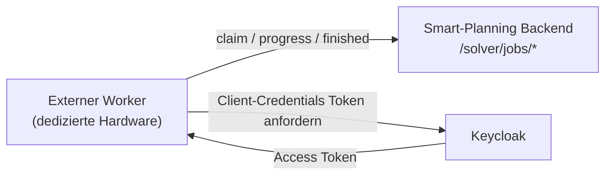

**Kernprinzip:**

1. Backend reiht Jobs als `VALIDATE` oder `SOLVE` ein.
2. Worker beanspruchen den nächsten Job über `POST /solver/jobs/claim`.
3. Worker melden Fortschritt über `POST /solver/jobs/{jobId}/progress`.
4. Worker schließen den Lauf über `POST /solver/jobs/{jobId}/finished` ab.

**Warum dieses Modell eingeführt wurde:**

- Schnellere und besser planbare Laufzeiten auf dedizierter Hardware
- Einfache horizontale Skalierung durch zusätzliche Worker (jeder zusätzliche Worker entspricht zusätzlicher dedizierter Hardware).
- Mehrere Worker-Hardware-Instanzen erhöhen nicht nur die Kapazität, sondern wirken auch als Hotstandby.
- Saubere Entkopplung zwischen UI/Backend und rechenintensiver Solver-Ausführung
- Höhere Betriebssicherheit durch explizite Job- und Statusführung inklusive Stale-Erkennung
- Keine inbound Ports auf den Worker-Systemen, da die Kommunikation ausschließlich outbound erfolgt

**Wichtige Einordnung für Integrator:innen:**

- Die in 10.2 beschriebenen Engine-Endpunkte (`/run-solver`, `/validate-snapshot`) bleiben für den direkten API-Pfad verfügbar.
- Im Worker-Betrieb sind die neuen `/solver/jobs/*`-Endpunkte **Backend-Endpunkte**, die vom Worker aufgerufen werden.
- Pro Worker läuft immer nur **ein `SOLVE`-Job gleichzeitig**, da der Planungslauf hohe CPU-Ressourcen benötigt.
- Insgesamt können mehrere `SOLVE`-Jobs parallel laufen -- abhängig von der Anzahl aktiver Worker.
- Die Skalierung erfolgt durch das Hinzufügen weiterer Worker, d. h. durch zusätzliche dedizierte Hardware.
- Fällt ein Worker-Rechner aus, geht nur der dort laufende Job verloren und wird als `STALE` sichtbar.
- Wenn ein Worker für einen laufenden Job länger als 15 Minuten keine Fortschrittsmeldung mehr sendet, wird der Job als `STALE` markiert.
- `STALE`-Jobs werden nicht automatisch neu gestartet und müssen manuell neu eingereiht werden.
- Die übrigen Worker sind davon nicht betroffen und verarbeiten weitere Queue-Jobs weiter.
- `VALIDATE`-Jobs können **jederzeit** ausgeführt werden -- auch dann, wenn bereits ein `SOLVE`-Job aktiv ist.
- Die Absicherung erfolgt über Maschinen-Authentifizierung (Keycloak Client-Credentials mit dedizierter Worker-Rolle).

---

## Glossar

| Begriff | Erklärung |
|---|---|
| **Arbeitsgang** | Einzelner Produktionsschritt innerhalb eines Bedarfs (HE01, RF01, BA01, ABF01, ...). Im API-Datenmodell: *work item*, im Code: *work operation* |
| **Bedarf** | Planungseinheit: ein zu produzierender Artikel in definierter Menge mit Liefertermin. Im Code: *demand* |
| **Betriebsmittel** | Oberbegriff für alle physischen Ressourcen (Tank, Topf, BA-Anlage, Leitung, Abfüller, Arbeitsplatz) |
| **Constraint** | Regel oder Einschränkung, die der Solver einhalten muss (z.B. "keine Doppelbelegung") |
| **Constraint Preparator** | Vorverarbeitungsstufe, die das Problem reduziert, bevor der Solver startet |
| **CP-SAT** | Constraint Programming with SAT -- der verwendete Solver-Algorithmus von Google OR-Tools |
| **Flow Constraint** | Einschränkung basierend auf physischen Rohrverbindungen zwischen Betriebsmitteln |
| **Funktion** | ESAROM-Begriff für den Typ eines Betriebsmittels: Tank, Topf, BA-Anlage, Leitung, Abfüller, Arbeitsplatz |
| **Gap** | Abstand zwischen der aktuellen besten Lösung und dem theoretischen Optimum |
| **Hint / Starthilfe** | Vorschlag an den Solver basierend auf einer vorherigen Lösung |
| **Kontamination** | Verschmutzungsklasse, die ein Artikel auf einem Betriebsmittel hinterlässt |
| **Losgröße** | Produktionsmenge eines Bedarfs in Litern |
| **Mitarbeitende** | Personen mit Qualifikationen, die Betriebsmittel bedienen können |
| **Objective / Zielfunktion** | Die zu minimierende Kostenfunktion (Verspätungen, Wartezeiten, Reinigungen) |
| **Penalty** | Strafpunkte in der Zielfunktion für unerwünschte Zustände |
| **Snapshot** | Vollständiger Datensatz aller Planungsinformationen (Input für den Solver) |
| **Solver** | Der Optimierungsalgorithmus, der den besten Produktionsplan sucht |
| **Stagnation** | Zustand, in dem der Solver keine wesentliche Verbesserung mehr findet |
| **Unmet Demand** | Bedarf, der nicht eingeplant werden konnte (mit Begründung) |
| **Werkauftrag** | Planungsergebnis: Ein Bedarf mit konkret geplanten Arbeitsgängen, Zeitpunkten, Betriebsmitteln und Mitarbeitenden. Im API-Datenmodell: *production order* |
