# Architekturdiagramme für den PT4-Projektbericht

> **Dokumenttyp:** zitierfähige Architektur- und Ablaufdokumentation  
> **Stand:** 13.07.2026  
> **System:** *Agentic AI in der Produktion – Human-in-the-Loop Governance, MCP-Integration und lernendes Review-System*  
> **Geltungsbereich:** real implementierter Stand von AP1 bis AP7; AP-E und AP-X werden nur dort gezeigt, wo sie ausdrücklich als offen beziehungsweise als Zielbild gekennzeichnet sind.

## 1. Zweck und Leselogik

Dieses Dokument übersetzt den realen Quellcode, den Umsetzungsplan und das Projektlog in konsistente Architektursichten für einen Projektbericht. Es ist nicht als idealisierte Referenzarchitektur zu lesen. Jede als **IST** bezeichnete Beziehung ist im Repository implementiert oder durch einen dokumentierten Funktionsnachweis belegt. **ZIEL** bezeichnet ausschließlich einen empfohlenen Ausbau und darf im Bericht nicht als bereits umgesetzt dargestellt werden.

Die Diagramme folgen einer einheitlichen Leselogik:

- **Blau:** Bestandteil des eigenen Systems.
- **Grün:** persistente Daten- oder Wissensbasis.
- **Violett:** KI-, Integrations- oder Infrastrukturkomponente außerhalb des eigenen Codes.
- **Orange:** Human-in-the-Loop-Grenze oder kontrollierte Mutation.
- **Grau gestrichelt:** Zielbild, noch nicht implementiert.

Die Mermaid-Blöcke können direkt in Markdown-fähigen Dokumentationswerkzeugen gerendert oder für den Projektbericht als SVG/PNG exportiert werden.

## 2. Contract-Check und Quellenhierarchie

Die Diagramme wurden gegen folgende Primärquellen im Projekt geprüft:

1. [PT4_PLAN.md](PT4_PLAN.md) – Akzeptanzkriterien, Arbeitspakete und Meilensteine.
2. [PROJECT_LOG.md](PROJECT_LOG.md) – chronologischer Nachweis der Entscheidungen, Abweichungen, Tests und bekannten Grenzen.
3. Aktueller Code unter `demo/` – maßgeblich für tatsächlich vorhandene Komponenten und Aufrufpfade.
4. [AP5_AP6_DOCUMENTATION.md](AP5_AP6_DOCUMENTATION.md) – historische Detaildokumentation für MCP und Dashboard.
5. [README.md](../demo/README.md) und [README-PT4.md](../demo/README-PT4.md) – Ausgangs- und Zwischenstandsdokumentation.

Bei Widersprüchen gilt: **aktueller Code vor neuestem Projektlog vor Plan vor historischen Zwischenstandsdokumenten**. Das ist besonders relevant, weil:

- automatische Proposal-E-Mails nach dem AP5-Abnahmenachweis wieder deaktiviert wurden;
- E-Mails aktuell ausschließlich nach expliziter Chat-Freigabe versendet werden;
- M6 und M7 inzwischen als abgeschlossen markiert sind;
- die Confidence-Formel inzwischen `formula_version = v3` verwendet und `value_grounded` klassenabhängig berechnet;
- AP-E weiterhin nicht vollständig abgeschlossen ist.

## 3. Methodische und literarische Fundierung

Die Dokumentation verwendet mehrere Sichten, weil eine einzelne Grafik weder Stakeholder, statische Struktur, Laufzeitverhalten, Daten noch Deployment angemessen erklären kann. Das entspricht dem Grundgedanken von [ISO/IEC/IEEE 42010:2022](https://www.iso.org/standard/74393.html), Architektur über zielgerichtete *Views* und *Viewpoints* für unterschiedliche Belange zu beschreiben.

Für die statische Zerlegung wird das [C4-Modell von Simon Brown](https://c4model.com/diagrams) verwendet: Systemkontext, Container und Komponenten bilden gestufte Detaillierungsebenen. C4 empfiehlt ausdrücklich, nur die Sichten einzusetzen, die einen konkreten Erkenntnisgewinn liefern. Dynamische Abläufe und Deployment werden als ergänzende Diagrammtypen genutzt. Die Gliederung ist zugleich kompatibel mit den Building-Block-, Runtime- und Deployment-Sichten des [arc42-Templates](https://arc42.org/).

Für die fachlichen Architekturentscheidungen sind zusätzlich relevant:

- Die [MCP-Architektur](https://modelcontextprotocol.io/docs/learn/architecture) unterscheidet Host, Client und Server. Diese Unterscheidung ist zentral, um den vorhandenen MCP-Server nicht fälschlich als bereits fertige Multi-Connection-Plattform darzustellen.
- Das CoALA-Paper [*Cognitive Architectures for Language Agents*](https://arxiv.org/abs/2309.02427) beschreibt Sprachagenten über modulare Gedächtniskomponenten, Entscheidungsprozesse und interne/externe Aktionen. Das Projekt lehnt seine Trennung von Arbeitsgedächtnis, episodischem Gedächtnis und Regelwissen daran an, verwendet die Begriffe aber bewusst nicht überdehnt.
- Das [NIST AI Risk Management Framework](https://airc.nist.gov/airmf-resources/airmf/appendices/app-c-ai-risk-management-and-human-ai-interaction/) fordert klar definierte menschliche Rollen und Verantwortlichkeiten in Human-AI-Konfigurationen. Im Projekt wird diese Forderung technisch durch eine echte Schreibsperre und einen separaten Review-Commit umgesetzt.
- Die von Amershi et al. publizierten [Guidelines for Human-AI Interaction](https://www.microsoft.com/en-us/research/publication/guidelines-for-human-ai-interaction/) betonen unter anderem Korrigierbarkeit, Kontrolle und verständliches Systemverhalten. Review-Diff, Confidence-Begründungen, Modify und explizite Versandfreigabe setzen diese Prinzipien konkret um.
- Microsofts [Azure AI Agent Orchestration Patterns](https://learn.microsoft.com/en-us/azure/architecture/ai-ml/guide/ai-agent-design-patterns) unterscheiden spezialisierte Agenten, Orchestration und menschliche Freigabepunkte. Das reale System entspricht dabei am ehesten einer zentral gesteuerten Orchestrator-Architektur mit spezialisierten Sub-Agenten und deterministischen Governance-Gates.

## 4. Sichtenkatalog für den Projektbericht

| Nr. | Sicht | Leitfrage | Empfohlene Verwendung |
|---:|---|---|---|
| 1 | Systemkontext | Wer nutzt das System und mit welchen externen Systemen interagiert es? | Einleitung / Systemabgrenzung |
| 2 | Container | Welche deploybaren Anwendungen und Datenspeicher bilden die Lösung? | Architekturkapitel |
| 3 | Backend-Komponenten | Wie sind Orchestrator, Agenten, Governance, MCP und Repository intern getrennt? | Technische Umsetzung |
| 4 | Chat-Laufzeit | Wie wird eine natürliche Anfrage geplant, geroutet und protokolliert? | Agentenarchitektur |
| 5 | HitL-Korrekturlauf | Wo endet KI-Autonomie und wo beginnt menschlich autorisiertes Schreiben? | Kernbeitrag / Governance |
| 6 | Proposal-Zustände | Welche Zustände und Fehlerpfade besitzt ein Vorschlag? | Prozess- und Auditierbarkeit |
| 7 | Datenmodell | Welche Entitäten tragen Chat, Vorschlag, Entscheidung, Memory und Telemetrie? | Persistenz |
| 8 | Memory-Architektur | Wie wirken Session-Kontext, Regelkarten und menschliche Präzedenzfälle zusammen? | AP7 / wissenschaftlicher Bezug |
| 9 | MCP-Ist-Architektur | Was ist wirklich standardisiert und wo liegen die Grenzen? | AP5 |
| 10 | E-Mail-Workflow | Wie verhindert das System unbeabsichtigten Versand? | Enterprise-Fall AP5 |
| 11 | Dashboard-Datenfluss | Wie entstehen KPIs und Data-Quality-Hinweise? | AP6 |
| 12 | Deployment | Wie unterscheiden sich lokale und Azure-Ausführung? | Betrieb / Übertragbarkeit |
| 13 | Trust Boundaries | Wo liegen Secrets, externe Vertrauensgrenzen und kontrollierte Schreibpfade? | Security-Einordnung |
| 14 | CI/CD | Wie gelangen Backend und Frontend reproduzierbar nach Azure? | DevOps |
| 15 | MCP-Zielbild | Wie kann GitHub, Wikipedia oder SharePoint später ergänzt werden? | Ausblick |
| 16 | AP-Traceability | Welche Architekturbausteine erfüllen welche Arbeitspakete? | Ergebnissicherung |

---

## 5. Diagramm 1 – Systemkontext nach C4, Ebene 1 (IST)

**Aussage:** Das System vermittelt zwischen Produktionsplaner, Fachreviewer und mehreren Azure-/Smart-Planning-Diensten. Die fachlich entscheidende Systemgrenze ist: Die KI darf Vorschläge erzeugen, aber eine Mutation der Produktionsplanungsdaten wird im PT4-Modus erst nach einer persistierten menschlichen Entscheidung zugelassen.

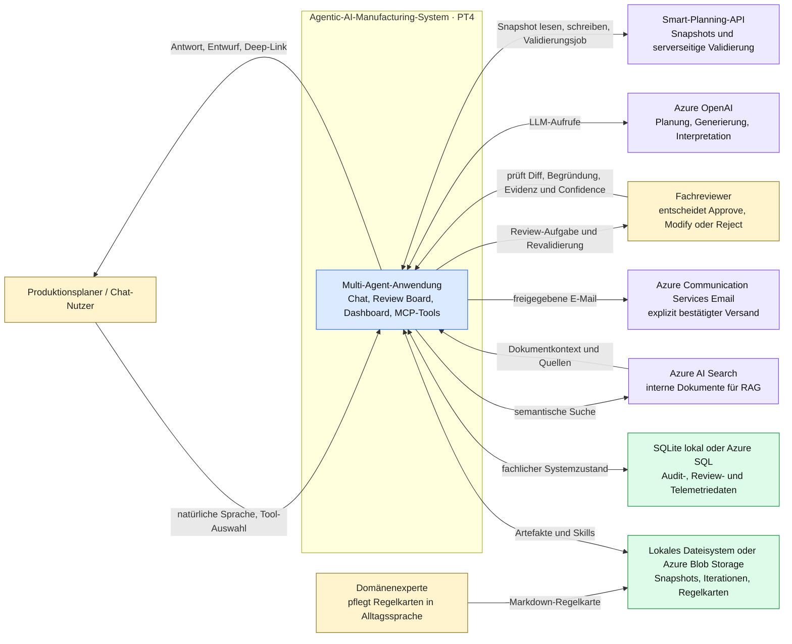

**Projektbezug:** `demo/web_server.py` stellt die Nutzeroberfläche und APIs bereit; `demo/agents/` enthält Orchestrator und Spezialagenten; `demo/routes/review.py` ist der freigegebene Schreibpfad; `demo/storage_manager.py` und `demo/db/session.py` abstrahieren Datei- und SQL-Persistenz.

**Geeignete Bildunterschrift:** *Systemkontext der PT4-Lösung: Die Agentenanwendung verbindet Nutzer, Smart Planning und Azure-Dienste; produktive Datenänderungen bleiben an eine menschliche Review-Entscheidung gebunden (eigene Darstellung in Anlehnung an C4).*

---

## 6. Diagramm 2 – Container-Sicht nach C4, Ebene 2 (IST)

**Aussage:** C4 verwendet „Container“ im Sinn einer separat laufenden Anwendung oder eines Datenspeichers, nicht nur im Sinn eines Docker-Containers. Der Python-Backend-Prozess enthält mehrere Komponenten, ist aber im aktuellen Deployment eine gemeinsame Anwendung. Der MCP-Server kann separat über `stdio` gestartet werden und verwendet dieselbe Tool- und Repository-Logik.

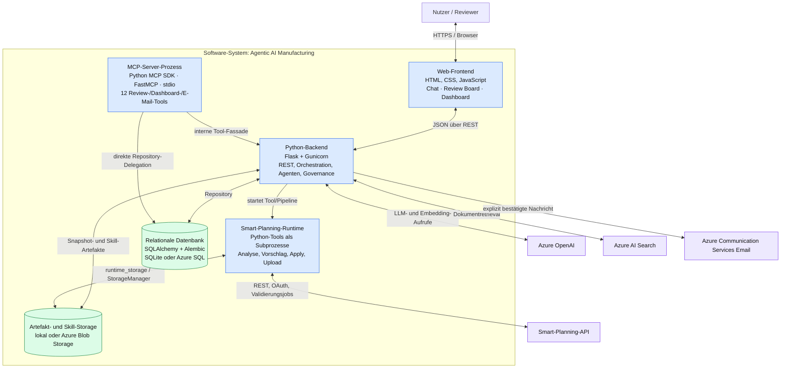

**Wichtige Präzisierung:** Die Linie `MCP → API` bezeichnet die Wiederverwendung derselben fachlichen Adapterlogik, nicht einen HTTP-Aufruf an Flask. `demo/mcp_connections/tools.py` importiert das Repository direkt; der E-Mail-Agent verwendet dieselben Tool-Funktionen in-process. Damit existiert nur eine Fachlogik, aber aktuell noch kein allgemeiner MCP-Host mit dynamischen Verbindungen zu externen MCP-Servern.

---

## 7. Diagramm 3 – Backend-Komponentensicht nach C4, Ebene 3 (IST)

**Aussage:** Der Backend-Container folgt einer klaren Schichtung: Eingangsadapter, Orchestration, spezialisierte Agenten, deterministische Fach-/Governance-Services und Persistenz. LLMs entscheiden über Routing und Vorschläge; harte Sicherheitsregeln wie Status-, Iterations-, Identitäts- und Action-Guards liegen dagegen in Python-Code.

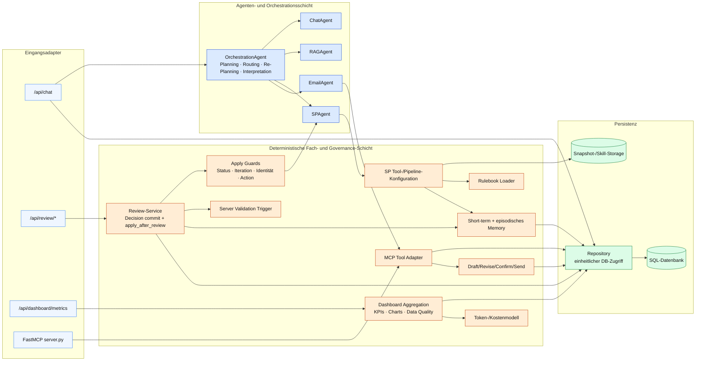

**Architekturargument für den Bericht:** Das System ist agentisch, aber nicht „prompt-only“. Nichtdeterministische Aufgaben – Sprachverständnis, Planung, Fehleranalyse, Korrekturvorschlag und Formulierung – werden LLM-gestützt ausgeführt. Zustandsübergänge, Persistenz, Berechtigungsgrenzen, Validierungstrigger, Action-Kompatibilität und Versandfreigabe werden deterministisch erzwungen. Diese Trennung ist der wesentliche Production-Readiness-Beitrag von PT4.

---

## 8. Diagramm 4 – Laufzeitsicht: allgemeine Chat-Anfrage (IST)

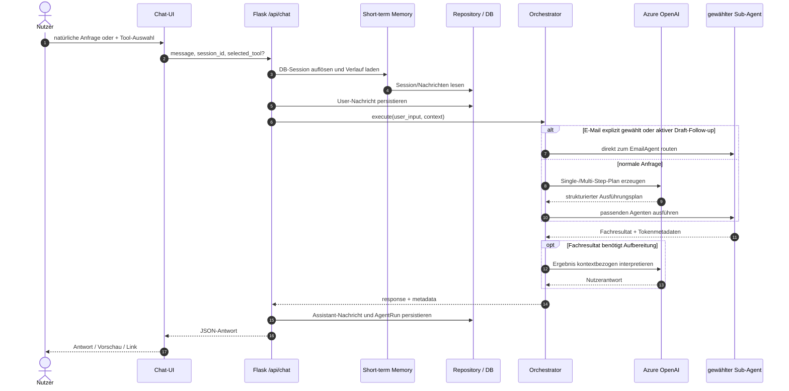

**Codebezug:** `web_server.chat()` erzeugt den Kontext und persistiert Messages/AgentRun; `OrchestrationAgent.execute()` plant und kann bis zu viermal adaptiv neu planen; der E-Mail-Modus besitzt eine explizite Routing-Abkürzung, damit eine sichtbare Draft-Konversation nicht versehentlich zu einem anderen Agenten springt.

---

## 9. Diagramm 5 – Kernablauf: Human-in-the-Loop-Korrektur (IST)

**Aussage:** Der zentrale Kontrollpunkt liegt nicht nur in der UI. Der Orchestrator blockiert Auto-Apply, die Entscheidung wird transaktional persistiert und `_apply_after_review()` prüft die Autorisierung erneut aus der Datenbank. Erst danach darf die bestehende Apply-Pipeline schreiben.

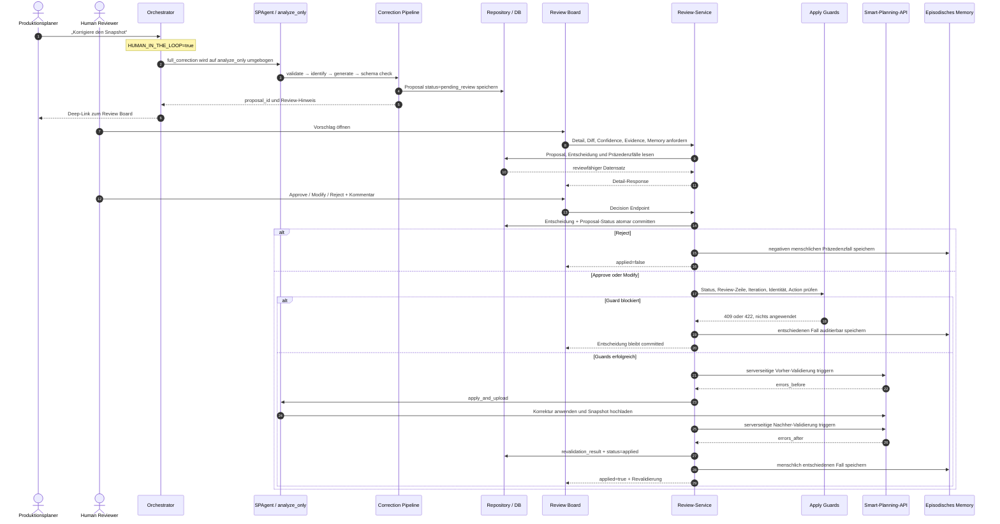

**Fehlersemantik:** Fällt die Pipeline oder die Netzvalidierung aus, bleibt die menschliche Entscheidung absichtlich committed. Der Status bleibt `approved` beziehungsweise `modified`, `revalidation_result` dokumentiert `failed_at` und `error`, und der Endpunkt antwortet geordnet mit HTTP 502 statt mit einem ungefangenen 500. Der Recovery-Weg ist ein erneuter Apply-Versuch, kein Zurücksetzen der menschlichen Entscheidung.

**Literaturbezug:** NIST fordert klar definierte Rollen und Verantwortlichkeiten für Human-AI-Entscheidungen. Hier ist der Mensch nicht nur informell „in the loop“, sondern besitzt die exklusive Autorität für den Übergang vom Vorschlag zur Mutation. Die KI kann diesen Übergang nicht durch eine Prompt-Entscheidung umgehen.

---

## 10. Diagramm 6 – Zustandsautomat eines Korrekturvorschlags (IST)

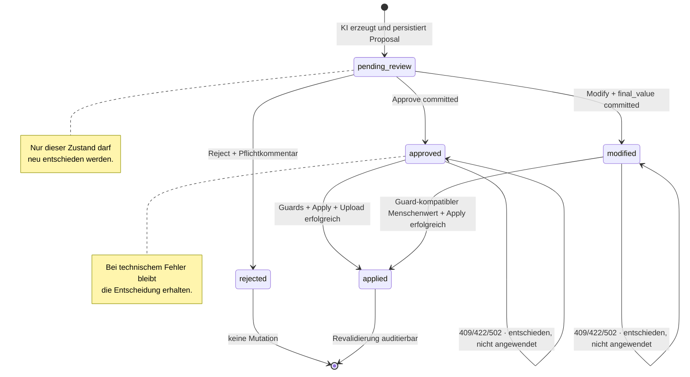

**Invariante:** Eine wiederholte Generierung derselben deterministischen `proposal_id` darf eine bereits getroffene Entscheidung nicht auf `pending_review` zurücksetzen. Das Repository schützt diesen Fall ausdrücklich.

---

## 11. Diagramm 7 – Relationales Datenmodell (IST)

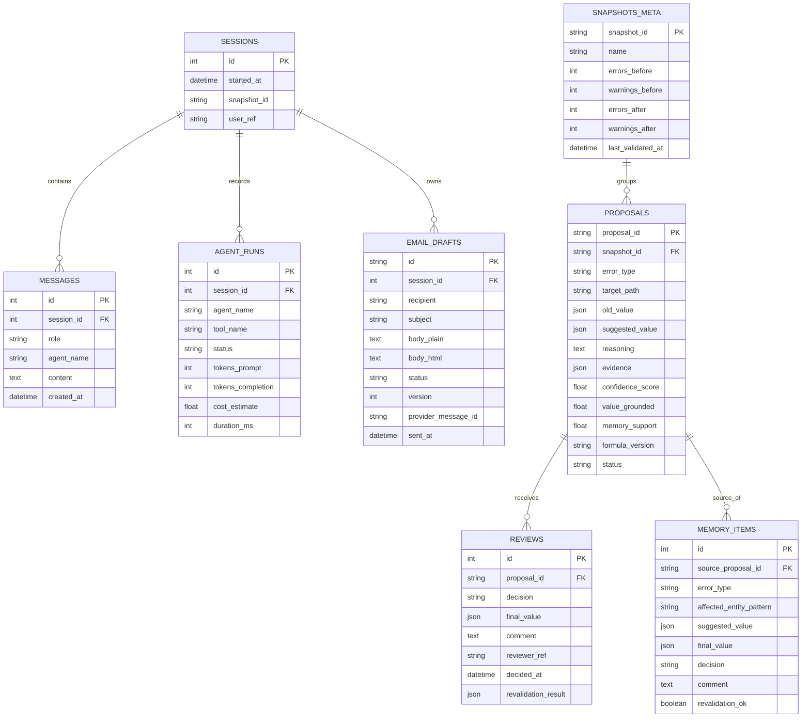

**Architekturargument:** Die Datenbank ist nicht nur technischer Speicher, sondern der Governance-Backbone. `proposals` hält die KI-Behauptung, `reviews` die menschliche Entscheidung, `memory_items` den daraus abgeleiteten Präzedenzfall und `agent_runs` die Betriebsmetrik. Dadurch bleiben Vorschlag, Entscheidung, Lerneffekt und Kosten analytisch trennbar.

---

## 12. Diagramm 8 – Gedächtnis- und Wissensarchitektur (IST)

**Aussage:** Das System besitzt drei fachlich verschiedene Kontextquellen. Sie dürfen im Bericht nicht zu einem einzigen unscharfen „Memory“ zusammengezogen werden.

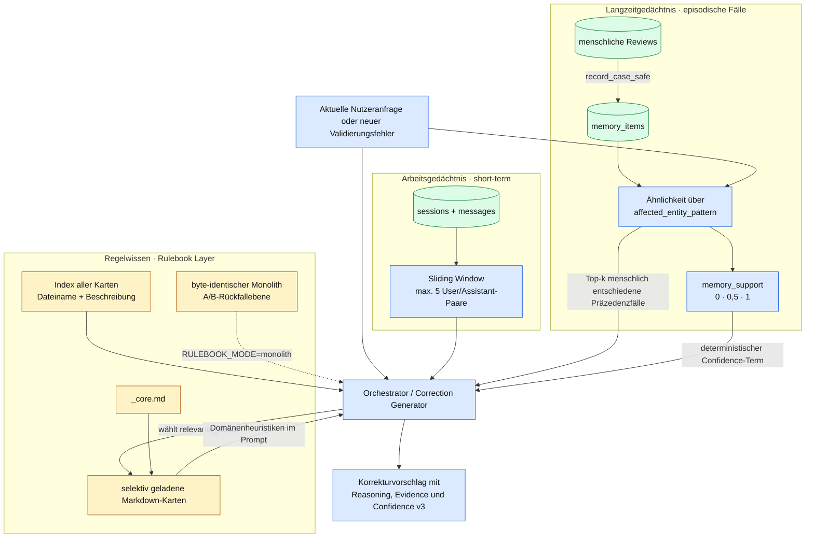

### 12.1 Einordnung gegenüber CoALA

Das CoALA-Modell liefert eine nützliche Begriffsschablone für Arbeits- und Langzeitgedächtnis, Entscheidungsprozess und Aktionen. Die konkrete PT4-Implementierung ist jedoch kleiner und bewusst pragmatisch:

- `memory.short_term` ist persistierter Session-Kontext mit begrenztem Promptfenster.
- `memory_items` sind episodische, von echten menschlichen Entscheidungen abgeleitete Fälle.
- `demo/skills/*.md` bilden ein **Rulebook Layer**. Die Karten enthalten sowohl Handlungsregeln als auch Domänenwissen und werden deshalb im Plan bewusst nicht streng als „prozedurales Gedächtnis“ bezeichnet.
- Das System lernt nicht autonom neue Regeln. AP-X würde lediglich Regeländerungen vorschlagen; menschliche Freigabe und Versionierung blieben zwingend.

### 12.2 Confidence als nachvollziehbare Aggregation

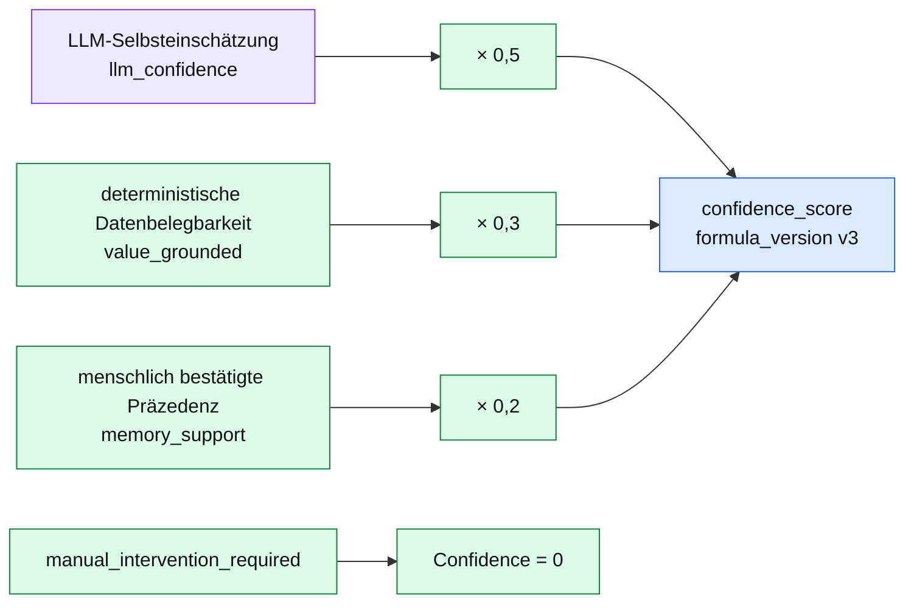

`value_grounded` stellt in v3 je Feldklasse eine andere deterministische Frage: neue Identitäten müssen eindeutig sein und der erkannten ID-Konvention folgen; Referenzen müssen existieren; Wertfelder müssen aus vergleichbaren Daten ableitbar sein; neue Array-Objekte werden auf Identität und Referenzen geprüft. Die Kennzahl misst bei Wertfeldern weiterhin Belegbarkeit, nicht garantierte fachliche Korrektheit – eine wichtige Einschränkung für die Evaluation.

---

## 13. Diagramm 9 – MCP-Ist-Architektur und reale Protokollgrenze (IST)

**Aussage:** AP5 implementiert einen echten FastMCP-Server mit standardisierten Tool-Schemas. Die laufende Webanwendung verwendet dieselben Tool-Funktionen intern. Ein universeller MCP-Host, der dynamisch mehrere externe MCP-Server verbindet, ist noch nicht Bestandteil des Systems.

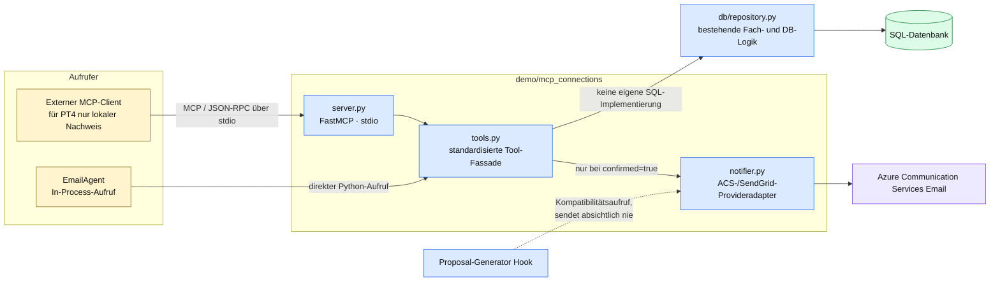

### 13.1 Registrierte MCP-Tools

| Domäne | Tools | Wirkung |
|---|---|---|
| Review lesen | `get_pending_reviews`, `get_review_details`, `get_snapshot_status` | Repository-Lesezugriff |
| Review entscheiden | `approve_correction`, `reject_correction`, `modify_correction` | Entscheidung persistieren; keine Apply-Pipeline starten |
| Dashboard | `get_dashboard_metrics` | kompakte Repository-Kennzahlen |
| E-Mail | `create_email_draft`, `get_email_draft`, `revise_email_draft`, `send_email_draft`, `cancel_email_draft` | persistenter Freigabe-Workflow |

### 13.2 Ehrliche Abgrenzung zur offiziellen MCP-Architektur

Die offizielle MCP-Architektur beschreibt einen **Host**, der für jeden verbundenen **Server** eine eigene **Client**-Instanz verwaltet. Im Projekt vorhanden sind:

- ein MCP-Server,
- standardisierte MCP-Tools,
- ein interner Adapteraufruf durch den E-Mail-Agenten.

Noch nicht vorhanden sind:

- ein allgemeiner MCP-Host/Client-Manager,
- dynamische Tool-Discovery über mehrere externe Server,
- eine deklarative Connection Registry,
- Remote-MCP über Streamable HTTP,
- OAuth- und rollenbasierte MCP-Autorisierung.

Diese Abgrenzung ist wichtig: AP5/M5 ist erfüllt, weil aufrufbare MCP-Tools und ein durchgehender Enterprise-Fall existieren. Die langfristige Vision einer beliebig erweiterbaren Connection-Plattform ist jedoch ein nachvollziehbares nächstes Architekturinkrement, nicht bereits der Ist-Zustand.

---

## 14. Diagramm 10 – Konversationeller E-Mail-Workflow (IST)

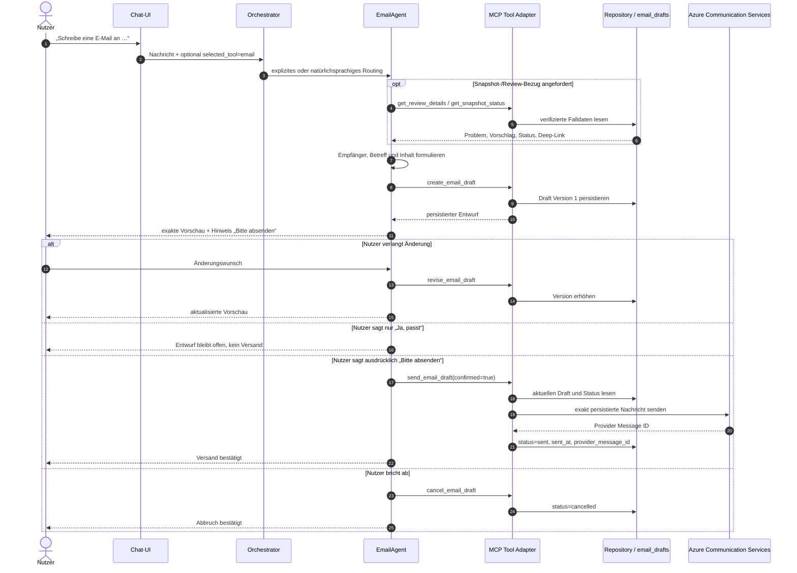

### 14.1 Draft-Zustandsautomat

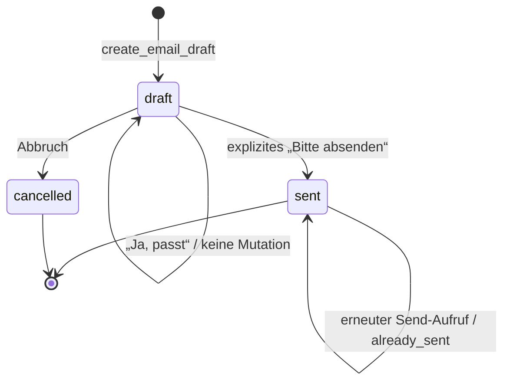

**Governance-Argument:** Die Versandfreigabe ist nicht nur eine höfliche Rückfrage des LLM. `send_email_draft()` verlangt technisch `confirmed=True`, lädt exakt den persistierten Entwurf und verhindert erneuten Versand eines bereits gesendeten Drafts. Der automatische Proposal-Notifier bleibt aus Kompatibilitätsgründen aufrufbar, liefert aber immer `skipped` und kann keine Nachricht senden.

---

## 15. Diagramm 11 – Dashboard-Datenfluss und Messlogik (IST)

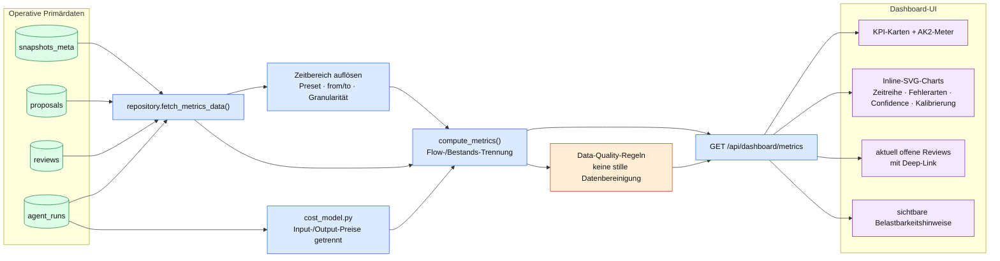

### 15.1 Fluss und Bestand

Das Zeitfenster darf nicht auf jede Kennzahl gleich angewandt werden:

- **Flussgrößen** wie erzeugte Proposals, Entscheidungen, Tokens und Kosten werden nach ihrem Ereigniszeitpunkt gefiltert.
- **Bestandsgrößen** wie die aktuell offenen Reviews beschreiben den momentanen Rückstand und bleiben unabhängig vom gewählten Zeitraum sichtbar.

### 15.2 Data Quality als Architekturmerkmal

Das Dashboard kennzeichnet unter anderem alte Confidence-Formeln, Legacy-Error-Labels, unzuverlässige Vor-AP3.3d-Revalidierungen, Test-Fixtures, unvollständige Tokens, Kostenschätzungen und kleine Stichproben. Diese Hinweise sind kein kosmetischer Zusatz: Sie verhindern, dass historisch heterogene Daten als scheinbar präzise Qualitätsaussage präsentiert werden.

**Wichtige Berichtsregel:** Für die AP-E-Kalibrierung muss genau eine `formula_version` – aktuell v3 – ausgewählt werden. Gemischte Formelgenerationen dürfen nicht als gemeinsame Kalibrierung interpretiert werden.

---

## 16. Diagramm 12 – Deployment-Sicht: lokal und Azure (IST-fähig)

**Aussage:** Derselbe Anwendungscode unterstützt lokale Entwicklung und ein getrenntes Azure-Deployment. Die Umschaltung von SQL- und Artefaktpersistenz erfolgt über Umgebungsvariablen, nicht durch Code-Forks.

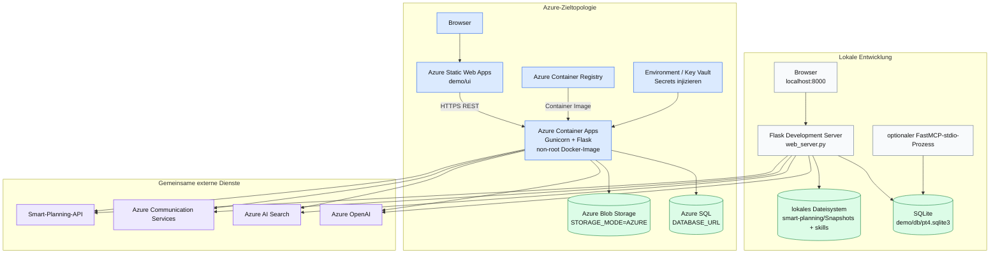

**Nicht überzeichnen:** Das Repository enthält die Deployment-Workflows und die Zielkonfiguration. Ob jede dargestellte Azure-Ressource zum Abgabezeitpunkt produktiv provisioniert und dauerhaft betrieben wird, muss im Bericht anhand der tatsächlichen Azure-Umgebung belegt werden. Das Diagramm zeigt die durch Code und Workflows unterstützte Topologie.

---

## 17. Diagramm 13 – Trust Boundaries, Secrets und kontrollierte Seiteneffekte (IST)

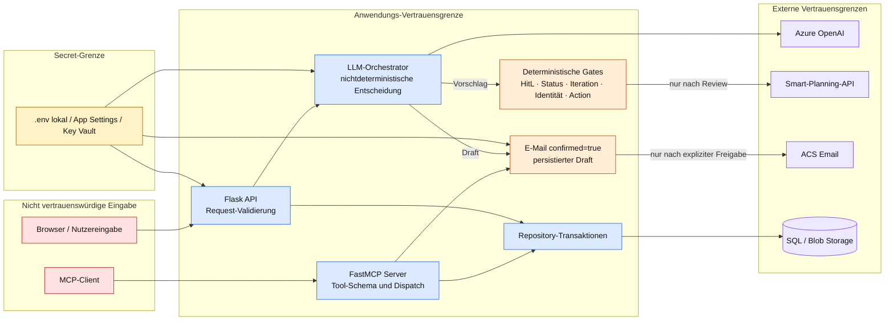

### 17.1 Bereits vorhandene Kontrollen

- Secrets werden aus Environment/.env gelesen und nicht im Quellcode hardcodiert.
- Der Docker-Prozess läuft als Non-Root-User.
- Das Backend setzt CSP-, Frame-, Content-Type- und Referrer-Header.
- Review-Entscheidung und Statusänderung werden transaktional geschrieben.
- Der Apply-Pfad revalidiert seine Autorisierung aus der DB.
- E-Mail-Versand erfordert einen persistierten Draft und explizite Freigabe.
- Fehler im ehemaligen automatischen Notification-Hook können keine Mail mehr auslösen.

### 17.2 Bewusst außerhalb des PT4-Scopes oder noch offen

- Authentifizierung und rollenbasierte Autorisierung der MCP-Tools.
- Produktiver Remote-MCP-Transport mit OAuth.
- Atomarer `draft → sending → sent`-Übergang für hochparallelen E-Mail-Versand.
- Outbox, Provider-Idempotency-Key und Delivery-/Bounce-Webhooks.
- Vollständige produktive Identity-Lösung für `reviewer_ref`.

---

## 18. Diagramm 14 – CI/CD- und Deployment-Pipeline (IST)

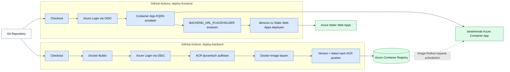

**Wichtiger Befund:** Der Backend-Workflow baut und pusht das Image, zeigt im vorliegenden YAML aber keinen expliziten Schritt, der die Azure Container App auf den neuen Image-Tag aktualisiert. Für den Bericht sollte deshalb zwischen **Image-Bereitstellung** und **tatsächlichem Container-App-Rollout** unterschieden werden. Der Frontend-Workflow deployt dagegen direkt zu Azure Static Web Apps.

---

## 19. Diagramm 15 – Zukunftsbild für erweiterbare MCP-Connections (ZIEL, nicht implementiert)

**Aussage:** Für die Vision „GitHub, Wikipedia, SharePoint oder weitere Systeme einfach ergänzen“ reicht ein Ordner mit anwendungsspezifischen SDK-Adaptern nicht aus. Benötigt wird ein MCP-Host mit Client-Lifecycle, Discovery, Namespace- und Policy-Schicht. Die vorhandenen internen Tools können dabei kompatibel weiterlaufen.

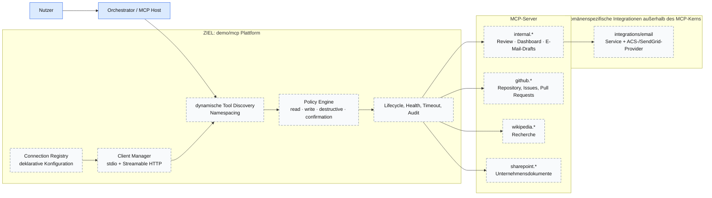

### 19.1 Empfohlene Zielstruktur

```text
demo/
├── mcp/
│   ├── host/
│   │   ├── connection_manager.py
│   │   ├── registry.py
│   │   ├── tool_catalog.py
│   │   ├── router.py
│   │   └── policies.py
│   ├── servers/
│   │   └── internal/
│   │       ├── server.py
│   │       └── tools/
│   │           ├── review.py
│   │           ├── dashboard.py
│   │           └── email.py
│   ├── clients/
│   │   ├── stdio_client.py
│   │   └── http_client.py
│   └── connections/
│       ├── github.yaml
│       ├── wikipedia.yaml
│       └── sharepoint.yaml
└── integrations/
    └── email/
        ├── service.py
        └── providers/
            ├── acs.py
            └── sendgrid.py
```

**Begründung:** `mcp/` sollte Protokoll-, Client- und Serverinfrastruktur enthalten. ACS ist dagegen ein konkreter E-Mail-Provider und kein MCP-Protokollbaustein; seine natürliche Heimat ist `integrations/email/providers/acs.py`. Diese Trennung verhindert, dass jede neue Verbindung zu einem anders strukturierten Sonderfall wird.

**Migrationsprinzip:** Die bestehende Agentenfunktionalität bleibt erhalten, indem `demo/mcp_connections/` vorübergehend als Kompatibilitätsfassade bestehen bleibt. Erst wenn Chat-E-Mail, Review-Tools, Dashboard-Tool, Freigabegates und Idempotenztests grün sind, wird auf die neue interne Struktur umgestellt.

---

## 20. Diagramm 16 – Traceability von Arbeitspaketen zu Architekturbausteinen (IST)

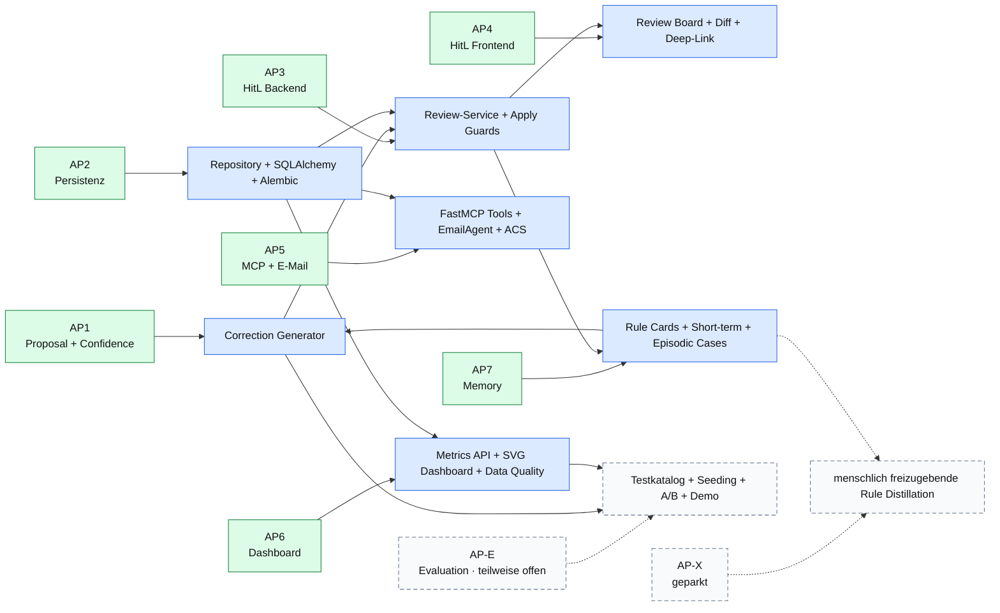

**Akzeptanzkriterien:** AK1 wird primär durch AP1, AK2 durch Proposal-Qualität plus AP-E, AK3 durch AP3/AP4, AK4 durch AP5, AK5 durch AP6 und AK6 durch AP7 adressiert. M8 bleibt offen, solange Seeding, vollständige A/B-Auswertung und Abschlussdemo nicht finalisiert sind.

---

## 21. Empfohlene Auswahl und Platzierung im Projektbericht

Nicht alle Diagramme müssen in den Haupttext. Eine überzeugende, kompakte Auswahl wäre:

1. **Kapitel „Ausgangslage und Systemabgrenzung“:** Diagramm 1.
2. **Kapitel „Lösungsarchitektur“:** Diagramme 2 und 3.
3. **Kapitel „Human-in-the-Loop Governance“:** Diagramme 5 und 6.
4. **Kapitel „Persistenz und lernendes System“:** Diagramme 7 und 8.
5. **Kapitel „MCP und Enterprise-Integration“:** Diagramme 9 und 10.
6. **Kapitel „Messbarkeit und Dashboard“:** Diagramm 11.
7. **Kapitel „Deployment und Übertragbarkeit“:** Diagramm 12; optional 14.
8. **Kapitel „Grenzen und Ausblick“:** Diagramm 15.

Die übrigen Diagramme eignen sich für Anhang, technische Dokumentation oder Präsentation.

## 22. Empfohlene Struktur des Projektberichts

### 22.1 Problem und Ausgangslage

Den Ausgangspunkt nicht als „es fehlte ein Dashboard“ formulieren, sondern als Governance-Problem: Die bestehende Korrekturpipeline konnte Änderungen autonom anwenden, ohne reviewfähigen Vorschlag, persistierte Entscheidung, belastbare Revalidierung oder systemweite Qualitätsmetriken. Daraus leiten sich die Akzeptanzkriterien logisch ab.

### 22.2 Anforderungen und Qualitätsziele

Die Architekturentscheidungen an konkrete Qualitätsziele binden:

- **Kontrollierbarkeit:** kein Apply ohne menschliche Entscheidung.
- **Nachvollziehbarkeit:** getrennte Speicherung von KI-Vorschlag, Menschenwert, Kommentar und Revalidierung.
- **Robustheit:** geordnete 4xx/502-Fehler statt stiller Mutation oder ungefangener Exceptions.
- **Erweiterbarkeit:** Repository-Fassade, MCP-Tools, Storage- und DB-Abstraktion.
- **Messbarkeit:** Token, Kosten, Bearbeitungszeit, Acceptance und Kalibrierung.
- **Lernfähigkeit:** menschliche Entscheidungen werden als Präzedenzfälle genutzt, ohne Entscheidungen zu erfinden.

### 22.3 Architekturentscheidungen statt Dateiaufzählung

Im Haupttext nicht primär erklären, welche Datei geändert wurde. Stattdessen die Entscheidungen begründen:

- Warum ein persistierter Proposal-Status notwendig ist.
- Warum Entscheidung und Apply zwei getrennte Schritte sind.
- Warum Guards deterministischer Code und keine Prompt-Regeln sind.
- Warum `reviews` die Ground Truth für Memory bildet.
- Warum das Dashboard historische Qualitätsprobleme sichtbar macht statt sie still herauszufiltern.
- Warum MCP-Fassade und Providerintegration getrennte Verantwortlichkeiten haben sollten.

### 22.4 Evaluation ehrlich vom Implementierungsnachweis trennen

Der Bericht sollte drei Evidenzarten unterscheiden:

1. **Technischer Funktionsnachweis:** Endpunkt antwortet korrekt, E-Mail kam an, Deep-Link funktioniert, Guards blockieren, Dashboard rendert Live-Daten.
2. **Messung:** Tokenreduktion im A/B, Kosten, Laufzeit, Fehlerzahlen vorher/nachher.
3. **Qualitätsnachweis:** Akzeptanzrate und Kalibrierung auf ausreichend vielen echten menschlichen Entscheidungen.

AP5 und AP6 können technisch abgeschlossen sein, auch wenn AP-E für statistisch belastbare Aussagen noch offen ist. Diese Trennung erhöht die Glaubwürdigkeit.

### 22.5 Grenzen offen benennen

Besonders wertvoll für die Diskussion sind:

- kleine Zahl menschlicher Entscheidungen;
- Formelgenerationen dürfen nicht gemischt werden;
- `value_grounded` ist nicht für jede Feldklasse ein vollständiges Korrektheitsmaß;
- MCP besitzt noch keinen allgemeinen Host/Client-Layer;
- MCP-Auth war bewusst außerhalb des PT4-Scopes;
- der Apply-Pfad ist synchron und kann bei langsamen externen Jobs blockieren;
- der Backend-CI-Workflow pusht ein Image, zeigt aber keinen Rollout-Schritt;
- AP-X und die Konfliktprüfung zwischen Regelkarten bleiben geparkt.

## 23. Formulierungsvorschläge für den Bericht

### 23.1 Architektur-Kernaussage

> Die in PT4 entwickelte Lösung überführt eine autonome, LLM-gestützte Korrekturpipeline in eine kontrollierte Human-in-the-Loop-Architektur. Das Sprachmodell erzeugt weiterhin Analyse und Korrekturvorschlag; die Autorisierung einer Datenmutation wird jedoch durch persistierte menschliche Entscheidungen und deterministische Guards außerhalb des Modells erzwungen.

### 23.2 MCP-Kernaussage

> Die MCP-Integration standardisiert die vorhandenen Review-, Dashboard- und E-Mail-Funktionen als aufrufbare Tools, ohne eine zweite Datenzugriffsschicht einzuführen. Sämtliche Tools delegieren an das bestehende Repository. Damit ist AP5 als serverseitige MCP-Tool-Schicht erfüllt; eine allgemeine Host-/Client-Plattform für dynamisch angebundene externe MCP-Server ist als nächste Ausbaustufe abzugrenzen.

### 23.3 Memory-Kernaussage

> Das Gedächtnissystem trennt Gesprächskontext, selektiv geladenes Regelwissen und episodische Präzedenzfälle. Nur echte menschliche Review-Entscheidungen dürfen den episodischen Speicher befüllen. Dadurch verbessert Memory nicht nur die Vorschlagserzeugung, sondern macht den Einfluss früherer Entscheidungen auf den Confidence-Score auditierbar.

### 23.4 Dashboard-Kernaussage

> Das Dashboard wurde nicht als reine Visualisierungsschicht entworfen, sondern als Mess- und Transparenzkomponente. Neben operativen Kennzahlen liefert es maschinenlesbare Data-Quality-Flags, die historische Formelwechsel, Legacy-Daten, unvollständige Telemetrie und kleine Stichproben offenlegen und damit Fehlinterpretationen der Kennzahlen begrenzen.

## 24. Literatur- und Quellenhinweise

Für das Literaturverzeichnis können folgende Quellen verwendet werden:

1. Brown, S.: *The C4 model for visualising software architecture*. Offizielle Dokumentation: <https://c4model.com/diagrams>.
2. ISO/IEC/IEEE 42010:2022: *Software, systems and enterprise — Architecture description*. <https://www.iso.org/standard/74393.html>.
3. arc42: *Template for architecture documentation and communication*. <https://arc42.org/>.
4. Model Context Protocol: *Architecture overview*. <https://modelcontextprotocol.io/docs/learn/architecture>.
5. Sumers, T. R. et al. (2023): *Cognitive Architectures for Language Agents*. arXiv:2309.02427. <https://arxiv.org/abs/2309.02427>.
6. Amershi, S. et al. (2019): *Guidelines for Human-AI Interaction*. CHI 2019. <https://www.microsoft.com/en-us/research/publication/guidelines-for-human-ai-interaction/>.
7. NIST (2023): *Artificial Intelligence Risk Management Framework 1.0*, Appendix C: Human-AI Interaction. <https://airc.nist.gov/airmf-resources/airmf/appendices/app-c-ai-risk-management-and-human-ai-interaction/>.
8. Microsoft Learn: *AI Agent Orchestration Patterns*. <https://learn.microsoft.com/en-us/azure/architecture/ai-ml/guide/ai-agent-design-patterns>.

## 25. Pflegehinweis

Diese Datei ist eine **Architektur-Baseline zum Cut vor Abschluss von AP-E und AP-X**. Nach der späteren Fortsetzung sollten nur folgende Stellen gezielt aktualisiert werden:

- Status und Messergebnisse in Diagramm 16;
- Formelversion und Evaluationsergebnisse in Abschnitt 12/15;
- MCP-Zielbild, falls der Host/Client-Umbau umgesetzt wird;
- Deployment-Sicht, sobald der produktive Container-App-Rollout eindeutig im Repository abgebildet ist.

Die historischen Diagramme zur implementierten PT4-Architektur sollten nicht rückwirkend überschrieben, sondern bei größeren Änderungen versioniert werden. So bleibt nachvollziehbar, welche Architektur zum Zeitpunkt des Projektberichts tatsächlich vorlag.
