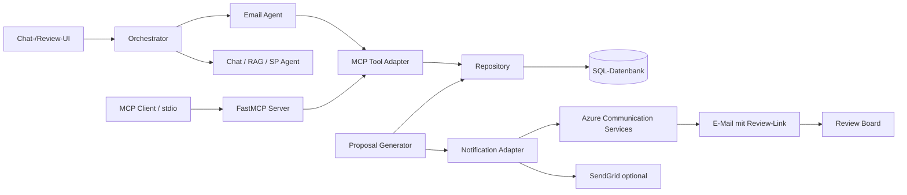
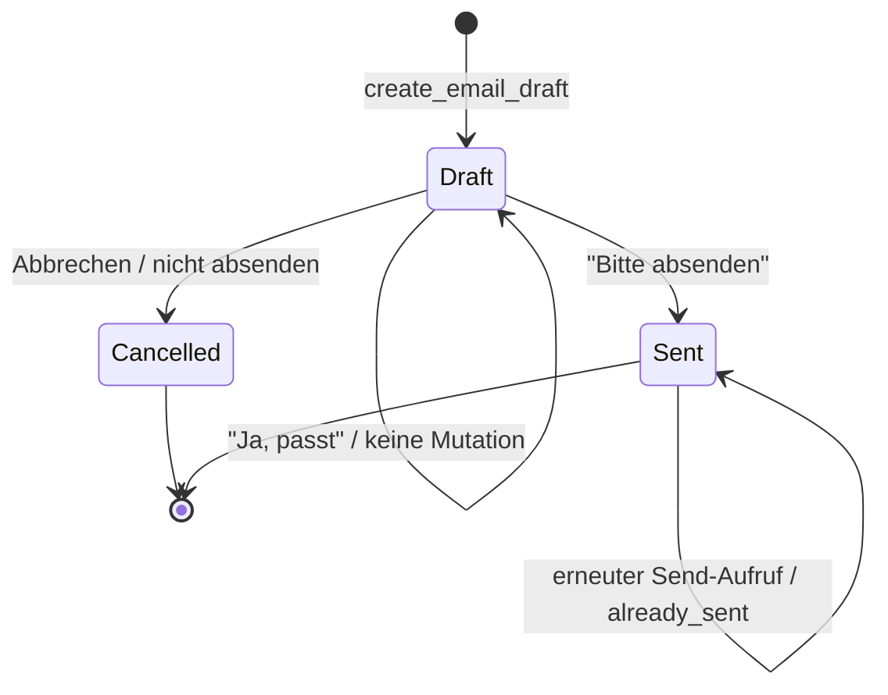
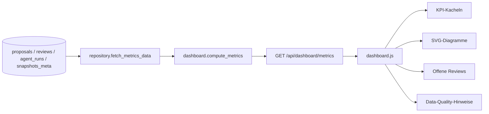

# Gesamtdokumentation AP5 — MCP-Integration und AP6 — Dashboard

## 1. Gesamtstatus

| Arbeitspaket | Technischer Status | Meilenstein |
|---|---|---|
| AP5.1 MCP-Tool-Schicht | Fertig | M5 erfüllt |
| AP5.2 automatische ACS-Benachrichtigung | Fertig, real zugestellt und Deep-Link bestätigt | M5 erfüllt |
| AP5.3 konversationeller E-Mail-Agent | Code-seitig fertig; technischer Versandpfad geprüft | Erweiterung von AP5 |
| AP6.1 Metrik-Backend | Fertig | Bestandteil von M6 |
| AP6.2 Dashboard-UI | Fertig | Bestandteil von M6 |
| AP6.3 Kostenmodell | Fertig | Bestandteil von M6 |
| AP6.4 Zeitfilter und Dashboard-Überarbeitung | Fertig | Bestandteil von M6 |
| M6 formal | Noch nicht abgehakt | Kalibrierung technisch vorhanden, aber Datengrundlage noch nicht belastbar |

Der entscheidende Unterschied lautet:

- AP5/M5 ist vollständig erfüllt, einschließlich real zugestellter ACS-Mail und funktionierendem Review-Link.
- AP6 ist code-seitig vollständig umgesetzt.
- M6 ist im Plan noch offen, weil die Confidence-Kalibrierung aktuell überwiegend alte Konfidenzwerte und nur sechs Entscheidungen enthält. Das Dashboard zeigt diesen Vorbehalt korrekt an, statt eine belastbare Statistik vorzutäuschen.

---

# Teil A — AP5: MCP-Integration

## 2. Zielbild von AP5

AP5 sollte die bestehende Review- und Datenbanklogik als standardisierte MCP-Tools verfügbar machen und mindestens einen durchgehenden Enterprise-Fall liefern:

1. Ein neuer Vorschlag erhält den Zustand `pending_review`.
2. Der Vorschlag wird dauerhaft gespeichert.
3. Eine E-Mail-Benachrichtigung wird über Azure Communication Services versendet.
4. Die E-Mail enthält Snapshot, Fehlertyp und einen Deep-Link.
5. Der Link öffnet direkt den richtigen Vorschlag im Review Board.
6. Review-Funktionen können über MCP aufgerufen werden.

Zusätzlich wurde AP5 um einen konversationellen E-Mail-Agenten erweitert:

1. Der Benutzer wählt in der Chatleiste über `+` das Werkzeug „E-Mail“ aus oder formuliert einen natürlichen E-Mail-Auftrag.
2. Der Orchestrator leitet den Auftrag an den E-Mail-Agenten.
3. Der Agent sammelt nur den tatsächlich benötigten Kontext.
4. Ein persistenter Entwurf wird angezeigt.
5. Änderungen werden dialogisch eingearbeitet und versioniert.
6. Erst eine ausdrückliche Anweisung wie „Bitte absenden“ löst den Versand aus.

## 3. AP5-Architektur



Die zentrale Designentscheidung war die Trennung von:

- Transport: MCP-Server, Chat-Orchestrator oder direkter interner Adapter.
- Fachlogik: bestehende Repository-Funktionen.
- Zustellung: ACS-/SendGrid-Adapter.
- Persistenz: SQLAlchemy-Repository und Alembic-Migration.

Die MCP-Schicht enthält daher keinen unabhängigen neuen Datenbankzugriff. Die Tool-Funktionen delegieren an [repository.py](../demo/db/repository.py#L313).

---

## 4. MCP-Server

Der echte MCP-Server befindet sich in [server.py](../demo/mcp_connections/server.py#L1).

Verwendet wird das Python MCP SDK mit `FastMCP`:

```text
mcp>=1.27,<2
```

Der Server:

- trägt den Namen `PT4 Review Tools`,
- erzeugt JSON-Antworten,
- registriert zwölf MCP-Tools,
- verwendet standardmäßig den `stdio`-Transport,
- kann lokal mit `python -m mcp_connections.server` gestartet werden.

### Registrierte Tools

Aktuell sind diese zwölf Tools registriert:

```text
approve_correction
cancel_email_draft
create_email_draft
get_dashboard_metrics
get_email_draft
get_pending_reviews
get_review_details
get_snapshot_status
modify_correction
reject_correction
revise_email_draft
send_email_draft
```

Der Server ist damit ein echter MCP-Server. Was für PT4 bewusst nicht umgesetzt wurde:

- kein produktiver MCP-Client,
- kein Streamable-HTTP-Deployment,
- keine OAuth-/Token-Validierung,
- keine rollenbasierte Tool-Autorisierung.

Die Token-Validierung ist im Code ausdrücklich als außerhalb des PT4-Scopes dokumentiert.

---

## 5. Review-MCP-Tools

Die Tool-Definitionen befinden sich in [tools.py](../demo/mcp_connections/tools.py#L1).

### 5.1 `get_pending_reviews()`

Delegiert an:

```python
repository.list_open_proposals_as_dicts()
```

Es werden alle Vorschläge zurückgegeben, die nach dem aktuellen Datenbankzustand noch nicht entschieden sind.

Die Repository-Funktion berücksichtigt nicht nur `status`, sondern prüft defensiv, ob bereits ein Review existiert. Dadurch kann ein inkonsistenter alter Status nicht versehentlich erneut als offen erscheinen.

Aktueller geprüfter Zustand:

```text
3 offene Reviews
```

### 5.2 `get_review_details(proposal_id)`

Delegiert an:

```python
repository.get_proposal_as_dict(proposal_id)
```

Ergebnis bei vorhandenem Vorschlag:

```json
{
  "ok": true,
  "status_code": 200,
  "proposal": {}
}
```

Ergebnis bei unbekannter ID:

```json
{
  "ok": false,
  "status_code": 404,
  "error": "Proposal not found",
  "proposal_id": "..."
}
```

Es handelt sich um HTTP-ähnliche Fehlersemantik innerhalb des MCP-Ergebnisses. Das Tool selbst benötigt keinen Flask-Kontext.

### 5.3 `approve_correction(proposal_id, comment="")`

Delegiert an:

```python
repository.decide_proposal(
    decision="approve",
    reviewer_ref="mcp_reviewer"
)
```

Wichtig: Die Entscheidung wird aufgezeichnet, aber die bestehende Apply-/Revalidierungs-Pipeline wird nicht automatisch gestartet.

Die Antwort enthält deshalb ausdrücklich:

```json
{
  "application_triggered": false,
  "note": "Decision recorded; applying corrections remains in the existing review workflow."
}
```

Das verhindert, dass ein MCP-Aufruf stillschweigend eine Snapshot-Mutation auslöst.

### 5.4 `reject_correction(proposal_id, comment)`

- Lehnt einen Vorschlag ab.
- Ein nicht leerer Kommentar ist verpflichtend.
- Ein leerer Kommentar ergibt einen 400-ähnlichen Toolfehler.
- Die Entscheidung wird mit `reviewer_ref="mcp_reviewer"` persistiert.
- Es wird nichts angewendet.

### 5.5 `modify_correction(proposal_id, final_value, comment)`

- Zeichnet eine menschlich angepasste Entscheidung auf.
- `final_value` ist verpflichtend.
- Der Wert wird als `final_value` im Review gespeichert.
- Das Tool startet nicht die Apply-Pipeline.

Die Action-Kompatibilität und das tatsächliche Anwenden bleiben Aufgabe der bestehenden Review-/Apply-Logik. Dadurch existieren nicht zwei konkurrierende Wege, Snapshots zu verändern.

### 5.6 Gemeinsame Entscheidungsfehler

Die Entscheidungstools unterscheiden:

- unbekannter Vorschlag → 404-ähnlich,
- bereits entschieden → 409-ähnlich,
- gültige neue Entscheidung → 200-ähnlich.

Die fachliche Transaktion liegt in `decide_proposal()`. Dadurch werden Proposal-Status und Review-Datensatz konsistent in einem Repository-Pfad geschrieben.

### 5.7 `get_snapshot_status(snapshot_id)`

Das Tool kombiniert bestehende Repository-Lesewege:

- offene Vorschläge des Snapshots,
- bereits gespeicherte Entscheidungen des Snapshots.

Antwortstruktur:

```json
{
  "ok": true,
  "status_code": 200,
  "snapshot_id": "...",
  "open_review_count": 1,
  "decision_count": 2,
  "pending_reviews": [],
  "decisions": []
}
```

Wenn weder offene Reviews noch Entscheidungen zu einer Snapshot-ID gefunden werden, wird ein 404-ähnlicher Fehler geliefert.

### 5.8 `get_dashboard_metrics()`

Dieses MCP-Tool liefert eine kompakte Allzeitübersicht:

- Anzahl Snapshots,
- Anzahl Vorschläge,
- offene Reviews,
- Anzahl Entscheidungen,
- Approve/Reject/Modify-Zähler,
- Anzahl Agent-Läufe.

Wichtig: Dieses MCP-Tool ist bewusst kompakter als `GET /api/dashboard/metrics`.

Es liefert nicht:

- Zeitfilter,
- Kalibrierungsbänder,
- Data-Quality-Flags,
- Charts,
- Bearbeitungszeit,
- detaillierte Token-/Kostenanalyse.

Für das vollständige AP6-Dashboard ist der Flask-Endpunkt maßgeblich.

---

## 6. Automatische Proposal-Benachrichtigung

Der Notification-Adapter befindet sich in [notifier.py](../demo/mcp_connections/notifier.py#L1).

### 6.1 Trigger

Der Trigger sitzt in `save_central_proposal_record()` in [generate_correction_llm.py](../demo/smart-planning/runtime/generate_correction_llm.py#L92).

Ablauf:

1. Der zentrale Proposal-Datensatz wird geschrieben.
2. Es wird geprüft, ob der Vorschlag in der Datenbank bereits existierte.
3. `repository.save_proposal(record)` persistiert ihn.
4. Nur bei einem erstmalig angelegten Proposal mit `status="pending_review"` wird der Notifier aufgerufen.
5. Ein Fehler des Notification-Providers darf die Proposal-Speicherung nicht zurückrollen.

Der Aufruf ist defensiv gekapselt:

```text
Proposal-Speicherung erfolgreich
    ↓
Notification versuchen
    ↓
Fehler nur als WARN ausgeben
```

### 6.2 Idempotenz

Die Proposal-ID ist deterministisch:

```text
{snapshot_id}__iteration-{N}
```

Vor dem Speichern wird geprüft, ob die ID bereits in der Datenbank existiert.

Dadurch gilt:

- erster Insert → Benachrichtigung möglich,
- erneuter Lauf derselben Iteration → keine zweite Benachrichtigung.

### 6.3 E-Mail-Inhalt

Betreff:

```text
Offener Review: {snapshot_id} / {error_type}
```

Plaintext und HTML enthalten:

- eine kurze Erklärung,
- Snapshot-ID,
- Fehlertyp,
- Deep-Link.

Deep-Link:

```text
{APP_BASE_URL}/review.html?id={proposal_id}
```

`APP_BASE_URL` kommt aus der Umgebung. Standard:

```text
http://localhost:8000
```

Die Proposal-ID wird URL-kodiert.

### 6.4 Deep-Link-Unterstützung

Die Review-UI akzeptiert additiv:

- den vorher vorhandenen Parameter `?proposal=...`,
- den neuen Notification-Parameter `?id=...`.

Damit funktionieren sowohl bestehende interne Links als auch E-Mail-Links.

---

## 7. E-Mail-Provider

### 7.1 Kanalwahl

Die Kanalwahl erfolgt über:

```dotenv
NOTIFICATION_CHANNEL=acs
```

Unterstützte Werte:

```text
acs
sendgrid
```

Wenn die Variable fehlt:

```text
Notification skipped: NOTIFICATION_CHANNEL not set
```

Das ist kein Fehler.

### 7.2 Azure Communication Services

Benötigte Variablen:

```dotenv
NOTIFICATION_CHANNEL=acs
ACS_CONNECTION_STRING=...
ACS_SENDER_EMAIL=...
NOTIFICATION_RECIPIENT_EMAIL=...
APP_BASE_URL=...
```

Die Abhängigkeit ist in `requirements-azure.txt` hinterlegt:

```text
azure-communication-email>=1.0,<2.0
```

Der Import erfolgt lazy, also erst wenn `acs` tatsächlich ausgewählt wurde.

ACS erhält:

```json
{
  "senderAddress": "...",
  "recipients": {
    "to": [
      {"address": "..."}
    ]
  },
  "content": {
    "subject": "...",
    "plainText": "...",
    "html": "..."
  }
}
```

Der Code wartet auf das Ergebnis des ACS-Pollers und übernimmt die ACS-Message-ID.

### 7.3 SendGrid

Optional unterstützt:

```dotenv
NOTIFICATION_CHANNEL=sendgrid
SENDGRID_API_KEY=...
NOTIFICATION_SENDER_EMAIL=...
```

Abhängigkeit:

```text
sendgrid>=6.0,<7.0
```

Auch SendGrid wird nur bei aktivem Kanal importiert.

### 7.4 Secrets

Alle Secrets kommen ausschließlich aus Environment beziehungsweise `demo/.env`.

Nicht im Code gespeichert werden:

- Connection Strings,
- API Keys,
- Senderadressen,
- Empfängeradressen.

---

## 8. Reale AP5-Abnahme

Der Enterprise-Fall wurde real nachgewiesen:

1. Ein offener Vorschlag wurde über ACS benachrichtigt.
2. ACS meldete erfolgreichen Versand und lieferte eine Message-ID.
3. Die E-Mail kam real im Postfach an.
4. Der Betreff enthielt Snapshot und Fehlertyp.
5. Der E-Mail-Body enthielt den passenden Review-Link.
6. Der Benutzer öffnete den Link.
7. Die UI zeigte direkt den richtigen `pending_review`-Vorschlag mit passendem Snapshot, Fehlertyp und Zielpfad.

Damit ist M5 erreicht.

---

# Teil B — AP5.3: Konversationeller E-Mail-Agent

## 9. Warum ein eigener E-Mail-Agent gebaut wurde

Ein einzelnes `send_email()`-Tool wäre für den gewünschten Dialog nicht ausreichend gewesen.

Der Benutzer wollte:

- frei formulierte E-Mail-Aufträge,
- allgemeine E-Mails ohne Snapshot-Bezug,
- Snapshot-/Review-E-Mails mit automatisch gesammelt relevanten Fakten,
- sichtbare Vorschau,
- dialogische Änderungen,
- explizite Freigabe,
- erst danach Versand.

Dafür braucht es einen zustandsbehafteten Agenten, der:

- aktive Entwürfe erkennt,
- Kontext verwaltet,
- Änderungen vom Versand unterscheidet,
- den exakten freigegebenen Stand persistiert,
- Freigabe und Abbruch sicher interpretiert.

Dieser Agent befindet sich in [email_agent.py](../demo/agents/email_agent.py#L40).

---

## 10. Routing zum E-Mail-Agenten

Der E-Mail-Agent wurde als vierter Agent neben Chat, RAG und Smart Planning registriert.

Konfiguration: [agent_config.py](../demo/agent_config.py#L72)

Initialisierung: [web_server.py](../demo/web_server.py#L191)

### Routing-Wege

Es gibt drei Wege zum Agenten:

1. Explizite UI-Auswahl  
   Der Benutzer klickt `+ → E-Mail`. Die UI sendet:

   ```json
   {
     "selected_tool": "email"
   }
   ```

2. Natürlichsprachige Planung  
   Eine Nachricht wie „Schreibe eine E-Mail an …“ wird durch den Orchestrator zum E-Mail-Agenten geroutet.

3. Aktiver E-Mail-Entwurf  
   Wenn in der Session ein offener Draft existiert und die Nachricht wie eine Revision, Freigabe oder ein Abbruch aussieht, bleibt das Routing beim E-Mail-Agenten.

Die Routingentscheidung befindet sich in [orchestration_agent.py](../demo/agents/orchestration_agent.py#L557).

### Unveränderte Vorschau

Antworten des E-Mail-Agenten werden vom Orchestrator nicht nachträglich umformuliert.

Das ist wichtig, weil sonst:

- Empfänger,
- Betreff,
- Text,
- Draft-ID,
- Freigabehinweis

zwischen gespeichertem Entwurf und sichtbarer Vorschau abweichen könnten.

---

## 11. Kontextgewinnung

Der Agent unterscheidet allgemeine und fallbezogene E-Mails.

### Allgemeine E-Mail

Beispiel:

```text
Schreibe eine E-Mail an chef@example.com und frage, ob er am Nachmittag Zeit hat.
```

In diesem Fall werden keine Snapshot-Daten ergänzt.

### Fallbezogene E-Mail

Wenn die Anfrage Wörter wie diese enthält:

```text
Snapshot
Fehler
Validierung
Review
Proposal
Vorschlag
Korrektur
Problem
```

prüft der Agent die aktuelle Nachricht und die letzten zehn Chatnachrichten auf:

- Proposal-IDs,
- Snapshot-UUIDs.

Für gefundene Proposal-IDs werden über MCP-/Adapter-Tools geladen:

- Proposal-ID,
- Snapshot-ID,
- Fehlertyp,
- Zielpfad,
- Status,
- Begründung,
- vorgeschlagener Wert,
- Review-Link.

Für Snapshot-IDs wird zusätzlich `get_snapshot_status()` verwendet.

Es werden maximal drei Proposals und drei Snapshots berücksichtigt. Der strukturierte Kontext ist zusätzlich auf 12.000 Zeichen begrenzt.

Das LLM erhält die Regel:

- Snapshot-Daten nur einbauen, wenn sie angefordert wurden.
- Keine Empfänger, Fakten, Werte, Entscheidungen oder Links erfinden.
- Bei fehlendem Empfänger oder Zweck nachfragen.

---

## 12. Draft-Persistenz

Für den E-Mail-Workflow wurde die Tabelle `email_drafts` ergänzt.

Modell: [models.py](../demo/db/models.py#L166)

Migration: [7c4e2d9a8f10_ap5_3_add_email_drafts.py](../demo/alembic/versions/7c4e2d9a8f10_ap5_3_add_email_drafts.py#L21)

Aktueller Alembic-Stand:

```text
7c4e2d9a8f10 (head)
```

### Felder

| Feld | Bedeutung |
|---|---|
| `id` | UUID des Entwurfs |
| `session_id` | Zugehörige Chat-Session |
| `recipient` | Empfängeradresse |
| `subject` | Betreff |
| `body_plain` | Freizugebender Plaintext |
| `body_html` | Generierte HTML-Version |
| `context_summary` | Kurzinfo über verwendeten Kontext |
| `status` | `draft`, `sent` oder `cancelled` |
| `version` | sichtbare Entwurfsversion |
| `provider_message_id` | ACS-/Provider-ID |
| `created_at` | Erstellungszeit |
| `updated_at` | letzte Änderung |
| `sent_at` | Versandzeit |

Die Drafts sind über eine Foreign-Key-Beziehung an die Chat-Session gebunden. Dadurch überleben sie einen Reload oder eine Wiederaufnahme der Session.

---

## 13. E-Mail-Draft-Zustandsmodell



### Sicherheitsregeln

- `create_email_draft` versendet niemals.
- `revise_email_draft` versendet niemals.
- `send_email_draft` verlangt `confirmed=True`.
- Ein reines „Ja, passt“ löst keinen Versand aus.
- „Bitte nicht absenden“ wird als Abbruch behandelt.
- Negative Formulierungen werden vor positiven Versandmustern geprüft.
- Ein gesendeter Draft wird nicht erneut versendet.
- Ein abgebrochener Draft kann nicht versendet oder geändert werden.

---

## 14. E-Mail-MCP-Tools

### `create_email_draft(...)`

Eingaben:

- Session-ID,
- Empfänger,
- Betreff,
- Plaintext,
- optional HTML,
- optional Kontextzusammenfassung.

Prüfungen:

- einfache syntaktische E-Mail-Prüfung,
- Betreff nicht leer,
- Text nicht leer,
- Session muss existieren.

Ergebnis:

- HTTP-ähnlicher Status 201,
- persistierter Draft,
- Version 1,
- Zustand `draft`.

### `get_email_draft(draft_id)`

Liest einen Draft inklusive:

- aktuellem Text,
- Version,
- Status,
- Provider-ID,
- Zeitstempeln.

Unbekannte ID → 404-ähnlich.

### `revise_email_draft(...)`

Ersetzt die sichtbaren Inhalte eines noch offenen Drafts.

- nur bei `status="draft"`,
- Version wird erhöht,
- `updated_at` wird aktualisiert,
- noch kein Versand.

### `send_email_draft(draft_id, confirmed=False)`

Ohne Bestätigung:

```json
{
  "ok": false,
  "status_code": 409,
  "error": "Explicit confirmation is required before sending"
}
```

Mit Bestätigung:

1. Draft laden.
2. Status prüfen.
3. Exakt den persistierten Empfänger, Betreff und Text an den Provider geben.
4. Bei Provider-Erfolg `status="sent"` setzen.
5. Provider-ID und `sent_at` speichern.

Ein erneuter Aufruf auf einen bereits gesendeten Draft liefert:

```json
{
  "ok": true,
  "already_sent": true
}
```

### `cancel_email_draft(draft_id)`

- setzt `status="cancelled"`,
- löscht den Audit-Datensatz nicht,
- verhindert späteren Versand.

---

## 15. Chat-UI für E-Mail

Die UI-Erweiterung befindet sich in:

- [index.html](../demo/ui/index.html#L60)
- [chat.js](../demo/ui/scripts/chat.js#L94)
- [styles.css](../demo/ui/css/styles.css)

### UI-Verhalten

- Plus-Schaltfläche neben dem Eingabefeld.
- Menüeintrag „E-Mail“.
- Sichtbarer E-Mail-Chip nach Auswahl.
- Angepasster Placeholder.
- `selected_tool=email` wird an `/api/chat` geschickt.
- Der E-Mail-Modus bleibt während Draft und Revision aktiv.
- Nach `sent` oder `cancelled` wird der Chip entfernt.
- Beim Wechsel oder Erstellen einer Chat-Session wird die lokale Toolauswahl zurückgesetzt.
- Der persistierte Draft bleibt trotzdem in der Session erhalten.

---

# Teil C — AP6: Dashboard

## 16. Ziel von AP6

AP6 sollte ein Live-Dashboard über die Human-in-the-Loop-Prozesse liefern.

Datenquellen:

- `proposals`,
- `reviews`,
- `agent_runs`,
- `snapshots_meta`.

Es wurden keine externen Analysequellen oder Beispielwerte eingeführt.

Das Dashboard beantwortet:

- Wie viele Vorschläge entstehen?
- Wie viele sind offen?
- Wie entscheidet der Mensch?
- Wie oft übernimmt er den KI-Wert unverändert?
- Ist eine hohe Konfidenz tatsächlich aussagekräftig?
- Wie häufig sind Fehlerarten?
- Wie erfolgreich ist die Revalidierung?
- Wie lange dauert die menschliche Entscheidung?
- Wie viele Tokens und geschätzte Kosten entstehen?
- Wann wurden Entscheidungen getroffen?

---

## 17. AP6-Architektur



Die Schichtung ist bewusst:

- Repository: Daten materialisieren.
- Dashboard-Route: KPI-Definitionen und Datenqualitätsregeln.
- Frontend: Darstellung, Navigation und Interaktion.

---

## 18. Repository-Datenabzug

Die Funktion [fetch_metrics_data()](../demo/db/repository.py#L589) lädt alle benötigten Daten in einem Session-Scope.

### Vorschläge

Geladen werden:

- Proposal-ID,
- Snapshot-ID,
- Fehlertyp,
- Zielpfad,
- Status,
- Konfidenz,
- `value_grounded`,
- Erstellungszeit.

### Reviews

Je Proposal wird nur das neueste Review verwendet.

Das verhindert zukünftiges Doppelzählen, falls das Datenmodell später mehrere Review-Versionen zulässt.

Geladen werden:

- Review-ID,
- Proposal-ID,
- Entscheidung,
- Entscheidungszeit,
- Revalidierungsergebnis.

### Agent-Läufe

Geladen werden:

- Agentname,
- Toolname,
- Status,
- Prompt-Tokens,
- Completion-Tokens,
- gespeicherte Kostenschätzung,
- Laufzeit,
- Erstellungszeit.

### Snapshot-Metadaten

Zusätzlich wird die Gesamtzahl der bekannten Snapshots ermittelt.

Das Repository berechnet bewusst keine KPIs. Sämtliche Nennerdefinitionen liegen zentral in [dashboard.py](../demo/routes/dashboard.py#L299).

---

## 19. Dashboard-Endpunkt

Route:

```http
GET /api/dashboard/metrics
```

Implementierung: [dashboard.py](../demo/routes/dashboard.py#L706)

Der Blueprint wird in [web_server.py](../demo/web_server.py#L38) unter `/api/dashboard` registriert.

### Query-Parameter

Unterstützt werden:

```text
preset=week|month|year|all
from=YYYY-MM-DD
to=YYYY-MM-DD
granularity=day|week|month
```

Default:

```text
letzte 30 Tage
Granularität: day
```

`to` ist inklusive und wird intern bis 23:59:59 des angegebenen Tages aufgelöst.

### Ungültige Parameter

Ungültige Werte verursachen keinen HTTP 500.

Stattdessen:

- Rückfall auf einen sinnvollen Default,
- Eintrag `RANGE_INPUT_IGNORED` in `data_quality`.

Vertauschte Grenzen werden getauscht und als Hinweis gemeldet.

### Automatische Granularität

Maximal werden 92 Buckets ausgegeben.

Bei zu großem Zeitraum:

```text
day → week → month
```

Die automatische Vergröberung wird über `GRANULARITY_COARSENED` offengelegt.

### `preset=all`

„Alles“ beginnt nicht 1970, sondern beim ältesten tatsächlich vorhandenen Datensatz. Dadurch werden echte fünf Tage Daten nicht in einen jahrzehntelangen Zeitraum eingebettet.

---

## 20. Flow versus Bestand

Eine der wichtigsten AP6-Entscheidungen ist die Trennung von Fluss und Bestand.

### Fluss

Zeitlich gefiltert werden Ereignisse:

- erzeugte Vorschläge nach `proposal.created_at`,
- Entscheidungen nach `review.decided_at`,
- Agent-Läufe nach `agent_run.created_at`,
- Tokens und Kosten über die gefilterten Agent-Läufe.

### Bestand

Nicht zeitlich gefiltert werden aktuell offene Reviews.

Begründung:

Ein Vorschlag bleibt offen, auch wenn er vor dem ausgewählten Zeitraum erzeugt wurde. Ein Wochenfilter darf einen realen Rückstand nicht verschwinden lassen.

Daher gilt:

```text
proposals_total = Vorschläge im Zeitraum
proposals_open  = aktuell offene Vorschläge, unabhängig vom Zeitraum
```

Der API-Response und die UI weisen ausdrücklich darauf hin.

---

## 21. API-Antwortstruktur

Die Antwort enthält fünf Hauptbereiche:

```json
{
  "generated_at": "...",
  "kpis": {},
  "pricing": {},
  "charts": {},
  "range": {},
  "open_reviews": [],
  "data_quality": []
}
```

### `kpis`

Enthält:

- `validations`
- `snapshots_tracked`
- `proposals_total`
- `proposals_open`
- `decisions_total`
- `approve_count`
- `reject_count`
- `modify_count`
- `approval_rate`
- `reject_rate`
- `modify_rate`
- `accepted_unchanged_rate`
- `avg_confidence`
- `revalidation_attempts`
- `revalidation_success`
- `revalidation_success_rate`
- `revalidation_untrusted`
- `handling_time_median_s`
- `handling_time_mean_s`
- `handling_time_n`
- `handling_time_excluded_fixtures`
- `tokens_prompt`
- `tokens_completion`
- `tokens_total`
- `cost_estimate_usd`
- `agent_runs`

### `charts`

Enthält:

- `timeline`
- `error_types`
- `confidence_distribution`
- `calibration`

### `range`

Enthält den tatsächlich aufgelösten Zeitraum:

- `from`
- `to`
- `granularity`
- `preset`
- `granularity_adjusted_from`

### `open_reviews`

Enthält aktuell offene Vorschläge mit:

- Proposal-ID,
- Snapshot-ID,
- Fehlertyp,
- Zielpfad,
- Konfidenz,
- `value_grounded`,
- Erstellungszeit.

### `data_quality`

Enthält explizite Hinweise und Warnungen zu Kennzahlen, statt problematische Daten still zu filtern.

---

## 22. KPI-Definitionen

### 22.1 Validierungen

Gezählt werden Agent-Läufe mit:

```text
tool_name == "validate_snapshot"
```

Bekannte Grenze:

Serverseitige Validierungsjobs aus der Apply-Pipeline erzeugen nicht immer einen `agent_runs`-Datensatz. Die Kennzahl ist daher eine Untergrenze.

Flag:

```text
VALIDATION_COUNT_PARTIAL
```

### 22.2 Vorschläge und offene Reviews

- `proposals_total`: im gewählten Zeitraum erzeugte Vorschläge.
- `proposals_open`: aktuell offene Vorschläge, nicht zeitgefiltert.

### 22.3 Entscheidungsquoten

Nenner:

```text
approve + modify + reject
```

Berechnet werden:

- Approval Rate,
- Modify Rate,
- Reject Rate.

### 22.4 AK2 — angenommen ohne Änderung

Die zentrale Qualitätskennzahl ist:

```text
approve / alle Entscheidungen
```

Nur `approve` zählt als „KI-Wert unverändert übernommen“.

- `modify` bedeutet: Mensch musste korrigieren.
- `reject` bedeutet: Vorschlag war nicht nutzbar.

Zielmarke:

```text
≥ 80 %
```

### 22.5 Durchschnittliche Konfidenz

Mittelwert aller im Zeitraum erzeugten Vorschläge mit vorhandenem `confidence_score`.

Vorschläge ohne Score werden nicht mit null eingerechnet.

### 22.6 Konfidenz-Kalibrierung

Konfidenzbänder:

```text
0.0–0.2
0.2–0.4
0.4–0.6
0.6–0.8
0.8–1.0
```

Für jedes Band wird berechnet:

- Anzahl entschiedener Vorschläge,
- Anzahl unverändert angenommener Vorschläge,
- Accept Rate.

Die zentrale Frage lautet:

> Steigt mit höherer Konfidenz tatsächlich die Wahrscheinlichkeit, dass der Mensch den Wert unverändert übernimmt?

Aktuell ist die Kurve flach. Das wird automatisch erkannt und erklärt.

### 22.7 Fehlerarten

Gezählt werden die Fehlertypen der im Zeitraum erzeugten Vorschläge.

Alte Heuristiklabels werden markiert:

```text
DUPLICATE_ID
SINGLE_MATCH
NO_RESULTS_FOUND
```

Sie erhalten:

```json
{
  "legacy_label": true
}
```

### 22.8 Revalidierungserfolg

Nenner sind nur tatsächliche Apply-/Revalidierungsversuche.

Ein Reject wird nicht als gescheiterte Revalidierung gezählt, weil bei Reject nichts angewendet wird.

Ein belastbarer Erfolg verlangt:

```text
pipeline_success == true
und
errors_after < errors_before
```

Alte Revalidierungen vor AP3.3d werden am fehlenden `errors_before`-Feld erkannt und aus der Quote genommen.

### 22.9 Bearbeitungszeit

Berechnung:

```text
review.decided_at - proposal.created_at
```

Entscheidungen unter 60 Sekunden werden als Skript-Fixtures separat ausgewiesen.

Ausgegeben werden:

- Median,
- Mittelwert,
- Anzahl menschlich plausibler Entscheidungen,
- Anzahl ausgeschlossener Fixtures.

Der Median wird bevorzugt angezeigt, weil einzelne Ausreißer bei kleinen Stichproben den Mittelwert stark verzerren.

### 22.10 Tokens

Summiert werden:

- Prompt-Tokens,
- Completion-Tokens,
- Gesamt-Tokens.

Läufe ohne Tokenwerte werden nicht als kostenlose Läufe interpretiert, sondern über `TOKENS_INCOMPLETE` offengelegt.

### 22.11 Kosten

Kosten werden aus den gespeicherten Tokens neu abgeleitet. Die alte gespeicherte `cost_estimate`-Spalte wird für die Dashboard-Gesamtsumme nicht einfach aufsummiert.

Begründung:

- Tokens sind die Rohdaten.
- Preise sind eine veränderliche Interpretation.
- Gespeicherte Kosten können unter unterschiedlichen Preisannahmen entstanden sein.

---

## 23. Kostenmodell

Implementierung: [cost_model.py](../demo/cost_model.py#L1)

### Unterstützte Modelle

| Modell | Input je 1K Tokens | Output je 1K Tokens |
|---|---:|---:|
| `gpt-4o` | $0.0025 | $0.0100 |
| `gpt-4o-mini` | $0.00015 | $0.0006 |
| `gpt-4-turbo` | $0.0100 | $0.0300 |

### Umgebungsüberschreibung

```dotenv
COST_PER_1K_INPUT=...
COST_PER_1K_OUTPUT=...
```

Input- und Output-Preis können unabhängig überschrieben werden.

### Unbekanntes Modell

Ein unbekanntes Modell fällt auf gpt-4o-Preise zurück, meldet aber:

```json
{
  "known_model": false
}
```

Es wird nicht still mit null gerechnet.

### Fehlende Tokenwerte

Wenn Prompt- und Completion-Tokens beide fehlen:

```python
estimate_cost(None, None) -> None
```

„Nicht bekannt“ wird damit nicht als `$0.00` dargestellt.

### Einordnung

Die Kosten sind:

- Listenpreisschätzung,
- keine Azure-Abrechnung,
- ohne Commit-Rabatte,
- ohne Batch-Preis,
- ohne Cached-Input-Rabatt.

Das Dashboard zeigt Modell und Preisannahmen direkt neben der Kostenzahl.

---

## 24. Data-Quality-System

AP6 filtert problematische historische Daten nicht still heraus. Stattdessen wird jede Einschränkung sichtbar gemacht.

Mögliche Flags:

| Code | Bedeutung |
|---|---|
| `RANGE_EXCLUDES_DATA` | Daten außerhalb des Zeitfensters |
| `RANGE_INPUT_IGNORED` | ungültiger Filter wurde ersetzt |
| `GRANULARITY_COARSENED` | Chart wurde automatisch vergröbert |
| `CONFIDENCE_LEGACY_FORMULA` | alte, kaum trennscharfe Confidence-Formel |
| `ERROR_TYPE_LEGACY_HEURISTIC` | alte Zähl-Heuristik statt echter Fehlerklasse |
| `REVALIDATION_PRE_AP33D` | historisch unzuverlässige Revalidierung |
| `HANDLING_TIME_FIXTURES` | unplausibel schnelle Testentscheidungen |
| `COST_IS_ESTIMATE` | Kosten sind keine Rechnung |
| `TOKENS_INCOMPLETE` | historische Läufe ohne Tokenwerte |
| `VALIDATION_COUNT_PARTIAL` | Validierungsanzahl ist unvollständig |
| `SMALL_SAMPLE` | weniger als zehn Entscheidungen |

Jedes Flag enthält:

```json
{
  "code": "...",
  "severity": "warning|info",
  "affects": ["..."],
  "message": "..."
}
```

Die `affects`-Zuordnung verbindet den Hinweis direkt mit der betroffenen KPI oder dem betroffenen Chart.

---

## 25. Dashboard-UI

Dateien:

- [dashboard.html](../demo/ui/dashboard.html#L1)
- [dashboard.js](../demo/ui/scripts/dashboard.js#L1)
- [styles.css](../demo/ui/css/styles.css#L1393)
- [shell.js](../demo/ui/scripts/shell.js#L78)

### Seitenaufbau

Nach dem Nutzer-Review wurde die Reihenfolge geändert zu:

1. Zeitfilter
2. AK2-Heldenzahl
3. neun KPI-Kacheln
4. Entscheidungs-Zeitreihe
5. Entscheidungsquoten
6. Fehlerarten
7. Konfidenz-Verteilung
8. Kalibrierung
9. offene Reviews
10. vollständige Belastbarkeitshinweise

Die Belastbarkeitshinweise stehen nicht mehr als großer Textblock am Anfang. Stattdessen:

- Warnsymbole direkt an der jeweiligen Kennzahl,
- Klartext beim Aufklappen,
- vollständige Liste zusätzlich am Seitenende.

### KPI-Kacheln

Angezeigt werden:

- offene Reviews,
- erzeugte Vorschläge,
- Entscheidungen,
- durchschnittliche Konfidenz,
- Revalidierungserfolg,
- Bearbeitungszeit,
- Validierungen,
- Tokens,
- geschätzte Kosten.

### AK2-Meter

Die wichtigste Kennzahl wird als eine zentrale Heldenzahl dargestellt:

```text
Angenommen ohne Änderung
```

Zusätzlich:

- Fortschrittsbalken,
- Zielmarke 80 %,
- Status „erreicht“ oder „nicht erreicht“.

### Offene Reviews

Die Tabelle zeigt:

- Fehlerart,
- Zielpfad,
- Konfidenz,
- ob der Wert datenbasiert belegt ist,
- Link ins Review Board.

Der Rückstand bleibt unabhängig vom ausgewählten Zeitraum sichtbar.

---

## 26. Diagramme

Es wurde bewusst kein Chart.js eingebaut.

Gründe:

- keine zusätzliche große Abhängigkeit,
- die Diagramme sind strukturell einfach,
- die bestehende CSP erlaubt nur eigene Skripte,
- ein CDN-Skript wäre blockiert worden.

Alle Charts werden als Inline-SVG erzeugt.

### 26.1 Entscheidungs-Zeitreihe

Gestapelte Balken nach:

- freigegeben,
- korrigiert,
- verworfen.

Zeitanker:

```text
review.decided_at
```

Leere Tage/Wochen/Monate bleiben als sichtbare Lücken erhalten.

### 26.2 Fehlerarten

Horizontaler Balken je Fehlertyp.

Alte Heuristiklabels erhalten:

- gelbe Farbe,
- sichtbare Textmarke „Alt-Label“.

Die Bedeutung wird nicht allein über Farbe vermittelt.

### 26.3 Konfidenz-Verteilung

Fünf Balken entsprechend den Konfidenzbändern.

### 26.4 Kalibrierung

Zeigt die unveränderte Annahmerate je Konfidenzband.

Leere Bänder werden nicht als 0-%-Balken dargestellt. Stattdessen erscheint `n=0`.

Damit bleibt unterscheidbar:

- keine Daten,
- echte 0 % Annahme.

### 26.5 Visuelle Regeln

- Balken maximal 24 Pixel breit,
- gerundetes Datenende,
- keine unnötigen Konturen,
- sichtbare Direktlabels,
- Tooltip nur ergänzend,
- Legende bei mehreren Serien,
- ganzzahlige Zählachsen,
- ausgedünnte Datumslabels bei langen Zeiträumen,
- keine Überläufe aus der SVG-ViewBox.

---

## 27. Zeitfilter im Frontend

Voreinstellungen:

- Woche,
- Monat,
- Jahr,
- Alles.

Zusätzlich:

- Vorwärtsnavigation,
- Rückwärtsnavigation,
- Granularität Tage/Wochen/Monate.

Ein verschobenes Preset wird in ein konkretes Zeitfenster umgewandelt. Dabei wird das Fenster um seine eigene Länge verschoben.

Der Filter wird in der URL gespeichert:

```text
dashboard.html?preset=month&granularity=day
```

oder:

```text
dashboard.html?from=2026-07-01&to=2026-07-12&granularity=day
```

Damit bleiben Filter erhalten bei:

- Reload,
- geteiltem Link,
- Browsernavigation.

Ein freier Kalender-Datepicker ist noch nicht eingebaut. Das Backend unterstützt `from` und `to` bereits vollständig.

---

## 28. Azure Static Web Apps und Navigation

Die Dashboard-Seite wurde in [staticwebapp.config.json](../demo/ui/staticwebapp.config.json#L9) explizit eingetragen.

Ohne diese Änderung hätte der allgemeine SPA-Fallback:

```text
/dashboard.html → /index.html
```

umgeschrieben.

Ergänzt wurden deshalb:

- eigene Route für `/dashboard.html`,
- Ausnahme im `navigationFallback`.

Der Sidebar-Eintrag „Dashboard“ ist aktiv und erkennt die aktuelle Seite korrekt.

---

## 29. Aktueller read-only Datenstand

Beim letzten Contract-Check ergab `preset=all`:

```text
Zeitraum: 08.07.2026 bis 12.07.2026
Granularität: Tag
Snapshots: 11
Vorschläge: 9
Offene Reviews: 3
Entscheidungen: 6
Approve: 2
Reject: 1
Modify: 3
Approval-/AK2-Rate: 33,33 %
Durchschnittliche Konfidenz: 69,44 %
Belastbare Revalidierungen: 2
Erfolgreiche Revalidierungen: 2
Revalidierungsquote: 100 %
Historisch unzuverlässige Revalidierungen: 2
Plausible menschliche Bearbeitungszeiten: 3
Ausgeschlossene schnelle Fixtures: 3
Prompt-Tokens: 1.103.300
Completion-Tokens: 25.380
Gesamt-Tokens: 1.128.680
Geschätzte Kosten: $3,0121
Agent-Läufe: 74
```

Die Zahlen sind höher als im ursprünglichen AP6-Projektlog, weil seit der damaligen Messung weitere Agent-Läufe stattgefunden haben. Das bestätigt, dass das Dashboard live aus der Datenbank rechnet und keine statischen Werte zeigt.

Aktuell aktive Data-Quality-Flags:

```text
CONFIDENCE_LEGACY_FORMULA
ERROR_TYPE_LEGACY_HEURISTIC
REVALIDATION_PRE_AP33D
HANDLING_TIME_FIXTURES
COST_IS_ESTIMATE
TOKENS_INCOMPLETE
VALIDATION_COUNT_PARTIAL
SMALL_SAMPLE
```

---

## 30. Test- und Funktionsnachweise

### AP5

Nachgewiesen wurden:

- zwölf MCP-Tools im FastMCP-Server registriert,
- Review-Tools gegen isolierte Wegwerf-Datenbank,
- 404/409/400-Semantik,
- Entscheidung ohne unbeabsichtigtes Anwenden,
- automatischer Notification-Skip ohne Kanal,
- ACS-Testdouble mit korrektem Empfänger, Betreff und Body,
- keine doppelte Notification bei erneutem Proposal-Lauf,
- realer ACS-Versand,
- reale Zustellung,
- funktionierender Deep-Link,
- persistenter E-Mail-Draft,
- Draft v1 → Revision v2,
- „Ja, passt“ ohne Versand,
- „Bitte absenden“ mit exakt persistierter Version,
- erneuter Send-Aufruf idempotent,
- „Bitte nicht absenden“ ohne Versand,
- UI-Auswahl und `selected_tool=email`,
- Tool-Chip bleibt bis `sent` oder `cancelled`,
- Snapshot-Kontext mit Problem, Begründung, Vorschlag und Link.

### AP6

Nachgewiesen wurden:

- echter Flask-Endpunkt HTTP 200,
- sämtliche KPI-Formeln gegen Datenbankwerte gegengerechnet,
- Konsistenz zwischen offenen Reviews und Review-Endpunkt,
- UTF-8-Roundtrip,
- DOM-Prüfungen der echten `dashboard.js`,
- SVG-Geometrieprüfungen,
- ganzzahlige Achsen,
- keine negativen Balkenkoordinaten,
- keine überlaufenden Labels,
- keine kollidierenden Datumslabels,
- alle Presets,
- Zeitfilter mit leeren Buckets,
- Flow/Bestand-Trennung,
- ungültige Filter ohne HTTP 500,
- automatische Granularitätsvergröberung,
- gefilterte Token- und Kostenwerte,
- Dashboard- und Review-Seiten ohne Regression,
- Static-Web-App-Route,
- Kostenmodell mit getrennten Input-/Output-Preisen.

Alle Wegwerf-Fixtures wurden entfernt.

Der geschützte Haupt-Snapshot blieb unverändert:

```text
SHA-256:
62279F6153EA41216312958F3A3D324ED4E62AB09489874F3980F3A9E61F9414
```

Iteration 5 blieb ebenfalls unberührt.

---

# Teil D — Ehrliche Grenzen und offene Punkte

## 31. AP5-Grenzen

### Produktiver MCP-Client

Der Server existiert, aber die Anwendung verwendet den internen Tool-Adapter direkt. Ein externer produktiver MCP-Client ist nicht konfiguriert.

### Transport

Der MCP-Server verwendet lokal `stdio`.

Für einen produktiven Remote-Betrieb wären nötig:

- Streamable HTTP,
- TLS,
- Deployment,
- Health Checks,
- Clientregistrierung.

### Authentifizierung

MCP-Tools besitzen aktuell keine eigene Tokenvalidierung oder rollenbasierte Autorisierung.

Das ist besonders relevant für:

- Approve,
- Reject,
- Modify,
- E-Mail-Versand.

### Entscheidung versus Anwenden

MCP-Entscheidungstools schreiben die menschliche Entscheidung, starten aber nicht die bestehende Apply-/Revalidierungs-Pipeline.

Das ist bewusst sicher, muss für Integratoren aber klar sein.

### Providerstatus versus Zustellung

`sent=true` bedeutet technisch: Der Provider hat den Auftrag erfolgreich angenommen.

Es bedeutet nicht automatisch:

- im Zielpostfach zugestellt,
- gelesen,
- nicht als Spam klassifiziert.

Der automatische AP5.2-Fall wurde zusätzlich durch den Benutzer real bestätigt.

### Providerfehler im konversationellen Versand

Der automatische Proposal-Notifier ist defensiv gekapselt. Beim konversationellen E-Mail-Versand können harte SDK-Ausnahmen derzeit bis zum Chat-Endpunkt durchlaufen. Für Production Hardening wäre eine zusätzliche Provider-Exception-Kapselung mit sauberem `send_failed`-Ergebnis sinnvoll.

### Gleichzeitige Send-Aufrufe

Die Idempotenz schützt zuverlässig gegen einen zweiten Aufruf nach gespeichertem `sent`-Status.

Zwei exakt gleichzeitig eintreffende Send-Aufrufe könnten theoretisch beide den Draft noch als `draft` lesen. Für produktive Hochparallelität wären sinnvoll:

- atomarer Statuswechsel `draft → sending`,
- Outbox-Tabelle,
- Provider-Idempotency-Key,
- eindeutige Send-Operation.

### Weitere Connections

Nicht umgesetzt sind:

- Outlook-Postfach lesen,
- Antworten auf bestehende Threads,
- Anhänge,
- Kalendertermine,
- Teams-Nachrichten,
- SharePoint-Dokumente,
- Slack,
- Zustell- und Bounce-Webhooks.

Diese Erweiterungen sollten nur bei konkretem Use Case ergänzt werden.

---

## 32. AP6-Grenzen

### M6 noch nicht formal abgeschlossen

Die UI und die Berechnung sind fertig. Die Kalibrierung ist aber noch nicht belastbar, weil:

- nur sechs Entscheidungen vorliegen,
- alle entschiedenen Vorschläge noch `value_grounded=NULL` tragen,
- damit die alte Konfidenzformel dominiert,
- die Kurve konstruktionsbedingt flach ist.

Für eine belastbare M6-Abnahme werden Entscheidungen auf Vorschlägen mit der neuen AP4.5-Konfidenzformel benötigt.

### Kleine Stichprobe

Bei sechs Entscheidungen verändert ein einziger Fall jede Quote massiv. Das Dashboard kennzeichnet dies mit `SMALL_SAMPLE`.

### Validierungszahl unvollständig

Nicht jeder serverseitige Validierungsjob wird als Agent-Lauf persistiert. Die angezeigte Validierungszahl ist daher eine Untergrenze.

### Historische Datenqualität

Die Datenbank enthält:

- echte Läufe,
- Test-Fixtures,
- alte Revalidierungswerte,
- alte Error-Type-Heuristik,
- alte Konfidenzformel.

AP6 macht diese Mischung sichtbar, bereinigt sie aber nicht nachträglich.

### Kosten sind Schätzungen

Die Kosten sind für relative Analyse geeignet, nicht für Rechnungsprüfung.

### Freier Datumswähler

Das Backend unterstützt freie `from`-/`to`-Werte. Die UI bietet bisher Presets und Navigation, aber noch kein Kalender-Popup.

### Review-Historie nach Reload

Der Review-Detailendpunkt liefert derzeit keine vollständige Review-Historie als eingebettete Liste. Nach einem Reload ist der aktuelle Proposal-Status sichtbar, aber nicht zwingend der komplette frühere Entscheidungsdialog. Das ist ein separater Audit-/Historienausbau.

---

## 33. Empfohlene nächste Schritte

Priorität 1:

1. Einen realen konversationellen Chat-E-Mail-Fall vollständig abnehmen.
2. Neue AP4.5-bewertete Vorschläge menschlich entscheiden.
3. Kalibrierung erneut prüfen und anschließend M6 formal abhaken.
4. Neue Alembic-Migration in jeder produktiven Azure-Datenbank ausrollen.

Priorität 2:

1. Provider-Ausnahmen beim konversationellen Versand sauber in `send_failed` übersetzen.
2. MCP-Tool-Authentifizierung und Rollenmodell ergänzen.
3. MCP über Streamable HTTP produktiv bereitstellen.
4. E-Mail-Outbox und atomaren Versandstatus ergänzen.

Priorität 3, nur bei konkretem fachlichem Bedarf:

1. Microsoft Graph für Outlook-Threads und Anhänge.
2. Outlook Calendar für Terminvereinbarungen.
3. Teams für Eskalationen.
4. SharePoint für Dokumentkontext.
5. Delivery-/Bounce-Webhooks.

---

## 34. Wesentliche Dateien

### AP5

- [MCP-Server](../demo/mcp_connections/server.py#L1)
- [MCP-Tools](../demo/mcp_connections/tools.py#L1)
- [Notification-Adapter](../demo/mcp_connections/notifier.py#L1)
- [MCP-Dokumentation](../demo/mcp_connections/README.md#L1)
- [E-Mail-Agent](../demo/agents/email_agent.py#L40)
- [Orchestrator-Routing](../demo/agents/orchestration_agent.py#L557)
- [Agent-Konfiguration](../demo/agent_config.py#L72)
- [Web-Chat-Integration](../demo/web_server.py#L283)
- [E-Mail-Draft-Modell](../demo/db/models.py#L166)
- [E-Mail-Draft-Migration](../demo/alembic/versions/7c4e2d9a8f10_ap5_3_add_email_drafts.py#L21)
- [Proposal-Notification-Trigger](../demo/smart-planning/runtime/generate_correction_llm.py#L92)
- [Chat-UI](../demo/ui/index.html#L60)
- [Chat-Toolsteuerung](../demo/ui/scripts/chat.js#L94)

### AP6

- [Metrik-Backend](../demo/routes/dashboard.py#L299)
- [Repository-Datenabzug](../demo/db/repository.py#L589)
- [Kostenmodell](../demo/cost_model.py#L1)
- [Dashboard-Seite](../demo/ui/dashboard.html#L1)
- [Dashboard-Frontend](../demo/ui/scripts/dashboard.js#L637)
- [Dashboard-Styles](../demo/ui/css/styles.css#L1393)
- [Sidebar-Navigation](../demo/ui/scripts/shell.js#L78)
- [Static-Web-App-Routing](../demo/ui/staticwebapp.config.json#L9)

### Projektdokumentation

- [PT4-Plan](PT4_PLAN.md#L116)
- [Projektlog AP6](PROJECT_LOG.md#L815)
- [Projektlog AP5](PROJECT_LOG.md#L981)

Bei dieser Dokumentation wurden keine Dateien geändert.
